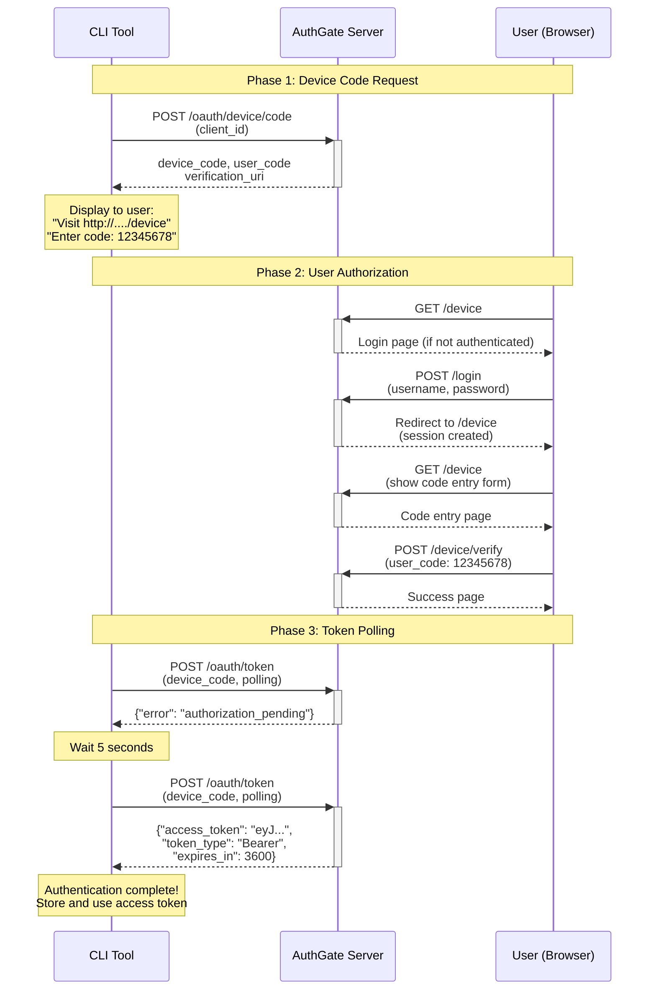

# AuthGate

> A lightweight OAuth 2.0 Device Authorization Grant server for CLI tools and browserless devices

[](https://github.com/appleboy/authgate/actions/workflows/security.yml)
[](https://github.com/appleboy/authgate/actions/workflows/testing.yml)
[](LICENSE)

## Table of Contents

- [AuthGate](#authgate)
  - [Table of Contents](#table-of-contents)
  - [Why AuthGate?](#why-authgate)
    - [The Problem](#the-problem)
    - [Real-World Scenarios](#real-world-scenarios)
    - [The Solution](#the-solution)
  - [Features](#features)
  - [Quick Start](#quick-start)
    - [Prerequisites](#prerequisites)
    - [Installation](#installation)
    - [Run the Server](#run-the-server)
    - [Docker Deployment](#docker-deployment)
      - [Docker Features](#docker-features)
      - [Docker Compose Example](#docker-compose-example)
    - [Test with the Example CLI](#test-with-the-example-cli)
  - [User Interface](#user-interface)
    - [1. Login Page](#1-login-page)
    - [2. Device Authorization Page](#2-device-authorization-page)
    - [3. Authorization Success](#3-authorization-success)
    - [4. Session Management](#4-session-management)
  - [How It Works](#how-it-works)
    - [Device Flow Sequence](#device-flow-sequence)
    - [Key Endpoints](#key-endpoints)
      - [Endpoint Details](#endpoint-details)
        - [Device Flow (CLI)](#device-flow-cli)
        - [User Authorization (Browser)](#user-authorization-browser)
        - [Token Validation](#token-validation)
        - [Token Revocation (RFC 7009)](#token-revocation-rfc-7009)
        - [Session Management (Web UI)](#session-management-web-ui)
  - [Configuration](#configuration)
    - [Environment Variables](#environment-variables)
      - [Generate Strong Secrets](#generate-strong-secrets)
    - [Default Test Data](#default-test-data)
      - [User Account](#user-account)
      - [OAuth Client](#oauth-client)
  - [Architecture](#architecture)
    - [Project Structure](#project-structure)
    - [Technology Stack](#technology-stack)
  - [Development](#development)
    - [Build Commands](#build-commands)
      - [Build Details](#build-details)
    - [Database Schema](#database-schema)
    - [Extending the Server](#extending-the-server)
      - [Add a new OAuth client](#add-a-new-oauth-client)
      - [Add custom scopes](#add-custom-scopes)
  - [Monitoring and Observability](#monitoring-and-observability)
    - [Health Check Endpoint](#health-check-endpoint)
      - [Health Check Details](#health-check-details)
    - [Monitoring Best Practices](#monitoring-best-practices)
      - [Key Metrics to Monitor](#key-metrics-to-monitor)
      - [Logging](#logging)
  - [Security Considerations](#security-considerations)
    - [Production Deployment Checklist](#production-deployment-checklist)
    - [Threat Model](#threat-model)
      - [What AuthGate Protects Against](#what-authgate-protects-against)
      - [What You Must Secure](#what-you-must-secure)
  - [Deployment](#deployment)
    - [Production Deployment Options](#production-deployment-options)
      - [1. Binary Deployment (Systemd)](#1-binary-deployment-systemd)
      - [2. Docker Deployment](#2-docker-deployment)
      - [3. Reverse Proxy Setup (Nginx)](#3-reverse-proxy-setup-nginx)
      - [4. Cloud Platform Deployment](#4-cloud-platform-deployment)
        - [Fly.io Example](#flyio-example)
  - [Use Cases](#use-cases)
    - [Example: Securing a CLI Tool](#example-securing-a-cli-tool)
    - [Example: IoT Device Authentication](#example-iot-device-authentication)
    - [Example: Security Incident Response](#example-security-incident-response)
  - [Performance Considerations](#performance-considerations)
    - [Scalability](#scalability)
      - [Current Architecture (SQLite)](#current-architecture-sqlite)
      - [For High-Scale Deployments](#for-high-scale-deployments)
      - [Performance Tips](#performance-tips)
    - [Benchmarks (Reference)](#benchmarks-reference)
  - [Comparison with Other Solutions](#comparison-with-other-solutions)
  - [Troubleshooting](#troubleshooting)
    - [Common Issues](#common-issues)
      - [Issue: "Client not found" error](#issue-client-not-found-error)
      - [Issue: Database locked errors](#issue-database-locked-errors)
      - [Issue: "authorization\_pending" never resolves](#issue-authorization_pending-never-resolves)
      - [Issue: JWT signature verification fails](#issue-jwt-signature-verification-fails)
      - [Issue: Session not persisting](#issue-session-not-persisting)
    - [Debug Mode](#debug-mode)
  - [FAQ](#faq)
    - [Q: Why not use OAuth password grant?](#q-why-not-use-oauth-password-grant)
    - [Q: Can I use this in production?](#q-can-i-use-this-in-production)
    - [Q: How do I add user registration?](#q-how-do-i-add-user-registration)
    - [Q: Can I use this with multiple clients?](#q-can-i-use-this-with-multiple-clients)
    - [Q: What about token refresh?](#q-what-about-token-refresh)
    - [Q: How do users revoke device access?](#q-how-do-users-revoke-device-access)
    - [Q: How long do device codes last?](#q-how-long-do-device-codes-last)
    - [Q: Can I use a different database?](#q-can-i-use-a-different-database)
    - [Q: How do I change the polling interval?](#q-how-do-i-change-the-polling-interval)
    - [Q: Are user codes case-sensitive?](#q-are-user-codes-case-sensitive)
  - [Contributing](#contributing)
  - [License](#license)
  - [References](#references)
  - [Acknowledgments](#acknowledgments)

---

## Why AuthGate?

### The Problem

Modern CLI tools and IoT devices need to access user resources securely, but traditional OAuth 2.0 flows weren't designed for them:

- **Authorization Code Flow** requires a browser redirect and a local callback server
- **Client Credentials Flow** can't authenticate specific users
- **Password Grant** requires users to enter credentials directly into apps (security risk)
- Embedding `client_secret` in distributed applications is insecure

### Real-World Scenarios

- 🖥️ **CLI tools** (like `gh`, `aws-cli`) need to access user data
- 📺 **Smart TVs** and streaming devices authenticating streaming services
- 🏠 **IoT devices** that lack browsers or input capabilities
- 🤖 **CI/CD pipelines** and automation scripts requiring user authorization
- 🎮 **Gaming consoles** logging into online services

### The Solution

**Device Authorization Grant (RFC 8628)** solves this by splitting the authorization flow:

1. Device requests a code from the server
2. User visits a URL **on another device** (phone/computer) with a browser
3. User logs in and enters the short code
4. Device polls the server until authorization is complete
5. Device receives an access token

**AuthGate** provides a production-ready implementation of this flow that you can deploy in minutes.

---

## Features

- ✅ **RFC 8628 Compliant** - Full implementation of OAuth 2.0 Device Authorization Grant
- ✅ **RFC 7009 Token Revocation** - Secure token revocation endpoint for revoking access
- ✅ **Lightweight** - Single binary, SQLite database, no external dependencies
- ✅ **Easy Configuration** - `.env` file support for all settings
- ✅ **Session-Based Auth** - Secure user login with encrypted cookies (7-day expiry)
- ✅ **JWT Tokens** - Industry-standard access tokens with HMAC-SHA256 signing
- ✅ **Session Management** - Web UI for users to view and revoke active sessions
- ✅ **Example CLI** - Complete working example of a client implementation
- ✅ **Token Verification** - Built-in endpoint to validate tokens (`/oauth/tokeninfo`)
- ✅ **Health Check** - Database connection monitoring via `/health` endpoint
- ✅ **Graceful Shutdown** - Proper signal handling for zero-downtime deployments
- ✅ **Embedded Assets** - Templates and static files compiled into binary
- ✅ **Cross-Platform** - Runs on Linux, macOS, Windows
- ✅ **Docker Ready** - Multi-arch images with security best practices
- ✅ **Static Binaries** - CGO-free builds for easy deployment

---

## Quick Start

### Prerequisites

- Go 1.24 or higher
- Make (optional, but recommended for convenience commands)

### Installation

```bash
# Clone the repository
git clone <repository-url>
cd authgate

# Copy environment configuration
cp .env.example .env

# Edit .env and set your secrets
nano .env

# Build the server (outputs to bin/authgate with version info)
make build

# Or build directly with Go
go build -o bin/authgate .
```

### Run the Server

```bash
# Show version information
./bin/authgate -v
./bin/authgate --version

# Show help
./bin/authgate -h

# Start the server
./bin/authgate server

# Or directly with Go
go run . server
```

The server will start on `http://localhost:8080` by default.

**Important:** Note the `client_id` printed in the startup logs - you'll need this for the CLI example.

### Docker Deployment

AuthGate provides multi-architecture Docker images for easy deployment:

```bash
# Build for your platform
make build_linux_amd64  # For Linux x86_64
make build_linux_arm64  # For Linux ARM64

# Build Docker image (with version tag)
docker build -f docker/Dockerfile \
  --build-arg VERSION=v1.0.0 \
  -t authgate:v1.0.0 \
  -t authgate:latest \
  .

# Or build without version (defaults to "dev")
docker build -f docker/Dockerfile -t authgate .

# Run with Docker
docker run -d \
  --name authgate \
  -p 8080:8080 \
  -v authgate-data:/app/data \
  -e JWT_SECRET=your-secret-here \
  -e SESSION_SECRET=your-session-secret \
  -e BASE_URL=http://localhost:8080 \
  authgate

# Check health
curl http://localhost:8080/health

# Inspect image labels to verify version
docker inspect authgate:v1.0.0 | grep -A 5 Labels
```

#### Docker Features

- Alpine-based (minimal attack surface)
- Multi-architecture support (amd64, arm64)
- Runs as non-root user (UID 1000)
- Built-in health check endpoint
- Persistent volume for SQLite database
- Embedded templates and static files (single binary)
- Version labels via `--build-arg VERSION=<version>` (supports both OCI and Label Schema standards)

#### Docker Compose Example

```yaml
version: "3.8"

services:
  authgate:
    image: authgate:latest
    container_name: authgate
    ports:
      - "8080:8080"
    volumes:
      - authgate-data:/app/data
    environment:
      - BASE_URL=https://auth.yourdomain.com
      - JWT_SECRET=${JWT_SECRET}
      - SESSION_SECRET=${SESSION_SECRET}
      - DATABASE_PATH=/app/data/oauth.db
    restart: unless-stopped
    healthcheck:
      test:
        [
          "CMD",
          "wget",
          "--no-verbose",
          "--tries=1",
          "--spider",
          "http://localhost:8080/health",
        ]
      interval: 30s
      timeout: 3s
      retries: 3
      start_period: 5s

volumes:
  authgate-data:
```

### Test with the Example CLI

```bash
cd _example/authgate-cli

# Configure the client
cp .env.example .env
nano .env  # Add the CLIENT_ID from server logs

# Run the CLI
go run main.go
```

The CLI will:

1. Request a device code
2. Display a URL and user code
3. Wait for you to authorize
4. Receive an access token
5. Verify the token

---

## User Interface

AuthGate provides a clean, modern web interface for user authentication and device authorization. Below are screenshots of the complete authorization flow:

### 1. Login Page


Users are prompted to sign in with their credentials before authorizing any device. The login page features:

- Simple username and password authentication
- Clear call-to-action: "Sign in to authorize your device"
- Responsive design that works on both desktop and mobile browsers

### 2. Device Authorization Page


After successful login, users see the device authorization page where they:

- Enter the code displayed on their CLI tool or device
- See their current logged-in status with a logout option
- Submit the code with a clear "Authorize Device" button
- Code format: `XXXX-XXXX` (8 characters, case-insensitive)

### 3. Authorization Success


Upon successful authorization, users receive confirmation with:

- Visual success indicator (green checkmark)
- Confirmation message showing which client was authorized
- Clear instructions to return to their CLI tool
- Option to authorize additional devices without re-login
- Logout button for security

### 4. Session Management

After logging in, users can manage their active sessions by clicking the "Active Sessions" link on the device authorization page. The session management interface provides:

- **View All Active Sessions** - See all devices that have been authorized with your account
- **Client Information** - Display client name and ID for easy identification
- **Session Details** - View creation time, expiration time, and granted scopes
- **Individual Revocation** - Revoke specific device access with one click
- **Revoke All** - Sign out all devices simultaneously for security
- **Status Indicators** - Visual display of active vs. expired sessions

This feature gives users complete control over which devices can access their account, enhancing security and transparency.

---

## How It Works

### Device Flow Sequence



### Key Endpoints

| Endpoint                       | Method   | Auth Required | Purpose                                        |
| ------------------------------ | -------- | ------------- | ---------------------------------------------- |
| `/health`                      | GET      | No            | Health check with database connection test     |
| `/oauth/device/code`           | POST     | No            | Request device and user codes (CLI/device)     |
| `/oauth/token`                 | POST     | No            | Poll for access token (grant_type=device_code) |
| `/oauth/tokeninfo`             | GET      | No            | Verify token validity (pass token as query)    |
| `/oauth/revoke`                | POST     | No            | Revoke access token (RFC 7009)                 |
| `/device`                      | GET      | Yes (Session) | User authorization page (browser)              |
| `/device/verify`               | POST     | Yes (Session) | Complete authorization (submit user_code)      |
| `/account/sessions`            | GET      | Yes (Session) | View all active sessions                       |
| `/account/sessions/:id/revoke` | POST     | Yes (Session) | Revoke specific session                        |
| `/account/sessions/revoke-all` | POST     | Yes (Session) | Revoke all user sessions                       |
| `/login`                       | GET/POST | No            | User login (creates session)                   |
| `/logout`                      | GET      | Yes (Session) | User logout (destroys session)                 |

#### Endpoint Details

##### Device Flow (CLI)

- `POST /oauth/device/code` - Returns `device_code`, `user_code`, `verification_uri`, `interval` (5s)
- `POST /oauth/token` - Poll with `device_code`, returns JWT or `authorization_pending` error

##### User Authorization (Browser)

- `GET /device` - Shows code entry form (redirects to `/login` if not authenticated)
- `POST /device/verify` - Validates and approves user code (requires valid session)

##### Token Validation

- `GET /oauth/tokeninfo?access_token=<JWT>` - Returns token details or error

##### Token Revocation (RFC 7009)

- `POST /oauth/revoke` - Revoke access token (CLI)
  - Parameters: `token` (required) - The JWT token to revoke
  - Parameters: `token_type_hint` (optional) - Set to "access_token"
  - Returns: HTTP 200 on success (even if token doesn't exist, per RFC 7009)
  - Note: Prevents token scanning attacks by always returning success

##### Session Management (Web UI)

- `GET /account/sessions` - View all active sessions for current user

  - Displays: Client name, Client ID, scopes, creation/expiration times, status
  - Requires: Valid user session (login required)

- `POST /account/sessions/:id/revoke` - Revoke specific session

  - Parameters: `:id` - Token ID to revoke
  - Requires: Valid user session, token must belong to current user
  - Returns: Redirect to sessions page

- `POST /account/sessions/revoke-all` - Sign out all devices
  - Revokes all access tokens for the current user
  - Useful for security incidents or password changes
  - Returns: Redirect to sessions page

**Security Note:** Session management endpoints use CSRF protection and verify token ownership before revocation.

---

## Configuration

### Environment Variables

Create a `.env` file in the project root:

```bash
# Server Configuration
SERVER_ADDR=:8080                # Listen address (e.g., :8080, 0.0.0.0:8080)
BASE_URL=http://localhost:8080   # Public URL for verification_uri

# Security - CHANGE THESE IN PRODUCTION!
JWT_SECRET=your-256-bit-secret-change-in-production       # HMAC-SHA256 signing key
SESSION_SECRET=session-secret-change-in-production        # Cookie encryption key

# Database
DATABASE_DRIVER=sqlite           # Database driver: "sqlite" or "postgres"
DATABASE_DSN=oauth.db            # Connection string (file path for SQLite, DSN for PostgreSQL)

# PostgreSQL Example:
# DATABASE_DRIVER=postgres
# DATABASE_DSN="host=localhost user=authgate password=secret dbname=authgate port=5432 sslmode=disable"
```

#### Generate Strong Secrets

```bash
# Generate JWT_SECRET (64 characters recommended)
openssl rand -hex 32

# Generate SESSION_SECRET (64 characters recommended)
openssl rand -hex 32

# Or use this one-liner to update .env
echo "JWT_SECRET=$(openssl rand -hex 32)" >> .env
echo "SESSION_SECRET=$(openssl rand -hex 32)" >> .env
```

### Default Test Data

The server initializes with default test accounts:

#### User Account

- Username: `admin`
- Password: Auto-generated 16-character random password (shown in server logs on first run)

#### OAuth Client

- Name: `AuthGate CLI`
- Client ID: Auto-generated UUID (shown in server logs)

**⚠️ Security Warning:** Note the admin password from server logs on first run and change it in production!

---

## Architecture

### Project Structure

```txt
authgate/
├── config/          # Configuration management (environment variables, defaults)
├── handlers/        # HTTP request handlers
│   ├── auth.go      # User login/logout endpoints
│   ├── device.go    # Device authorization flow (/device, /device/verify)
│   ├── token.go     # Token issuance (/oauth/token), verification (/oauth/tokeninfo), and revocation (/oauth/revoke)
│   ├── session.go   # Session management (/account/sessions)
│   └── client.go    # Admin client management
├── middleware/      # HTTP middleware
│   ├── auth.go      # Session authentication (RequireAuth, RequireAdmin)
│   └── csrf.go      # CSRF protection middleware
├── models/          # Data models
│   ├── user.go      # User accounts
│   ├── client.go    # OAuth clients (OAuthClient)
│   ├── device.go    # Device codes (DeviceCode)
│   └── token.go     # Access tokens (AccessToken)
├── services/        # Business logic layer (depends on store)
│   ├── auth.go      # User authentication and session management
│   ├── device.go    # Device code generation and validation
│   ├── token.go     # JWT creation, signing, validation, and revocation
│   └── client.go    # OAuth client management
├── store/           # Database layer (GORM + SQLite)
│   └── sqlite.go    # Database initialization, migrations, seed data, batch queries
├── templates/       # HTML templates (embedded via go:embed)
│   ├── account/     # User account templates
│   │   └── sessions.html  # Active sessions management page
│   └── admin/       # Admin panel templates
├── static/          # Static files (embedded via go:embed)
├── docker/          # Docker configuration
│   └── Dockerfile   # Alpine-based multi-arch image
├── _example/        # Example CLI client implementation
│   └── authgate-cli/
├── version/         # Version information (embedded at build time)
├── Makefile         # Build automation and targets
├── main.go          # Application entry point and router setup
├── .env.example     # Environment configuration template
└── CLAUDE.md        # AI assistant guidance (optional)
```

### Technology Stack

- **Web Framework:** [Gin](https://gin-gonic.com/) - Fast HTTP router
- **ORM:** [GORM](https://gorm.io/) - Database abstraction
- **Database:** SQLite - Embedded database
- **Sessions:** [gin-contrib/sessions](https://github.com/gin-contrib/sessions) - Cookie sessions
- **JWT:** [golang-jwt/jwt](https://github.com/golang-jwt/jwt) - Token generation
- **Config:** [joho/godotenv](https://github.com/joho/godotenv) - Environment management

---

## Development

### Build Commands

```bash
# Build binary with version info (outputs to bin/authgate)
make build

# Install binary to $GOPATH/bin
make install

# Run tests with coverage report (generates coverage.txt)
make test

# Run linter (auto-installs golangci-lint if missing)
make lint

# Format code with golangci-lint
make fmt

# Cross-compile for Linux
make build_linux_amd64  # Static binary (CGO_ENABLED=0)
make build_linux_arm64  # Static binary (CGO_ENABLED=0)

# Clean build artifacts and coverage
make clean

# Show all available targets
make help
```

#### Build Details

- Version information is automatically embedded using git tags/commits
- LDFLAGS includes: Version, BuildTime, GitCommit, GoVersion, BuildOS, BuildArch
- Cross-compiled binaries are statically linked (no external dependencies)
- Output locations: `bin/` for local builds, `release/<os>/<arch>/` for cross-compilation

### Database Schema

The application automatically creates these tables:

- `users` - User accounts
- `oauth_clients` - Registered client applications
- `device_codes` - Active device authorization requests
- `access_tokens` - Issued JWT tokens

### Extending the Server

#### Add a new OAuth client

```go
client := &models.OAuthClient{
    Name:         "My App",
    ClientID:     uuid.New().String(),
    RedirectURIs: "http://localhost:3000/callback",
}
db.Create(client)
```

#### Add custom scopes

Modify `services/device.go` to validate and store additional scopes.

---

## Monitoring and Observability

### Health Check Endpoint

```bash
# Basic health check
curl http://localhost:8080/health

# Response format (JSON)
{
  "status": "healthy",
  "database": "connected",
  "timestamp": "2026-01-07T10:00:00Z"
}
```

#### Health Check Details

- Tests database connectivity with a ping
- Returns HTTP 200 on success, 503 on database failure
- Used by Docker HEALTHCHECK directive
- Recommended monitoring interval: 30 seconds

### Monitoring Best Practices

#### Key Metrics to Monitor

- Health check endpoint availability
- Database file size growth
- Active device codes count
- Issued tokens per hour
- Session count
- HTTP response times
- Failed login attempts

#### Logging

- Gin framework logs all HTTP requests
- Include request ID for tracing
- Log authentication failures for security monitoring

---

## Security Considerations

### Production Deployment Checklist

- [ ] Change `JWT_SECRET` to a strong random value (32+ characters)
- [ ] Change `SESSION_SECRET` to a strong random value (32+ characters)
- [ ] Use HTTPS (set `BASE_URL` to `https://...`)
- [ ] Change default admin user password (check server logs for initial random password)
- [ ] Set appropriate `DeviceCodeExpiration` (default: 30 minutes)
- [ ] Set appropriate `JWTExpiration` (default: 1 hour)
- [ ] Configure firewall rules
- [ ] Enable rate limiting for token polling and revocation endpoints
- [ ] Regularly backup `oauth.db`
- [ ] Set up automated cleanup for expired tokens and device codes
- [ ] Use Docker non-root user mode (already configured)
- [ ] Configure timeouts for HTTP server (ReadTimeout, WriteTimeout)
- [ ] Enable CORS policies if needed
- [ ] Monitor `/health` endpoint for service availability
- [ ] Educate users to use `/account/sessions` to review and revoke suspicious devices

### Threat Model

#### What AuthGate Protects Against

- ✅ Client secret exposure in distributed apps
- ✅ Phishing attacks (user authorizes on trusted domain)
- ✅ Replay attacks (device codes are single-use)
- ✅ Token tampering (JWT signature verification)

#### What You Must Secure

- 🔒 Server host security
- 🔒 Database encryption at rest
- 🔒 TLS/HTTPS in production
- 🔒 Secret rotation policies

---

## Deployment

### Production Deployment Options

#### 1. Binary Deployment (Systemd)

```bash
# Build static binary
make build_linux_amd64

# Copy to server
scp release/linux/amd64/authgate user@server:/usr/local/bin/

# Create systemd service
cat > /etc/systemd/system/authgate.service <<EOF
[Unit]
Description=AuthGate OAuth Server
After=network.target

[Service]
Type=simple
User=authgate
WorkingDirectory=/var/lib/authgate
ExecStart=/usr/local/bin/authgate server
Restart=on-failure
RestartSec=10

# Security
NoNewPrivileges=true
PrivateTmp=true
ProtectSystem=strict
ProtectHome=true
ReadWritePaths=/var/lib/authgate

# Environment
EnvironmentFile=/etc/authgate/.env

[Install]
WantedBy=multi-user.target
EOF

# Enable and start
systemctl enable authgate
systemctl start authgate
```

#### 2. Docker Deployment

```bash
# Build with version information
VERSION=$(git describe --tags --always --dirty)
docker build -f docker/Dockerfile \
  --build-arg VERSION=${VERSION} \
  -t authgate:${VERSION} \
  -t authgate:latest \
  .

# Using Docker Compose (recommended)
docker-compose up -d

# Or standalone Docker
docker run -d \
  --name authgate \
  --restart unless-stopped \
  -p 8080:8080 \
  -v /var/lib/authgate:/app/data \
  -e JWT_SECRET=$(openssl rand -hex 32) \
  -e SESSION_SECRET=$(openssl rand -hex 32) \
  -e BASE_URL=https://auth.yourdomain.com \
  authgate:latest

# Verify deployed version
docker inspect authgate:latest --format '{{index .Config.Labels "org.opencontainers.image.version"}}'
```

#### 3. Reverse Proxy Setup (Nginx)

```nginx
server {
    listen 443 ssl http2;
    server_name auth.yourdomain.com;

    ssl_certificate /etc/letsencrypt/live/auth.yourdomain.com/fullchain.pem;
    ssl_certificate_key /etc/letsencrypt/live/auth.yourdomain.com/privkey.pem;

    location / {
        proxy_pass http://localhost:8080;
        proxy_set_header Host $host;
        proxy_set_header X-Real-IP $remote_addr;
        proxy_set_header X-Forwarded-For $proxy_add_x_forwarded_for;
        proxy_set_header X-Forwarded-Proto $scheme;

        # WebSocket support (if needed)
        proxy_http_version 1.1;
        proxy_set_header Upgrade $http_upgrade;
        proxy_set_header Connection "upgrade";
    }
}
```

#### 4. Cloud Platform Deployment

##### Fly.io Example

```bash
# Install flyctl
curl -L https://fly.io/install.sh | sh

# Launch app
fly launch

# Set secrets
fly secrets set JWT_SECRET=$(openssl rand -hex 32)
fly secrets set SESSION_SECRET=$(openssl rand -hex 32)

# Deploy
fly deploy
```

---

## Use Cases

### Example: Securing a CLI Tool

Your CLI tool needs to access a protected API:

1. **Server Setup:** Deploy AuthGate with your custom client
2. **CLI Integration:** Use the device flow to get user tokens
3. **API Calls:** Include the JWT in `Authorization: Bearer <token>` headers
4. **Token Refresh:** Store tokens securely, implement refresh logic

### Example: IoT Device Authentication

Your smart device needs user authorization:

1. Device displays a short code on its screen
2. User visits the URL on their phone
3. User logs in and enters the code
4. Device receives token and can now access user's account
5. Token stored securely in device memory

### Example: Security Incident Response

When a user suspects unauthorized access:

1. **User logs in** to the web interface
2. **Reviews active sessions** at `/account/sessions`
3. **Identifies suspicious devices** by checking client names and authorization times
4. **Revokes specific sessions** for unrecognized devices
5. **Or revokes all sessions** if multiple devices are compromised
6. **Re-authorizes legitimate devices** after security review

This workflow gives users complete control and visibility over their device authorizations, meeting modern security and privacy expectations.

---

## Performance Considerations

### Scalability

#### Current Architecture (SQLite)

- Suitable for: Small to medium deployments (< 1000 concurrent devices)
- Limitations: SQLite write locks can cause contention under heavy load
- Recommended: Monitor database file size and query performance

#### For High-Scale Deployments

AuthGate now supports PostgreSQL natively. Simply configure via environment variables:

```bash
# .env configuration
DATABASE_DRIVER=postgres
DATABASE_DSN="host=localhost user=authgate password=secret dbname=authgate port=5432 sslmode=require"
```

No code changes required! The application automatically selects the appropriate driver based on your configuration.

#### Performance Tips

- Enable SQLite WAL mode for better concurrent read performance
- Add indexes on frequently queried columns (`device_code`, `user_code`, `client_id`)
- Implement connection pooling for PostgreSQL
- Use Redis for session storage instead of cookies
- Add caching layer for token validation
- Clean up expired device codes and tokens regularly
- **Batch Queries:** Session management uses `WHERE IN` queries to avoid N+1 problems when fetching client information

### Benchmarks (Reference)

**Hardware:** 2-core CPU, 4GB RAM, SSD
**Test:** 100 concurrent device authorization flows

| Metric               | SQLite | PostgreSQL |
| -------------------- | ------ | ---------- |
| Requests/sec         | ~500   | ~2000      |
| Avg Response Time    | 20ms   | 5ms        |
| P95 Response Time    | 50ms   | 15ms       |
| Database Size (1000) | 2MB    | 5MB        |

---

## Comparison with Other Solutions

| Feature          | AuthGate      | Auth0  | Keycloak     | Custom OAuth |
| ---------------- | ------------- | ------ | ------------ | ------------ |
| Device Flow      | ✅            | ✅     | ✅           | 🔧 DIY       |
| Self-Hosted      | ✅            | ❌     | ✅           | ✅           |
| Lightweight      | ✅ (< 20MB)   | N/A    | ❌ (> 500MB) | 🔧 Varies    |
| Setup Time       | 5 min         | 15 min | 1 hour       | Days         |
| Learning Curve   | Low           | Medium | High         | High         |
| Cost             | Free (OSS)    | $$$    | Free (OSS)   | Dev Time     |
| Production Ready | ✅ (w/ audit) | ✅     | ✅           | 🔧 Varies    |
| Multi-tenancy    | ❌ (DIY)      | ✅     | ✅           | 🔧 DIY       |
| Embedded Binary  | ✅            | N/A    | ❌           | 🔧 Varies    |

---

## Troubleshooting

### Common Issues

#### Issue: "Client not found" error

```bash
# Solution: Check that CLIENT_ID in your CLI .env matches the server logs
# Server logs show: "Seeded OAuth client with ID: abc-123-def"
```

#### Issue: Database locked errors

```bash
# Solution: Ensure only one instance is running, or use WAL mode
# SQLite doesn't handle high concurrency well - consider PostgreSQL for production
```

#### Issue: "authorization_pending" never resolves

```bash
# Solution: Check that the user completed authorization in browser
# Verify the user_code was entered correctly (case-insensitive, dashes ignored)
# Check server logs for errors during authorization
```

#### Issue: "Username conflict with existing user" error

**Problem**: User sees "Username conflict with existing user. Please contact administrator." when logging in via external API.

**Cause**: The username returned by the external authentication API matches an existing user in the local database.

**Resolution Options**:

1. **Rename existing local user** (if it's a different person):
   ```sql
   UPDATE users SET username = 'newname' WHERE username = 'conflicting-username';
   ```

2. **Configure external API to use different username**: Update the external system to return a unique username (e.g., append domain suffix).

3. **Manual account merge** (if it's the same person):
   - Ensure the local user has `auth_source='http_api'` and correct `external_id`
   - Recommended for migrating local users to external authentication

**Prevention**: Use namespaced usernames in external API (e.g., "john@company.com" instead of "john").

#### Issue: JWT signature verification fails

```bash
# Solution: Ensure JWT_SECRET is the same across restarts
# Don't change JWT_SECRET while tokens are still valid
```

#### Issue: Session not persisting

```bash
# Solution: Ensure SESSION_SECRET is set
# Check that cookies are enabled in browser
# Verify BASE_URL matches the domain you're accessing
```

### Debug Mode

Enable debug logging by setting Gin to debug mode:

```bash
GIN_MODE=debug ./bin/authgate server
```

---

## FAQ

### Q: Why not use OAuth password grant?

A: Password grant requires users to enter credentials directly into your app, which trains users to trust third parties with passwords (security anti-pattern).

### Q: Can I use this in production?

A: Yes, but ensure you follow the security checklist and harden the deployment. This is a reference implementation - audit it for your specific needs.

### Q: How do I add user registration?

A: Implement registration handlers in `handlers/auth.go` and update the database schema in `models/user.go`.

### Q: Can I use this with multiple clients?

A: Yes! Add additional clients to the `oauth_clients` table with unique `client_id` values. Each client can have different redirect URIs.

### Q: What about token refresh?

A: This implementation uses short-lived JWTs without refresh tokens. For production use, consider implementing refresh tokens to avoid frequent re-authorization.

### Q: How do users revoke device access?

A: Users have multiple options to revoke access:

- **Web UI:** Visit `/account/sessions` to view and revoke individual devices
- **CLI/API:** Call `POST /oauth/revoke` with the token parameter (RFC 7009)
- **Revoke All:** Use the "Revoke All" button on the sessions page to sign out all devices at once

### Q: How long do device codes last?

A: Device codes expire after 30 minutes by default. This is configurable via `Config.DeviceCodeExpiration`.

### Q: Can I use a different database?

A: Yes! AuthGate supports both SQLite and PostgreSQL out of the box:

**SQLite** (default):

```bash
DATABASE_DRIVER=sqlite
DATABASE_DSN=oauth.db
```

**PostgreSQL**:

```bash
DATABASE_DRIVER=postgres
DATABASE_DSN="host=localhost user=authgate password=secret dbname=authgate port=5432 sslmode=disable"
```

The database driver uses a factory pattern and can be extended to support MySQL or other databases. See `internal/store/driver.go` for implementation details.

### Q: How do I change the polling interval?

A: The polling interval is 5 seconds by default (RFC 8628 compliant). Modify `Config.PollingInterval` in `config/config.go`.

### Q: Are user codes case-sensitive?

A: No, user codes are normalized to uppercase and dashes are removed before lookup (e.g., "ABCD-1234" = "abcd1234" = "ABCD1234").

---

## Contributing

Contributions are welcome! Please:

1. Fork the repository
2. Create a feature branch (`git checkout -b feature/amazing-feature`)
3. Commit your changes (`git commit -m 'Add amazing feature'`)
4. Push to the branch (`git push origin feature/amazing-feature`)
5. Open a Pull Request

---

## License

This project is licensed under the MIT License - see the [LICENSE](LICENSE) file for details.

---

## References

- [RFC 8628 - OAuth 2.0 Device Authorization Grant](https://datatracker.ietf.org/doc/html/rfc8628)
- [RFC 7009 - OAuth 2.0 Token Revocation](https://datatracker.ietf.org/doc/html/rfc7009)
- [OAuth 2.0 Documentation](https://oauth.net/2/)
- [JWT Best Practices](https://datatracker.ietf.org/doc/html/rfc8725)

---

## Acknowledgments

Built with ❤️ using:

- [Gin Web Framework](https://gin-gonic.com/)
- [GORM](https://gorm.io/)
- [golang-jwt](https://github.com/golang-jwt/jwt)

---

**Need Help?** Open an issue or check the `_example/` directory for working client code.
