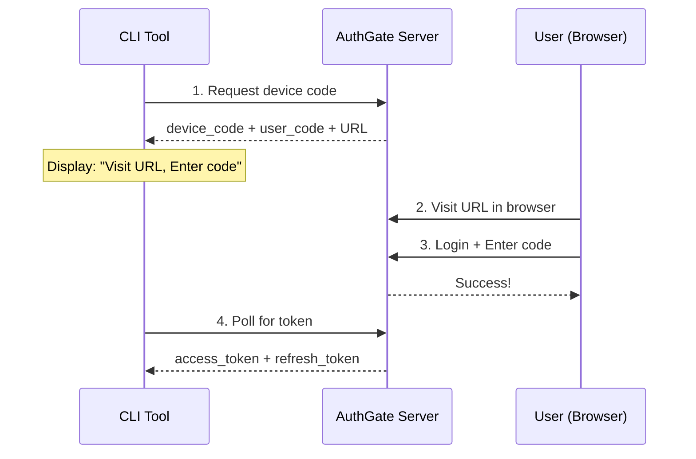

# AuthGate

> A lightweight OAuth 2.0 Device Authorization Grant server for CLI tools and browserless devices

[](https://github.com/appleboy/authgate/actions/workflows/security.yml)
[](https://github.com/appleboy/authgate/actions/workflows/testing.yml)
[](LICENSE)

## Table of Contents

- [AuthGate](#authgate)
  - [Table of Contents](#table-of-contents)
  - [Why AuthGate?](#why-authgate)
  - [✨ Key Features](#-key-features)
  - [🚀 Quick Start](#-quick-start)
    - [Prerequisites](#prerequisites)
    - [Installation](#installation)
    - [Run the Server](#run-the-server)
    - [Test with Example CLI](#test-with-example-cli)
  - [📖 Documentation](#-documentation)
    - [Getting Started](#getting-started)
    - [Development](#development)
    - [Operations](#operations)
    - [Advanced Topics](#advanced-topics)
  - [🎯 How It Works](#-how-it-works)
  - [🎨 User Interface](#-user-interface)
    - [Login \& Authorization Flow](#login--authorization-flow)
    - [Session Management](#session-management)
  - [⚙️ Configuration](#️-configuration)
    - [Basic Configuration (.env)](#basic-configuration-env)
    - [Advanced Features](#advanced-features)
  - [🏗️ Architecture](#️-architecture)
    - [Technology Stack](#technology-stack)
    - [Project Structure](#project-structure)
  - [🚀 Deployment](#-deployment)
    - [Docker Deployment](#docker-deployment)
    - [Production Deployment](#production-deployment)
  - [🔒 Security](#-security)
    - [Production Checklist](#production-checklist)
    - [What AuthGate Protects](#what-authgate-protects)
  - [📊 Performance](#-performance)
    - [Benchmarks (Reference)](#benchmarks-reference)
    - [Scalability](#scalability)
  - [🔧 Development](#-development)
    - [Build from Source](#build-from-source)
    - [Extending AuthGate](#extending-authgate)
  - [❓ FAQ](#-faq)
    - [Q: Why not use OAuth password grant?](#q-why-not-use-oauth-password-grant)
    - [Q: Can I use this in production?](#q-can-i-use-this-in-production)
    - [Q: How do I add user registration?](#q-how-do-i-add-user-registration)
    - [Q: Does it support refresh tokens?](#q-does-it-support-refresh-tokens)
    - [Q: How do users revoke device access?](#q-how-do-users-revoke-device-access)
  - [🤝 Contributing](#-contributing)
  - [📄 License](#-license)
  - [📚 References](#-references)
  - [🙏 Acknowledgments](#-acknowledgments)

---

## Why AuthGate?

Modern CLI tools and IoT devices need secure user authentication, but traditional OAuth flows don't work well for devices without browsers or keyboards. **AuthGate** implements the OAuth 2.0 Device Authorization Grant (RFC 8628), allowing users to authenticate on a separate device while keeping credentials secure.

**Perfect for:**

- 🖥️ CLI tools (like `gh`, `aws-cli`)
- 📺 Smart TVs and streaming devices
- 🏠 IoT devices without input capabilities
- 🤖 CI/CD pipelines and automation scripts
- 🎮 Gaming consoles

---

## ✨ Key Features

- **OAuth 2.0 Compliance**: Full implementation of Device Authorization Grant (RFC 8628), Refresh Tokens (RFC 6749), and Token Revocation (RFC 7009)
- **Security First**: Rate limiting, audit logging, CSRF protection, and session management built-in
- **Production Ready**: Built-in monitoring, health checks, and comprehensive audit trails
- **Zero Dependencies**: Single static binary with SQLite embedded, or use PostgreSQL for scale
- **Multi-Auth Support**: Local authentication, external HTTP API, OAuth providers (GitHub, Gitea, Microsoft)
- **Flexible Deployment**: Docker-ready, cloud-friendly, runs anywhere
- **Token Management**: Fixed and rotation refresh token modes, web UI for session management

---

## 🚀 Quick Start

### Prerequisites

- Go 1.24 or higher
- Make (optional, but recommended)

### Installation

```bash
# Clone repository
git clone <repository-url>
cd authgate

# Copy environment configuration
cp .env.example .env

# Generate strong secrets
echo "JWT_SECRET=$(openssl rand -hex 32)" >> .env
echo "SESSION_SECRET=$(openssl rand -hex 32)" >> .env

# Build the server
make build
```

### Run the Server

```bash
# Start server
./bin/authgate server

# Or with Docker
docker run -d \
  --name authgate \
  -p 8080:8080 \
  -v authgate-data:/app/data \
  -e JWT_SECRET=$(openssl rand -hex 32) \
  -e SESSION_SECRET=$(openssl rand -hex 32) \
  -e BASE_URL=http://localhost:8080 \
  authgate:latest
```

Server starts on `http://localhost:8080`

**Important:** Note the `client_id` printed in startup logs - you'll need this for the CLI example.

### Test with Example CLI

```bash
cd _example/authgate-cli

# Configure client
cp .env.example .env
nano .env  # Add CLIENT_ID from server logs

# Run the CLI
go run main.go
```

The CLI demonstrates the complete device authorization flow with automatic token refresh.

---

## 📖 Documentation

### Getting Started

- **[Quick Start](#-quick-start)** - Get up and running in 5 minutes
- **[Configuration Guide](docs/CONFIGURATION.md)** - Environment variables, secrets, OAuth setup, rate limiting
- **[Deployment Guide](docs/DEPLOYMENT.md)** - Production deployment with Docker, systemd, Nginx, cloud platforms

### Development

- **[Architecture Guide](docs/ARCHITECTURE.md)** - System design, flow diagrams, database schema
- **[Development Guide](docs/DEVELOPMENT.md)** - Building, testing, and extending AuthGate

### Operations

- **[Monitoring Guide](docs/MONITORING.md)** - Health checks, metrics, audit logging, alerting
- **[Security Guide](docs/SECURITY.md)** - Production checklist, threat model, secrets management
- **[Troubleshooting](docs/TROUBLESHOOTING.md)** - Common issues, debug mode, FAQ

### Advanced Topics

- **[OAuth Setup Guide](docs/OAUTH_SETUP.md)** - GitHub, Gitea, Microsoft Entra ID integration
- **[Rate Limiting Guide](docs/RATE_LIMITING.md)** - Protect against brute force and API abuse
- **[Performance Guide](docs/PERFORMANCE.md)** - Scalability, optimization, benchmarks
- **[Use Cases](docs/USE_CASES.md)** - Real-world examples and code samples

---

## 🎯 How It Works



**Key Endpoints:**

| Endpoint             | Method | Purpose                           |
| -------------------- | ------ | --------------------------------- |
| `/oauth/device/code` | POST   | Request device code (CLI)         |
| `/oauth/token`       | POST   | Get or refresh tokens             |
| `/oauth/tokeninfo`   | GET    | Verify token validity             |
| `/oauth/revoke`      | POST   | Revoke tokens (RFC 7009)          |
| `/device`            | GET    | User authorization page (browser) |
| `/device/verify`     | POST   | Complete authorization            |
| `/account/sessions`  | GET    | View and manage active sessions   |
| `/login`             | POST   | User login                        |
| `/health`            | GET    | Health check (monitoring)         |

**[Full API Reference →](docs/ARCHITECTURE.md#key-endpoints)**

---

## 🎨 User Interface

AuthGate provides a clean, modern web interface:

### Login & Authorization Flow


_Simple username/password authentication_


_Enter the code from your CLI tool_


_Confirmation and return to CLI_

### Session Management

Users can view and revoke active sessions at `/account/sessions`:

- View all authorized devices
- See client information and authorization times
- Revoke specific devices or all at once
- Monitor active vs expired sessions

---

## ⚙️ Configuration

### Basic Configuration (.env)

```bash
# Server
SERVER_ADDR=:8080
BASE_URL=http://localhost:8080

# Security (REQUIRED - use openssl rand -hex 32)
JWT_SECRET=your-256-bit-secret-change-in-production
SESSION_SECRET=your-session-secret-change-in-production

# Database
DATABASE_DRIVER=sqlite          # or postgres
DATABASE_DSN=oauth.db

# Admin Password (REQUIRED in production)
DEFAULT_ADMIN_PASSWORD=your-secure-password

# Features
ENABLE_RATE_LIMIT=true          # Brute force protection
ENABLE_AUDIT_LOGGING=true       # Comprehensive audit trails
```

**[Complete Configuration Guide →](docs/CONFIGURATION.md)**

### Advanced Features

- **OAuth Third-Party Login**: GitHub, Gitea, Microsoft Entra ID
- **External Authentication**: Integrate with existing auth systems
- **Pluggable Token Providers**: Use external token services
- **Service-to-Service Auth**: HMAC or simple header authentication
- **HTTP Retry with Backoff**: Resilient external API calls
- **Rate Limiting**: Memory or Redis store for distributed deployments

**[Advanced Configuration →](docs/CONFIGURATION.md)**

---

## 🏗️ Architecture

### Technology Stack

- **Web Framework**: [Gin](https://gin-gonic.com/) - Fast HTTP router
- **Templates**: [templ](https://templ.guide/) - Type-safe HTML templating
- **ORM**: [GORM](https://gorm.io/) - Database abstraction
- **Database**: SQLite (default) / PostgreSQL
- **Sessions**: Encrypted cookies with [gin-contrib/sessions](https://github.com/gin-contrib/sessions)
- **JWT**: [golang-jwt/jwt](https://github.com/golang-jwt/jwt)

### Project Structure

```txt
authgate/
├── config/          # Configuration management
├── handlers/        # HTTP request handlers
├── middleware/      # Auth, CSRF, rate limiting
├── models/          # Database models
├── auth/            # Authentication providers
├── token/           # Token providers
├── services/        # Business logic
├── store/           # Database layer (SQLite/PostgreSQL)
├── templates/       # Type-safe templ templates
├── docs/            # Documentation
├── docker/          # Docker configuration
└── _example/        # Example CLI client
```

**[Architecture Deep Dive →](docs/ARCHITECTURE.md)**

---

## 🚀 Deployment

### Docker Deployment

```bash
# Build image
docker build -f docker/Dockerfile -t authgate .

# Run container
docker run -d \
  --name authgate \
  --restart unless-stopped \
  -p 8080:8080 \
  -v authgate-data:/app/data \
  -e JWT_SECRET=$(openssl rand -hex 32) \
  -e SESSION_SECRET=$(openssl rand -hex 32) \
  -e BASE_URL=https://auth.yourdomain.com \
  authgate:latest
```

### Production Deployment

- **Binary Deployment**: Systemd service with security hardening
- **Docker Compose**: Multi-container setup with health checks
- **Reverse Proxy**: Nginx/Caddy with SSL/TLS
- **Cloud Platforms**: Fly.io, AWS, GCP, Azure

**[Complete Deployment Guide →](docs/DEPLOYMENT.md)**

---

## 🔒 Security

### Production Checklist

- [ ] Generate strong JWT and session secrets (32+ bytes)
- [ ] Set secure admin password
- [ ] Enable HTTPS (use reverse proxy)
- [ ] Configure rate limiting
- [ ] Enable audit logging
- [ ] Set up regular database backups
- [ ] Review security best practices

**[Full Security Guide →](docs/SECURITY.md)**

### What AuthGate Protects

- ✅ Client secret exposure in distributed apps
- ✅ Phishing attacks (authorization on trusted domain)
- ✅ Replay attacks (single-use device codes)
- ✅ Token tampering (JWT signature verification)
- ✅ Brute force attacks (rate limiting)
- ✅ Session hijacking (encrypted cookies, CSRF protection)

---

## 📊 Performance

### Benchmarks (Reference)

**Hardware**: 2-core CPU, 4GB RAM, SSD

| Metric             | SQLite | PostgreSQL |
| ------------------ | ------ | ---------- |
| Requests/sec       | ~500   | ~2000      |
| Avg Response Time  | 20ms   | 5ms        |
| P95 Response Time  | 50ms   | 15ms       |
| Concurrent Devices | < 1000 | > 1000     |

### Scalability

- **SQLite**: Suitable for < 1000 concurrent devices, single-instance deployments
- **PostgreSQL**: Recommended for production, supports horizontal scaling
- **Multi-Pod**: Use PostgreSQL + Redis for rate limiting across pods

**[Performance Guide →](docs/PERFORMANCE.md)**

---

## 🔧 Development

### Build from Source

```bash
# Build binary
make build

# Run tests
make test

# Run linter
make lint

# Cross-compile for Linux
make build_linux_amd64
make build_linux_arm64
```

### Extending AuthGate

- Add custom OAuth clients
- Implement custom authentication providers
- Add new endpoints
- Customize web UI templates

**[Development Guide →](docs/DEVELOPMENT.md)**

---

## ❓ FAQ

### Q: Why not use OAuth password grant?

Password grant requires users to enter credentials directly into your app, training users to trust third parties with passwords (security anti-pattern). Device flow keeps credentials on the trusted authorization server.

### Q: Can I use this in production?

Yes! Follow the [Security Checklist](docs/SECURITY.md#production-deployment-checklist) and harden your deployment. AuthGate includes production features like audit logging, rate limiting, and health checks.

### Q: How do I add user registration?

Implement custom registration handlers. See [Development Guide](docs/DEVELOPMENT.md#extending-the-server).

### Q: Does it support refresh tokens?

Yes! AuthGate fully supports RFC 6749 refresh tokens with two modes:

- **Fixed Mode** (default): Reusable tokens, perfect for multi-device
- **Rotation Mode**: High-security one-time-use tokens

### Q: How do users revoke device access?

- Web UI: Visit `/account/sessions`
- CLI/API: Call `POST /oauth/revoke`
- Bulk action: "Revoke All" button

**[More FAQs →](docs/TROUBLESHOOTING.md#frequently-asked-questions-faq)**

---

## 🤝 Contributing

Contributions are welcome! Please:

1. Fork the repository
2. Create a feature branch
3. Write tests for new features
4. Run `make fmt && make lint && make test`
5. Submit a Pull Request

---

## 📄 License

This project is licensed under the MIT License - see the [LICENSE](LICENSE) file for details.

---

## 📚 References

- [RFC 8628 - OAuth 2.0 Device Authorization Grant](https://datatracker.ietf.org/doc/html/rfc8628)
- [RFC 6749 - OAuth 2.0 Framework (Refresh Tokens)](https://datatracker.ietf.org/doc/html/rfc6749)
- [RFC 7009 - OAuth 2.0 Token Revocation](https://datatracker.ietf.org/doc/html/rfc7009)
- [RFC 8725 - JWT Best Practices](https://datatracker.ietf.org/doc/html/rfc8725)

---

## 🙏 Acknowledgments

Built with:

- [Gin Web Framework](https://gin-gonic.com/)
- [GORM](https://gorm.io/)
- [templ](https://templ.guide/)
- [golang-jwt](https://github.com/golang-jwt/jwt)

---

**Need Help?** Check the [Troubleshooting Guide](docs/TROUBLESHOOTING.md) or open an issue on GitHub.

**Ready to Deploy?** Start with the [Deployment Guide](docs/DEPLOYMENT.md).
