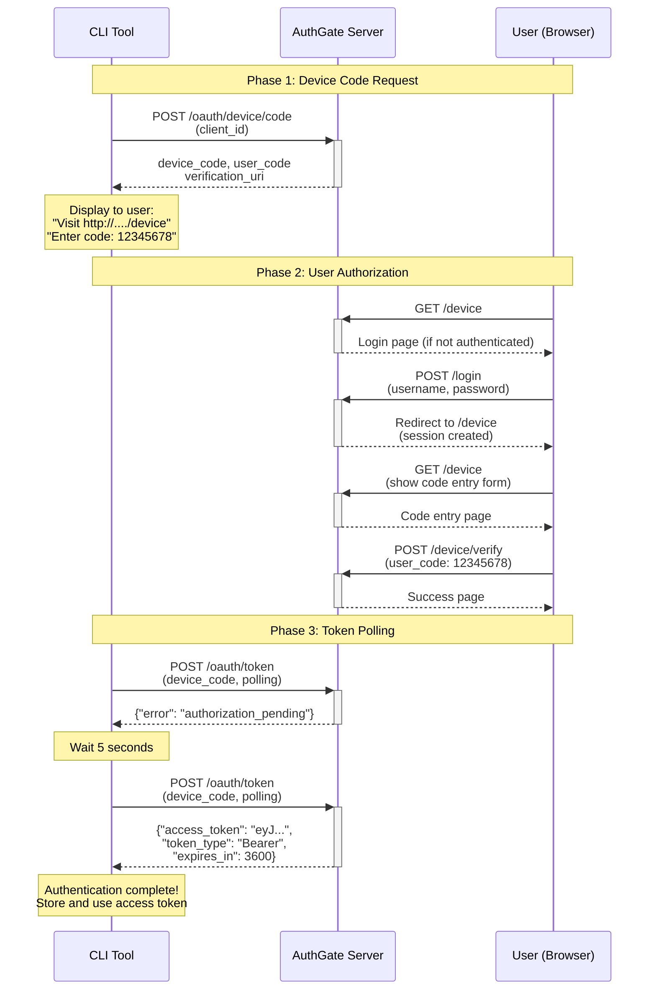

# Architecture Guide

This document provides a detailed overview of AuthGate's architecture, design patterns, and OAuth 2.0 Device Authorization flow implementation.

## Table of Contents

- [Project Structure](#project-structure)
- [Technology Stack](#technology-stack)
- [Device Flow Sequence](#device-flow-sequence)
- [Key Endpoints](#key-endpoints)
- [Refresh Token Architecture](#refresh-token-architecture)
- [Client Credentials Architecture](#client-credentials-architecture)

---

## Project Structure

```txt
authgate/
├── config/          # Configuration management (environment variables, defaults)
├── handlers/        # HTTP request handlers
│   ├── auth.go      # User login/logout endpoints
│   ├── device.go    # Device authorization flow (/device, /device/verify)
│   ├── token.go     # Token issuance (/oauth/token), verification (/oauth/tokeninfo), and revocation (/oauth/revoke)
│   ├── oidc.go      # OIDC Discovery (/.well-known/openid-configuration) and UserInfo (/oauth/userinfo)
│   ├── session.go   # Session management (/account/sessions)
│   ├── client.go    # Admin client management
│   ├── oauth_handler.go  # OAuth third-party login handlers
│   └── audit.go     # Audit log viewing and export (/admin/audit)
├── middleware/      # HTTP middleware
│   ├── auth.go      # Session authentication (RequireAuth, RequireAdmin)
│   ├── csrf.go      # CSRF protection middleware
│   └── ratelimit.go # Rate limiting middleware (memory/Redis store)
├── models/          # Data models
│   ├── user.go      # User accounts
│   ├── client.go    # OAuth clients (OAuthClient)
│   ├── device.go    # Device codes (DeviceCode)
│   ├── token.go     # Access tokens (AccessToken)
│   ├── oauth_connection.go  # OAuth provider connections
│   └── audit_log.go # Audit log entries (AuditLog)
├── auth/            # Authentication providers (pluggable design)
│   ├── local.go     # Local authentication (database)
│   ├── http_api.go  # External HTTP API authentication
│   └── oauth_provider.go  # OAuth 2.0 provider implementations (GitHub, Gitea)
├── token/           # Token providers (pluggable design)
│   ├── types.go     # Shared data structures (TokenResult, TokenValidationResult)
│   ├── errors.go    # Provider-level error definitions
│   ├── local.go     # Local JWT provider (HMAC-SHA256)
│   └── http_api.go  # External HTTP API token provider
├── services/        # Business logic layer (depends on store and providers)
│   ├── user.go      # User management (integrates auth providers)
│   ├── device.go    # Device code generation and validation
│   ├── token.go     # Token service (integrates token providers)
│   ├── client.go    # OAuth client management
│   └── audit.go     # Audit logging service (async batch writing, sensitive data masking)
├── store/           # Database layer (GORM)
│   ├── driver.go    # Database driver factory (SQLite, PostgreSQL)
│   ├── sqlite.go    # Database initialization, migrations, seed data, batch queries
│   └── audit_filters.go  # Audit log filtering and pagination
├── templates/       # Type-safe templ templates (compiled to Go code)
│   ├── *.templ      # Templ template files (generate *_templ.go files)
│   ├── props.go     # Type-safe template props structures
│   ├── render.go    # Templ rendering helper for Gin
│   └── generate.go  # Go generate directive for templ
├── docker/          # Docker configuration
│   └── Dockerfile   # Alpine-based multi-arch image
├── docs/            # Documentation
│   ├── ARCHITECTURE.md             # System architecture and design patterns
│   ├── AUTHORIZATION_CODE_FLOW.md  # Auth Code Flow with PKCE guide
│   ├── CLIENT_CREDENTIALS_FLOW.md  # Client Credentials Grant (M2M) guide
│   ├── CONFIGURATION.md            # Environment variables and configuration
│   ├── DEPLOYMENT.md               # Production deployment guide
│   ├── DEVELOPMENT.md              # Developer guide and extension points
│   ├── METRICS.md                  # Prometheus metrics documentation
│   ├── MONITORING.md               # Monitoring, logging, and alerting
│   ├── OAUTH_SETUP.md              # OAuth provider setup guide
│   ├── PERFORMANCE.md              # Scalability and optimization
│   ├── RATE_LIMITING.md            # Rate limiting configuration
│   ├── SECURITY.md                 # Security best practices
│   ├── TROUBLESHOOTING.md          # Common issues and FAQ
│   └── USE_CASES.md                # Real-world examples
├── _example/        # Example CLI client implementations
│   ├── (Device Code Flow CLI → github.com/go-authgate/device-cli)
│   └── (Authorization Code Flow CLI → github.com/go-authgate/oauth-cli)
├── version/         # Version information (embedded at build time)
├── Makefile         # Build automation and targets
├── main.go          # Application entry point and router setup
├── .env.example     # Environment configuration template
└── CLAUDE.md        # AI assistant guidance (optional)
```

---

## Technology Stack

- **Web Framework:** [Gin](https://gin-gonic.com/) - Fast HTTP router
- **Templates:** [templ](https://templ.guide/) - Type-safe HTML templating with compile-time validation
- **ORM:** [GORM](https://gorm.io/) - Database abstraction
- **Database:** SQLite (default) / PostgreSQL - Embedded or network database
- **Sessions:** [gin-contrib/sessions](https://github.com/gin-contrib/sessions) - Cookie sessions
- **JWT:** [golang-jwt/jwt](https://github.com/golang-jwt/jwt) - Token generation
- **Config:** [joho/godotenv](https://github.com/joho/godotenv) - Environment management

---

## Device Flow Sequence



---

## Key Endpoints

| Endpoint                            | Method   | Auth Required | Purpose                                                                        |
| ----------------------------------- | -------- | ------------- | ------------------------------------------------------------------------------ |
| `/health`                           | GET      | No            | Health check with database connection test                                     |
| `/.well-known/openid-configuration` | GET      | No            | OIDC Discovery metadata (RFC 8414 / OIDC Discovery 1.0)                        |
| `/oauth/device/code`                | POST     | No            | Request device and user codes (CLI/device)                                     |
| `/oauth/authorize`                  | GET      | Yes (Session) | Authorization Code Flow consent page (web apps)                                |
| `/oauth/authorize`                  | POST     | Yes (Session) | Submit consent decision (allow/deny)                                           |
| `/oauth/token`                      | POST     | No            | Token endpoint (grant_type=device_code, authorization_code, refresh_token, or client_credentials) |
| `/oauth/tokeninfo`                  | GET      | No            | Verify token validity (pass token as query)                                    |
| `/oauth/userinfo`                   | GET/POST | No (Bearer)   | OIDC UserInfo — returns profile claims for authenticated user (OIDC Core §5.3) |
| `/oauth/revoke`                     | POST     | No            | Revoke access token (RFC 7009)                                                 |
| `/device`                           | GET      | Yes (Session) | User authorization page (browser)                                              |
| `/device/verify`                    | POST     | Yes (Session) | Complete authorization (submit user_code)                                      |
| `/account/sessions`                 | GET      | Yes (Session) | View all active sessions                                                       |
| `/account/sessions/:id/revoke`      | POST     | Yes (Session) | Revoke specific session                                                        |
| `/account/sessions/revoke-all`      | POST     | Yes (Session) | Revoke all user sessions                                                       |
| `/account/authorizations`           | GET      | Yes (Session) | View apps authorized via Authorization Code Flow                               |
| `/login`                            | GET/POST | No            | User login (creates session)                                                   |
| `/logout`                           | GET      | Yes (Session) | User logout (destroys session)                                                 |
| `/auth/login/:provider`             | GET      | No            | Initiate OAuth login (provider: github, gitea, microsoft)                      |
| `/auth/callback/:provider`          | GET      | No            | OAuth callback endpoint                                                        |
| `/admin/audit`                      | GET      | Yes (Admin)   | View audit logs (HTML interface)                                               |
| `/admin/audit/export`               | GET      | Yes (Admin)   | Export audit logs as CSV                                                       |
| `/admin/audit/api`                  | GET      | Yes (Admin)   | List audit logs (JSON API)                                                     |
| `/admin/audit/api/stats`            | GET      | Yes (Admin)   | Get audit log statistics                                                       |
| `/admin/clients/:id/authorizations` | GET      | Yes (Admin)   | View all users who consented to a client                                       |
| `/admin/clients/:id/revoke-all`     | POST     | Yes (Admin)   | Revoke all tokens and consents for a client                                    |

### Endpoint Details

#### Device Flow (CLI)

- `POST /oauth/device/code` - Returns `device_code`, `user_code`, `verification_uri`, `interval` (5s)
- `POST /oauth/token` - Token endpoint supporting multiple grant types:
  - **Device Code Grant**: `grant_type=urn:ietf:params:oauth:grant-type:device_code`
    - Poll with `device_code` and `client_id`
    - Returns `access_token`, `refresh_token`, `token_type`, `expires_in`, `scope`
    - Returns `authorization_pending` error while waiting for user
  - **Refresh Token Grant**: `grant_type=refresh_token`
    - Request with `refresh_token`, `client_id`, and optional `scope`
    - Returns new `access_token` (fixed mode) or new `access_token` + `refresh_token` (rotation mode)
    - Returns `invalid_grant` error if refresh token is invalid/expired
  - **Client Credentials Grant**: `grant_type=client_credentials`
    - Authenticate via HTTP Basic Auth (`Authorization: Basic base64(client_id:client_secret)`) or form body
    - Returns `access_token`, `token_type`, `expires_in`, `scope` — **no** `refresh_token`
    - Requires confidential client with `EnableClientCredentialsFlow = true`
    - Returns `401 Unauthorized` with `WWW-Authenticate: Basic realm="authgate"` for auth failures

#### User Authorization (Browser)

- `GET /device` - Shows code entry form (redirects to `/login` if not authenticated)
- `POST /device/verify` - Validates and approves user code (requires valid session)

#### Token Validation

- `GET /oauth/tokeninfo?access_token=<JWT>` - Returns token details or error

#### OIDC Discovery & UserInfo

- `GET /.well-known/openid-configuration` - Returns OIDC Provider Metadata (RFC 8414):
  - Issuer, authorization/token/userinfo/revocation endpoint URLs
  - Supported response types, grant types, scopes, claims, and code challenge methods

- `GET /oauth/userinfo` or `POST /oauth/userinfo` - Returns claims for the token owner (OIDC Core 1.0 §5.3):
  - Requires `Authorization: Bearer <access_token>` header
  - Returns `401` with `WWW-Authenticate: Bearer error="invalid_token"` on failure
  - Claims returned depend on the scopes granted when the token was issued:

| Scope     | Claims returned                                                    |
| --------- | ------------------------------------------------------------------ |
| _(any)_   | `sub` (always present — user UUID)                                 |
| `profile` | `name`, `preferred_username`, `picture` (if set), `updated_at`     |
| `email`   | `email`, `email_verified` (always `false` — no email verification) |

Example request for `openid profile email` scopes:

```json
{
  "sub": "550e8400-e29b-41d4-a716-446655440000",
  "name": "John Doe",
  "preferred_username": "johndoe",
  "picture": "https://example.com/avatar.jpg",
  "updated_at": 1708646400,
  "email": "john@example.com",
  "email_verified": false
}
```

#### Token Revocation (RFC 7009)

- `POST /oauth/revoke` - Revoke access token (CLI)
  - Parameters: `token` (required) - The JWT token to revoke
  - Parameters: `token_type_hint` (optional) - Set to "access_token"
  - Returns: HTTP 200 on success (even if token doesn't exist, per RFC 7009)
  - Note: Prevents token scanning attacks by always returning success

#### Session Management (Web UI)

- `GET /account/sessions` - View all active sessions for current user
  - Displays: Client name, Client ID, scopes, creation/expiration times, status
  - Requires: Valid user session (login required)

- `POST /account/sessions/:id/revoke` - Revoke specific session
  - Parameters: `:id` - Token ID to revoke
  - Requires: Valid user session, token must belong to current user
  - Returns: Redirect to sessions page

- `POST /account/sessions/revoke-all` - Sign out all devices
  - Revokes all access tokens for the current user
  - Useful for security incidents or password changes
  - Returns: Redirect to sessions page

**Security Note:** Session management endpoints use CSRF protection and verify token ownership before revocation.

---

## Refresh Token Architecture

AuthGate supports refresh tokens following RFC 6749 with configurable rotation modes for different security requirements.

### Key Features

- **Dual Modes**: Fixed (reusable) vs Rotation (one-time use) refresh tokens
- **Unified Storage**: Both access and refresh tokens stored in `AccessToken` table with `token_category` field
- **Token Family Tracking**: `parent_token_id` links tokens for audit trails and revocation
- **Status Management**: Tokens can be `active`, `disabled`, or `revoked`
- **Configurable Expiration**: `REFRESH_TOKEN_EXPIRATION` env var (default: 720h = 30 days)
- **Provider Support**: Both LocalTokenProvider and HTTPTokenProvider support refresh operations

### Fixed Mode (Default - Multi-Device Friendly)

1. Device code exchange returns `access_token` + `refresh_token`
2. When access token expires, client POSTs to `/oauth/token` with `grant_type=refresh_token`
3. Server returns new `access_token` only (refresh token remains unchanged and reusable)
4. Process repeats until refresh token expires or is manually disabled/revoked
5. Each device/application gets its own refresh token that doesn't affect others
6. Users can manage all tokens (disable/enable/revoke) via backend UI
7. LastUsedAt field tracks activity for identifying inactive sessions

### Rotation Mode (Optional - High Security)

1. Same as fixed mode, but step 3 returns both new `access_token` + new `refresh_token`
2. Old refresh token is automatically revoked (status set to 'revoked') after each use
3. Prevents token replay attacks
4. Requires clients to update stored refresh token after each use
5. Enable via `ENABLE_TOKEN_ROTATION=true`

### Token Management

- **Status Field**: `active` (usable) / `disabled` (temporarily blocked, can re-enable) / `revoked` (permanently blocked)
- **Independent Revocation**: Revoking refresh token doesn't affect existing access tokens
- **Family Tracking**: ParentTokenID enables audit trails and selective revocation
- **Scope Validation**: Refresh requests cannot escalate privileges beyond original grant

### Environment Variables

- `REFRESH_TOKEN_EXPIRATION=720h` - Refresh token lifetime (default: 30 days)
- `ENABLE_REFRESH_TOKENS=true` - Feature flag (default: enabled)
- `ENABLE_TOKEN_ROTATION=false` - Enable rotation mode (default: disabled, uses fixed mode)

### Grant Type Support

- `urn:ietf:params:oauth:grant-type:device_code` - Device authorization flow (returns access + refresh)
- `authorization_code` - Authorization Code Flow (returns access + refresh)
- `refresh_token` - RFC 6749 refresh token grant (returns new tokens)
- `client_credentials` - Machine-to-machine grant (returns access token only, no refresh token)

### Security Considerations

- Refresh tokens validated by type claim (`"type": "refresh"` in JWT)
- Refresh tokens cannot be used as access tokens (separate validation logic)
- Client ID verification prevents cross-client token usage
- Token family tracking enables detection of suspicious patterns
- Optional rotation mode for high-security scenarios

### Key Implementation Details

- Device codes expire after 30min (configurable via Config.DeviceCodeExpiration)
- User codes are 8-char uppercase alphanumeric (generated by generateUserCode in services/device.go)
- User codes normalized: uppercase + dashes removed before lookup
- JWTs signed with HMAC-SHA256, expire after 1 hour (Config.JWTExpiration)
- Sessions stored in encrypted cookies (gin-contrib/sessions), 7-day expiry
- Polling interval is 5 seconds (Config.PollingInterval)
- Templates and static files embedded via go:embed in main.go

---

## Client Credentials Architecture

AuthGate supports the **Client Credentials Grant** (RFC 6749 §4.4) for machine-to-machine (M2M) authentication where no user context is involved.

### Design Principles

- **Confidential clients only** — public clients cannot securely store a secret; enabling the flow for a public client is silently ignored at the service layer
- **No refresh token** — per RFC 6749 §4.4.3; the client simply requests a new token when the current one expires
- **Machine UserID** — tokens are stored with `user_id = "client:<clientID>"` to clearly distinguish M2M tokens from user-delegated tokens throughout the system
- **`subject_type` field** — `/oauth/tokeninfo` returns `"subject_type": "client"` when `user_id` starts with `"client:"`, and `"subject_type": "user"` otherwise
- **Independent TTL** — `CLIENT_CREDENTIALS_TOKEN_EXPIRATION` (default: 1h) is separate from the user access token TTL; keep short per RFC 9700 recommendations

### Scope Handling

| Request scope | Effective scope |
|---------------|-----------------|
| Empty (`""`) | All scopes registered on the client |
| Subset (e.g., `"read"`) | Only the requested scopes (validated against client's registered scopes) |
| Superset or unknown scope | `invalid_scope` error |
| `openid` or `offline_access` | `invalid_scope` error (user-centric OIDC scopes are not permitted) |

### Client Authentication

Per RFC 6749 §2.3.1, HTTP Basic Authentication is preferred:

```
Authorization: Basic base64(client_id + ":" + client_secret)
```

Form body is also accepted as a fallback:

```
POST /oauth/token
Content-Type: application/x-www-form-urlencoded

grant_type=client_credentials&client_id=<id>&client_secret=<secret>&scope=read
```

### Error Responses

| Condition | HTTP Status | OAuth Error |
|-----------|-------------|-------------|
| Missing or invalid credentials | 401 + `WWW-Authenticate: Basic realm="authgate"` | `invalid_client` |
| Client is public | 400 | `unauthorized_client` |
| Flow not enabled for client | 400 | `unauthorized_client` |
| Scope exceeds client's registered scopes | 400 | `invalid_scope` |
| `openid` / `offline_access` requested | 400 | `invalid_scope` |

### Environment Variables

- `CLIENT_CREDENTIALS_TOKEN_EXPIRATION=1h` — Access token lifetime (default: 1 hour)

### Per-Client Setup (Admin UI)

1. Create or edit an OAuth client in **Admin → OAuth Clients**
2. Set **Client Type** to `Confidential`
3. Check **Client Credentials Flow (RFC 6749 §4.4)**
4. Save — the client can now authenticate with `grant_type=client_credentials`

---

## Database Schema

The application automatically creates these tables:

- `users` - User accounts (includes OAuth-linked users)
- `oauth_clients` - Registered client applications
- `device_codes` - Active device authorization requests
- `access_tokens` - Issued JWT tokens (both access and refresh tokens)
- `oauth_connections` - OAuth provider connections (GitHub, Gitea, etc.)
- `audit_logs` - Comprehensive audit trail of all operations (authentication, tokens, admin actions, security events)

---

**Next Steps:**

- [Configuration Guide](CONFIGURATION.md) - Configure environment variables
- [Development Guide](DEVELOPMENT.md) - Build and extend AuthGate
- [Deployment Guide](DEPLOYMENT.md) - Deploy to production
