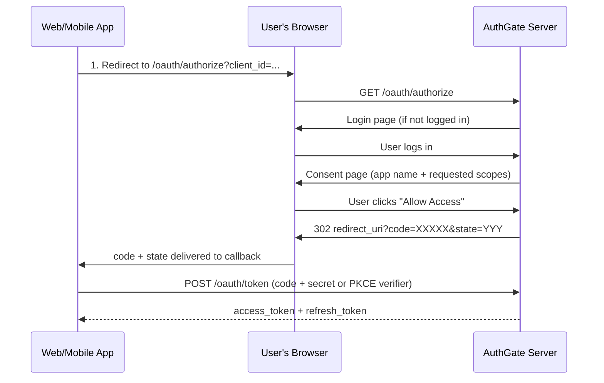

# Authorization Code Flow Guide

AuthGate supports three OAuth 2.0 grant types. This guide covers the **Authorization Code Flow** (RFC 6749 §4.1) with PKCE (RFC 7636), suitable for web apps that can perform browser redirects.

## Table of Contents

- [Authorization Code Flow Guide](#authorization-code-flow-guide)
  - [Table of Contents](#table-of-contents)
  - [Which Flow Should I Use?](#which-flow-should-i-use)
  - [Enabling Authorization Code Flow](#enabling-authorization-code-flow)
    - [Step 1 — Create or Edit an OAuth Client](#step-1--create-or-edit-an-oauth-client)
    - [Step 2 — Note Your Credentials](#step-2--note-your-credentials)
  - [How It Works](#how-it-works)
  - [PKCE (Required for Public Clients)](#pkce-required-for-public-clients)
    - [Generate Code Verifier and Challenge](#generate-code-verifier-and-challenge)
  - [API Reference](#api-reference)
    - [1. Redirect to Authorization Page](#1-redirect-to-authorization-page)
    - [2. Exchange Code for Tokens](#2-exchange-code-for-tokens)
  - [Example CLI Clients](#example-cli-clients)
    - [`go-authgate/oauth-cli` — pure browser flow](#go-authgateoauth-cli--pure-browser-flow)
    - [`go-authgate/cli` — auto-detect environment](#go-authgatecli--auto-detect-environment)
  - [User Consent Management](#user-consent-management)
    - [View Authorized Apps](#view-authorized-apps)
    - [Revoke Access for an App](#revoke-access-for-an-app)
  - [Admin Management](#admin-management)
    - [View All Authorized Users for a Client](#view-all-authorized-users-for-a-client)
    - [Revoke All User Tokens (Force Re-authentication)](#revoke-all-user-tokens-force-re-authentication)
  - [Environment Variables](#environment-variables)
  - [Error Reference](#error-reference)

---

## Which Flow Should I Use?

| Scenario                                   | Recommended Flow                                                           |
| ------------------------------------------ | -------------------------------------------------------------------------- |
| CLI tools, IoT devices, TV apps            | **Device Code Flow** (RFC 8628)                                            |
| Web apps with a server-side backend        | **Authorization Code Flow** (confidential client)                          |
| Single-page apps (SPA), mobile apps        | **Authorization Code Flow + PKCE** (public client)                         |
| Microservices / server-to-server (no user) | **[Client Credentials Grant](CLIENT_CREDENTIALS_FLOW.md)** (RFC 6749 §4.4) |

---

## Enabling Authorization Code Flow

### Step 1 — Create or Edit an OAuth Client

Navigate to **Admin → OAuth Clients → Create New Client** (or edit an existing one).

**Required fields:**

| Field             | Description                                                                                                   |
| ----------------- | ------------------------------------------------------------------------------------------------------------- |
| **Client Type**   | `Confidential` for server-side apps (has a secret). `Public` for SPAs/mobile (uses PKCE instead of a secret). |
| **Grant Types**   | Check **Authorization Code Flow (RFC 6749)**                                                                  |
| **Redirect URIs** | Comma-separated list of allowed callback URLs. Must be an exact match (no wildcards).                         |

**Example redirect URIs:**

```
https://app.example.com/callback
http://localhost:3000/callback
myapp://oauth/callback
```

> **Security note:** For public clients, redirect URIs are the primary security boundary. Register only the exact URIs your app uses.

### Step 2 — Note Your Credentials

After creating a **confidential** client, copy the `client_id` and `client_secret` shown once on the confirmation page.

For **public** clients, only `client_id` is needed (no secret).

---

## How It Works



**Consent caching:** If `CONSENT_REMEMBER=true` (default) and the user has already consented to the same scopes, the consent page is skipped on subsequent authorizations.

---

## PKCE (Required for Public Clients)

PKCE (Proof Key for Code Exchange, RFC 7636) protects public clients against authorization code interception. It replaces the client secret with a cryptographic proof.

### Generate Code Verifier and Challenge

```bash
# Generate random 32-byte verifier (must be 43–128 chars)
CODE_VERIFIER=$(openssl rand -base64 32 | tr -d '=+/' | head -c 43)

# Compute S256 challenge
CODE_CHALLENGE=$(echo -n "$CODE_VERIFIER" | openssl dgst -sha256 -binary | openssl base64 | tr '+/' '-_' | tr -d '=')

echo "verifier:  $CODE_VERIFIER"
echo "challenge: $CODE_CHALLENGE"
```

**In Go:**

```go
import (
    "crypto/rand"
    "crypto/sha256"
    "encoding/base64"
)

// Generate verifier
b := make([]byte, 32)
rand.Read(b)
verifier := base64.RawURLEncoding.EncodeToString(b)

// Compute S256 challenge
sum := sha256.Sum256([]byte(verifier))
challenge := base64.RawURLEncoding.EncodeToString(sum[:])
```

---

## API Reference

### 1. Redirect to Authorization Page

```
GET /oauth/authorize
```

The user's browser is redirected to this URL to begin the authorization flow.

**Query Parameters:**

| Parameter               | Required          | Description                                                            |
| ----------------------- | ----------------- | ---------------------------------------------------------------------- |
| `client_id`             | ✅                | Your OAuth client ID (UUID)                                            |
| `redirect_uri`          | ✅                | Must exactly match a registered Redirect URI                           |
| `response_type`         | ✅                | Must be `code`                                                         |
| `scope`                 | ○                 | Space-separated scopes. Defaults to all scopes allowed for the client. |
| `state`                 | Recommended       | Random string to prevent CSRF. Returned unchanged in the redirect.     |
| `code_challenge`        | Public clients ✅ | Base64url(SHA256(code_verifier))                                       |
| `code_challenge_method` | Public clients ✅ | Must be `S256`                                                         |

**Example (confidential client):**

```
GET /oauth/authorize?
  client_id=550e8400-e29b-41d4-a716-446655440000
  &redirect_uri=https%3A%2F%2Fapp.example.com%2Fcallback
  &response_type=code
  &scope=read%20write
  &state=abc123xyz
```

**Example (public client with PKCE):**

```
GET /oauth/authorize?
  client_id=550e8400-e29b-41d4-a716-446655440000
  &redirect_uri=https%3A%2F%2Fapp.example.com%2Fcallback
  &response_type=code
  &scope=read
  &state=abc123xyz
  &code_challenge=E9Melhoa2OwvFrEMTJguCHaoeK1t8URWbuGJSstw-cM
  &code_challenge_method=S256
```

**Success redirect (to your app):**

```
https://app.example.com/callback?code=a1b2c3d4...&state=abc123xyz
```

**Error redirect:**

```
https://app.example.com/callback?error=access_denied&state=abc123xyz
```

---

### 2. Exchange Code for Tokens

```
POST /oauth/token
Content-Type: application/x-www-form-urlencoded
```

Exchange the authorization code for access and refresh tokens. The code is **single-use** and expires in `AUTH_CODE_EXPIRATION` (default: 10 minutes).

**Request Parameters:**

| Parameter       | Required        | Description                                                  |
| --------------- | --------------- | ------------------------------------------------------------ |
| `grant_type`    | ✅              | `authorization_code`                                         |
| `code`          | ✅              | Authorization code received in the redirect                  |
| `redirect_uri`  | ✅              | Must exactly match the redirect_uri used in step 1           |
| `client_id`     | ✅              | Your OAuth client ID                                         |
| `client_secret` | Confidential ✅ | Your client secret                                           |
| `code_verifier` | Public ✅       | The original random string used to generate `code_challenge` |

**Example (confidential client):**

```bash
curl -X POST https://auth.example.com/oauth/token \
  -d grant_type=authorization_code \
  -d code=a1b2c3d4... \
  -d redirect_uri=https://app.example.com/callback \
  -d client_id=550e8400-... \
  -d client_secret=your-client-secret
```

**Example (public client with PKCE):**

```bash
curl -X POST https://auth.example.com/oauth/token \
  -d grant_type=authorization_code \
  -d code=a1b2c3d4... \
  -d redirect_uri=https://app.example.com/callback \
  -d client_id=550e8400-... \
  -d code_verifier=your-original-verifier
```

**Success Response (200 OK):**

```json
{
  "access_token": "eyJhbGciOiJIUzI1NiIsInR5cCI6IkpXVCJ9...",
  "refresh_token": "eyJhbGciOiJIUzI1NiIsInR5cCI6IkpXVCJ9...",
  "token_type": "Bearer",
  "expires_in": 3600,
  "scope": "read write"
}
```

**Refreshing tokens** works identically to the device flow — use `grant_type=refresh_token`:

```bash
curl -X POST https://auth.example.com/oauth/token \
  -d grant_type=refresh_token \
  -d refresh_token=eyJ... \
  -d client_id=550e8400-...
```

---

## Example CLI Clients

Two CLI examples demonstrate Authorization Code Flow. Choose the one that fits your use case.

### `go-authgate/oauth-cli` — pure browser flow

[github.com/go-authgate/oauth-cli](https://github.com/go-authgate/oauth-cli) always uses the browser, suitable for desktop apps and scripts that run on a machine with a display.

```bash
git clone https://github.com/go-authgate/oauth-cli
cd oauth-cli
cp .env.example .env      # Fill in CLIENT_ID (and CLIENT_SECRET for confidential clients)
go run .
```

**What the example demonstrates:**

1. Generates a cryptographically random `state` (CSRF protection) and PKCE `code_verifier` / `code_challenge` on every run
2. Opens the authorization URL in your default browser
3. Starts a local HTTP server on `localhost:8888/callback` to receive the redirect
4. Validates the returned `state` and exchanges the `code` for tokens
5. Saves tokens to `.authgate-tokens.json` (supports multiple client IDs in one file)
6. On subsequent runs, reuses valid tokens or refreshes them silently

**Supported client modes:**

| Mode                              | `CLIENT_SECRET` | PKCE                         |
| --------------------------------- | --------------- | ---------------------------- |
| Public client (SPA, mobile, CLI)  | Leave empty     | Always used                  |
| Confidential client (server-side) | Set the secret  | Also used (defence-in-depth) |

See [go-authgate/oauth-cli](https://github.com/go-authgate/oauth-cli) for full configuration options.

### `go-authgate/cli` — auto-detect environment

[github.com/go-authgate/cli](https://github.com/go-authgate/cli) automatically selects the flow based on the environment: browser flow on a local machine, Device Code Flow over SSH or in headless environments. This is the recommended pattern for CLIs that must run in both contexts.

---

## User Consent Management

Users can view and revoke the applications they have authorized at `/account/authorizations`.

### View Authorized Apps

```
GET /account/authorizations
```

Displays a list of all applications the logged-in user has granted access to, with the authorized scopes and grant date.

### Revoke Access for an App

Click **Revoke Access** next to any application in the list. This immediately:

1. Invalidates the consent record (user will see the consent page again next time)
2. Revokes all active access and refresh tokens issued to that application for this user

---

## Admin Management

### View All Authorized Users for a Client

```
GET /admin/clients/:client_id/authorizations
```

Accessible from **Admin → OAuth Clients → [Client Name] → 👥 Authorized Users**.

Shows every user who has granted consent to this application, with their username, email, approved scopes, and grant timestamp.

### Revoke All User Tokens (Force Re-authentication)

```
POST /admin/clients/:client_id/revoke-all
```

Available in the **Danger Zone** section of the client detail page. This action:

1. Revokes every active access and refresh token for this client
2. Clears all user consent records (every user will see the consent page again)

Use this when rotating client secrets, responding to security incidents, or forcing all users to re-acknowledge updated permissions.

> **Audit log:** This action is logged at `CRITICAL` severity under event type `CLIENT_TOKENS_REVOKED_ALL`.

---

## Environment Variables

| Variable               | Default | Description                                                                                                             |
| ---------------------- | ------- | ----------------------------------------------------------------------------------------------------------------------- |
| `AUTH_CODE_EXPIRATION` | `10m`   | How long an authorization code is valid. RFC 6749 recommends ≤ 10 minutes.                                              |
| `PKCE_REQUIRED`        | `false` | When `true`, all clients (including confidential) must use PKCE.                                                        |
| `CONSENT_REMEMBER`     | `true`  | Skip the consent page if the user has already approved the same scopes. Set to `false` to always show the consent page. |

---

## Error Reference

Errors are returned as redirects to your `redirect_uri` with the following query parameters:

| `error`                     | Cause                                                                                 |
| --------------------------- | ------------------------------------------------------------------------------------- |
| `unauthorized_client`       | Unknown `client_id`, inactive client, or Auth Code Flow not enabled                   |
| `unsupported_response_type` | `response_type` is not `code`                                                         |
| `invalid_scope`             | Requested scope is not within the client's allowed scopes                             |
| `invalid_request`           | Missing required parameter, invalid `redirect_uri`, or PKCE required but not provided |
| `access_denied`             | User clicked **Deny** on the consent page                                             |

Token endpoint errors are returned as JSON (HTTP 400):

| `error`                  | Cause                                                                             |
| ------------------------ | --------------------------------------------------------------------------------- |
| `invalid_grant`          | Code expired, already used, wrong `redirect_uri`, or invalid PKCE `code_verifier` |
| `unauthorized_client`    | Wrong or missing `client_secret`                                                  |
| `unsupported_grant_type` | `grant_type` is not supported                                                     |
