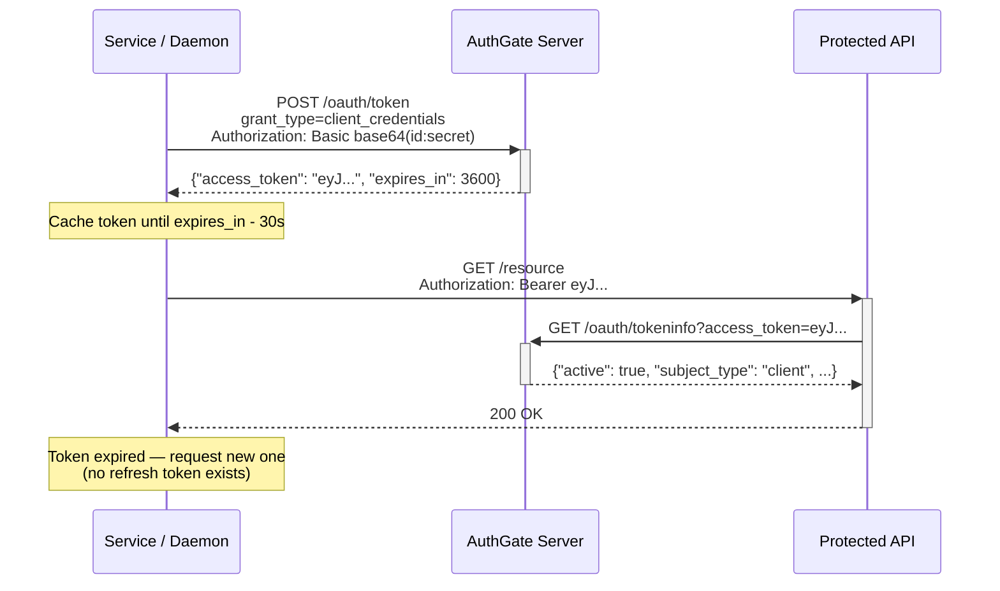

# Client Credentials Flow Guide

AuthGate supports the **Client Credentials Grant** (RFC 6749 §4.4) for machine-to-machine (M2M) authentication. This guide covers setup, usage, and security recommendations for service-to-service scenarios where no user is involved.

## Table of Contents

- [Client Credentials Flow Guide](#client-credentials-flow-guide)
  - [Table of Contents](#table-of-contents)
  - [Which Flow Should I Use?](#which-flow-should-i-use)
  - [Enabling Client Credentials Flow](#enabling-client-credentials-flow)
    - [Step 1 — Create a Confidential OAuth Client](#step-1--create-a-confidential-oauth-client)
    - [Step 2 — Note Your Credentials](#step-2--note-your-credentials)
  - [How It Works](#how-it-works)
  - [API Reference](#api-reference)
    - [Request an Access Token](#request-an-access-token)
    - [Token Response](#token-response)
    - [Verify a Token](#verify-a-token)
  - [Scope Handling](#scope-handling)
  - [Example Implementations](#example-implementations)
    - [curl](#curl)
    - [Go](#go)
    - [Python](#python)
    - [JavaScript / Node.js](#javascript--nodejs)
  - [Token Lifecycle](#token-lifecycle)
  - [Admin Management](#admin-management)
  - [Environment Variables](#environment-variables)
  - [Error Reference](#error-reference)
  - [Security Best Practices](#security-best-practices)

---

## Which Flow Should I Use?

| Scenario                                        | Recommended Flow                                   |
| ----------------------------------------------- | -------------------------------------------------- |
| CLI tools, IoT devices, TV apps                 | **Device Code Flow** (RFC 8628)                    |
| Web apps with a server-side backend             | **Authorization Code Flow** (confidential client)  |
| Single-page apps (SPA), mobile apps             | **Authorization Code Flow + PKCE** (public client) |
| Microservices, daemons, CI/CD pipelines         | **Client Credentials Grant** (RFC 6749 §4.4)       |
| Server calling another server without user data | **Client Credentials Grant** (RFC 6749 §4.4)       |

Use Client Credentials when:

- There is **no user** involved (pure service identity)
- The service can **securely store** a `client_secret` (server-side only)
- The operation does not require user-scoped data (no `openid`, `profile`, `email` scopes)

---

## Enabling Client Credentials Flow

### Step 1 — Create a Confidential OAuth Client

Navigate to **Admin → OAuth Clients → Create New Client** (or edit an existing one).

**Required settings:**

| Field             | Value                                                  |
| ----------------- | ------------------------------------------------------ |
| **Client Type**   | `Confidential` (public clients cannot use this flow)   |
| **Grant Types**   | Check **Client Credentials Flow (RFC 6749 §4.4)**      |
| **Scopes**        | Space-separated list of scopes the service may request |
| **Redirect URIs** | Not required for this flow (leave empty)               |

> **Note:** If you also enable Device Flow or Authorization Code Flow on the same client, they operate independently. The `client_credentials` grant is completely separate from user-delegated flows.

### Step 2 — Note Your Credentials

After saving, the admin UI shows:

- **Client ID** — public identifier (safe to log)
- **Client Secret** — shown once at creation time; store it in a secrets manager

To rotate the secret at any time: **Admin → OAuth Clients → [client] → Regenerate Secret**

---

## How It Works



Key properties:

- The token's `sub` / `user_id` is set to `"client:<clientID>"` to identify it as an M2M token
- `/oauth/tokeninfo` returns `"subject_type": "client"` for these tokens (vs `"subject_type": "user"` for user-delegated tokens)
- **No refresh token is issued** — the client simply requests a new access token when the old one expires

---

## API Reference

### Request an Access Token

```
POST /oauth/token
```

**Authentication** (choose one):

_Preferred — HTTP Basic Auth (RFC 6749 §2.3.1):_

```http
POST /oauth/token HTTP/1.1
Authorization: Basic base64(client_id:client_secret)
Content-Type: application/x-www-form-urlencoded

grant_type=client_credentials&scope=read
```

_Alternative — form body:_

```http
POST /oauth/token HTTP/1.1
Content-Type: application/x-www-form-urlencoded

grant_type=client_credentials&client_id=<id>&client_secret=<secret>&scope=read
```

**Parameters:**

| Parameter       | Required | Description                                                               |
| --------------- | -------- | ------------------------------------------------------------------------- |
| `grant_type`    | Yes      | Must be `client_credentials`                                              |
| `scope`         | No       | Space-separated list of scopes. Defaults to all client scopes if omitted. |
| `client_id`     | Cond.    | Required if not using HTTP Basic Auth                                     |
| `client_secret` | Cond.    | Required if not using HTTP Basic Auth                                     |

### Token Response

```json
{
  "access_token": "eyJhbGciOiJIUzI1NiIsInR5cCI6IkpXVCJ9...",
  "token_type": "Bearer",
  "expires_in": 3600,
  "scope": "read"
}
```

> `refresh_token` is **not** included per RFC 6749 §4.4.3.

### Verify a Token

Resource servers can verify tokens using the tokeninfo endpoint:

```http
GET /oauth/tokeninfo?access_token=eyJhbGc...
```

Response for a client credentials token:

```json
{
  "active": true,
  "user_id": "client:a1b2c3d4-...",
  "client_id": "a1b2c3d4-...",
  "scope": "read",
  "exp": 1736899200,
  "iss": "https://auth.example.com",
  "subject_type": "client"
}
```

Use `"subject_type": "client"` to distinguish M2M tokens from user-delegated tokens in your API logic.

---

## Scope Handling

| Requested scope          | Behaviour                                     |
| ------------------------ | --------------------------------------------- |
| Empty (`""` or omitted)  | Granted all scopes registered on the client   |
| Subset (e.g. `"read"`)   | Granted only the requested scopes             |
| Superset / unknown scope | `400 invalid_scope`                           |
| `openid`                 | `400 invalid_scope` (user-centric OIDC scope) |
| `offline_access`         | `400 invalid_scope` (requires user consent)   |

---

## Example Implementations

### curl

```bash
# HTTP Basic Auth (recommended)
curl -s -X POST https://auth.example.com/oauth/token \
  -u "$CLIENT_ID:$CLIENT_SECRET" \
  -d "grant_type=client_credentials&scope=read" \
  | jq .

# Form body alternative
curl -s -X POST https://auth.example.com/oauth/token \
  -d "grant_type=client_credentials" \
  -d "client_id=$CLIENT_ID" \
  -d "client_secret=$CLIENT_SECRET" \
  -d "scope=read"
```

### Go

```go
package main

import (
    "encoding/json"
    "fmt"
    "net/http"
    "net/url"
    "strings"
    "sync"
    "time"
)

type M2MClient struct {
    authServer   string
    clientID     string
    clientSecret string
    scope        string

    mu        sync.Mutex
    token     string
    expiresAt time.Time
}

func NewM2MClient(authServer, clientID, clientSecret, scope string) *M2MClient {
    return &M2MClient{
        authServer:   authServer,
        clientID:     clientID,
        clientSecret: clientSecret,
        scope:        scope,
    }
}

func (c *M2MClient) Token() (string, error) {
    c.mu.Lock()
    defer c.mu.Unlock()

    if c.token != "" && time.Now().Add(30*time.Second).Before(c.expiresAt) {
        return c.token, nil
    }

    body := url.Values{
        "grant_type": {"client_credentials"},
        "scope":      {c.scope},
    }

    req, _ := http.NewRequest("POST", c.authServer+"/oauth/token",
        strings.NewReader(body.Encode()))
    req.Header.Set("Content-Type", "application/x-www-form-urlencoded")
    req.SetBasicAuth(c.clientID, c.clientSecret)

    resp, err := http.DefaultClient.Do(req)
    if err != nil {
        return "", err
    }
    defer resp.Body.Close()

    var result struct {
        AccessToken string `json:"access_token"`
        ExpiresIn   int    `json:"expires_in"`
    }
    if err := json.NewDecoder(resp.Body).Decode(&result); err != nil {
        return "", err
    }

    c.token = result.AccessToken
    c.expiresAt = time.Now().Add(time.Duration(result.ExpiresIn) * time.Second)
    return c.token, nil
}

func (c *M2MClient) AuthHeader() (string, error) {
    token, err := c.Token()
    if err != nil {
        return "", err
    }
    return "Bearer " + token, nil
}
```

### Python

```python
import requests
import time
import threading

class M2MTokenClient:
    def __init__(self, auth_server, client_id, client_secret, scope=""):
        self.auth_server = auth_server
        self.client_id = client_id
        self.client_secret = client_secret
        self.scope = scope
        self._token = None
        self._expires_at = 0
        self._lock = threading.Lock()

    def get_token(self) -> str:
        with self._lock:
            if self._token and time.time() + 30 < self._expires_at:
                return self._token

            response = requests.post(
                f"{self.auth_server}/oauth/token",
                data={"grant_type": "client_credentials", "scope": self.scope},
                auth=(self.client_id, self.client_secret),
            )
            response.raise_for_status()
            data = response.json()

            self._token = data["access_token"]
            self._expires_at = time.time() + data["expires_in"]
            return self._token

    def session(self) -> requests.Session:
        """Return a requests.Session pre-configured with a valid Bearer token."""
        s = requests.Session()
        s.headers["Authorization"] = f"Bearer {self.get_token()}"
        return s
```

### JavaScript / Node.js

```javascript
const https = require("https");

class M2MClient {
  constructor(authServer, clientId, clientSecret, scope = "") {
    this.authServer = authServer;
    this.clientId = clientId;
    this.clientSecret = clientSecret;
    this.scope = scope;
    this._token = null;
    this._expiresAt = 0;
  }

  async getToken() {
    if (this._token && Date.now() / 1000 + 30 < this._expiresAt) {
      return this._token;
    }

    const credentials = Buffer.from(
      `${this.clientId}:${this.clientSecret}`,
    ).toString("base64");

    const response = await fetch(`${this.authServer}/oauth/token`, {
      method: "POST",
      headers: {
        "Content-Type": "application/x-www-form-urlencoded",
        Authorization: `Basic ${credentials}`,
      },
      body: new URLSearchParams({
        grant_type: "client_credentials",
        scope: this.scope,
      }),
    });

    if (!response.ok) {
      throw new Error(`Token request failed: ${response.status}`);
    }

    const data = await response.json();
    this._token = data.access_token;
    this._expiresAt = Date.now() / 1000 + data.expires_in;
    return this._token;
  }

  async authHeader() {
    return `Bearer ${await this.getToken()}`;
  }
}
```

---

## Token Lifecycle

```
Client authenticates → Access token issued (default TTL: 1h)
       │
       ▼
Token cached in memory with 30s expiry buffer
       │
       ▼
Token used for API calls until (expires_in - 30s)
       │
       ▼
Fetch new token (no refresh token — re-authenticate directly)
```

Unlike Device Code Flow and Authorization Code Flow, **no refresh token is issued**. When the access token expires, the service simply repeats the `POST /oauth/token` request. This simplifies implementation and avoids refresh token management.

Token TTL is configured server-side via `CLIENT_CREDENTIALS_TOKEN_EXPIRATION` (default: 1h). Per [RFC 9700](https://datatracker.ietf.org/doc/html/rfc9700) recommendations, keep it short for M2M tokens.

---

## Admin Management

**View active M2M tokens:**

Navigate to **Admin → OAuth Clients → [client] → View Authorizations** — M2M tokens appear here with `user_id` prefixed `client:`.

**Revoke all tokens for a client:**

**Admin → OAuth Clients → [client] → Revoke All** — immediately invalidates all active access tokens.

**Audit trail:**

**Admin → Audit Logs** — filter by event type `CLIENT_CREDENTIALS_TOKEN_ISSUED` to see all M2M token issuance events, including client IP and timestamp.

---

## Environment Variables

| Variable                              | Default | Description                                                                                                                      |
| ------------------------------------- | ------- | -------------------------------------------------------------------------------------------------------------------------------- |
| `CLIENT_CREDENTIALS_TOKEN_EXPIRATION` | `1h`    | Access token lifetime for `client_credentials` grant. Keep short — no rotation mechanism exists since there is no refresh token. |

---

## Error Reference

| HTTP Status | `error`                  | Cause                                                                                                                          |
| ----------- | ------------------------ | ------------------------------------------------------------------------------------------------------------------------------ |
| 400         | `unsupported_grant_type` | `grant_type` is not `client_credentials`                                                                                       |
| 400         | `unauthorized_client`    | Client is public, or `EnableClientCredentialsFlow` is false                                                                    |
| 400         | `invalid_scope`          | Requested scope exceeds client's registered scopes, or `openid`/`offline_access` was requested                                 |
| 401         | `invalid_client`         | Missing credentials, wrong `client_id`, or wrong `client_secret`. Response includes `WWW-Authenticate: Basic realm="authgate"` |

---

## Security Best Practices

1. **Store secrets securely** — use environment variables or a secrets manager (Vault, AWS Secrets Manager, Kubernetes Secrets). Never commit `client_secret` to source control.

2. **Keep TTL short** — the default 1h is already conservative. For highly sensitive services, consider reducing `CLIENT_CREDENTIALS_TOKEN_EXPIRATION` further (e.g., `15m`).

3. **Restrict scopes** — register only the scopes the service actually needs on the client. Use per-request scope restriction to further limit each token.

4. **Rotate secrets periodically** — use **Admin → Regenerate Secret** on a regular schedule. Update the new secret in your secrets manager; old tokens remain valid until they expire.

5. **Use HTTPS** — the `client_secret` is sent over the wire on every token request. Always use TLS in production.

6. **Monitor audit logs** — alert on unexpected `CLIENT_CREDENTIALS_TOKEN_ISSUED` events from unknown IPs or at unusual hours.

7. **Separate clients per service** — give each microservice its own OAuth client. This enables independent revocation and per-service scope restriction.

---

**Next Steps:**

- [Configuration Guide](CONFIGURATION.md) — `CLIENT_CREDENTIALS_TOKEN_EXPIRATION` and other settings
- [Architecture Guide](ARCHITECTURE.md#client-credentials-architecture) — internals and token design
- [Use Cases](USE_CASES.md#machine-to-machine-m2m-authentication) — complete code examples
- [Authorization Code Flow Guide](AUTHORIZATION_CODE_FLOW.md) — user-delegated flows
