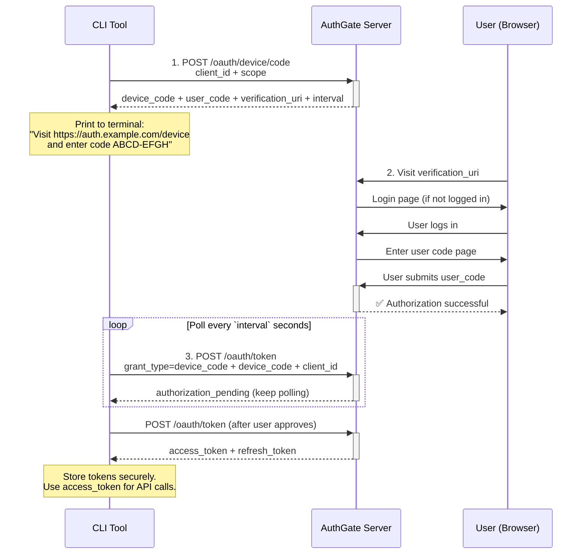

# Device Code Flow Guide

AuthGate supports the **Device Authorization Grant** (RFC 8628) for CLI tools, IoT devices, smart TVs, and any environment where a browser redirect is not practical. The user authenticates on a separate device (phone or laptop) while the CLI waits for approval.

## Table of Contents

- [Device Code Flow Guide](#device-code-flow-guide)
  - [Table of Contents](#table-of-contents)
  - [Which Flow Should I Use?](#which-flow-should-i-use)
  - [Enabling Device Code Flow](#enabling-device-code-flow)
    - [Step 1 — Create or Edit an OAuth Client](#step-1--create-or-edit-an-oauth-client)
    - [Step 2 — Note Your Client ID](#step-2--note-your-client-id)
  - [How It Works](#how-it-works)
  - [API Reference](#api-reference)
    - [1. Request a Device Code](#1-request-a-device-code)
    - [2. Display Instructions to the User](#2-display-instructions-to-the-user)
    - [3. Poll for Token](#3-poll-for-token)
    - [4. Refresh an Expired Access Token](#4-refresh-an-expired-access-token)
  - [Example CLI Clients](#example-cli-clients)
    - [`go-authgate/device-cli` — minimal example](#go-authgatedevice-cli--minimal-example)
    - [`go-authgate/cli` — auto-detect environment](#go-authgatecli--auto-detect-environment)
  - [Complete Go Implementation](#complete-go-implementation)
  - [Token Lifecycle](#token-lifecycle)
  - [User Session Management](#user-session-management)
  - [Admin Management](#admin-management)
  - [Environment Variables](#environment-variables)
  - [Error Reference](#error-reference)
    - [`POST /oauth/device/code` errors](#post-oauthdevicecode-errors)
    - [`POST /oauth/token` polling errors](#post-oauthtoken-polling-errors)
    - [`POST /oauth/token` refresh errors](#post-oauthtoken-refresh-errors)
  - [Security Best Practices](#security-best-practices)

---

## Which Flow Should I Use?

| Scenario                                   | Recommended Flow                                                                 |
| ------------------------------------------ | -------------------------------------------------------------------------------- |
| CLI tools, IoT devices, TV apps            | **Device Code Flow** (RFC 8628) — this guide                                     |
| Web apps with a server-side backend        | **[Authorization Code Flow](AUTHORIZATION_CODE_FLOW.md)** (confidential client)  |
| Single-page apps (SPA), mobile apps        | **[Authorization Code Flow + PKCE](AUTHORIZATION_CODE_FLOW.md)** (public client) |
| Microservices / server-to-server (no user) | **[Client Credentials Grant](CLIENT_CREDENTIALS_FLOW.md)** (RFC 6749 §4.4)       |

Use Device Code Flow when:

- The environment **has no browser** (SSH sessions, headless servers, IoT devices)
- You want to avoid a local callback server
- The tool must work both locally and over SSH (see [hybrid CLI](#go-authgatecli--auto-detect-environment))

---

## Enabling Device Code Flow

### Step 1 — Create or Edit an OAuth Client

Navigate to **Admin → OAuth Clients → Create New Client** (or edit an existing one).

**Required settings:**

| Field           | Value                                                          |
| --------------- | -------------------------------------------------------------- |
| **Client Type** | `Public` (CLI tools have no secure location to store a secret) |
| **Grant Types** | Check **Device Authorization Flow (RFC 8628)**                 |
| **Scopes**      | Space-separated list of scopes the client may request          |

> **Client type note:** Public clients use only a `client_id` — no secret is needed or issued. This is correct for CLIs: the binary may be distributed to end users, so a secret cannot be kept confidential.

### Step 2 — Note Your Client ID

After saving, copy the **Client ID** (UUID) shown on the confirmation page. This value goes into your CLI's configuration (e.g., `.env` or compiled constant).

---

## How It Works



**Key properties:**

- The CLI **never sees** the user's credentials — authentication happens entirely in the browser
- The `device_code` is a server-side secret; only the `user_code` is shown to the user
- User codes are 8 uppercase characters formatted as `XXXX-XXXX`, avoiding visually ambiguous characters (`0`, `O`, `1`, `I`, `L`)
- The `verification_uri_complete` embeds the user code in the URL for QR code use

---

## API Reference

### 1. Request a Device Code

```
POST /oauth/device/code
Content-Type: application/x-www-form-urlencoded
```

**Parameters:**

| Parameter   | Required | Description                                                     |
| ----------- | -------- | --------------------------------------------------------------- |
| `client_id` | Yes      | Your OAuth client ID (UUID)                                     |
| `scope`     | No       | Space-separated scopes. Defaults to `email profile` if omitted. |

**Example:**

```bash
curl -s -X POST https://auth.example.com/oauth/device/code \
  -d client_id=550e8400-e29b-41d4-a716-446655440000 \
  -d scope="email profile"
```

**Success Response (200 OK):**

```json
{
  "device_code": "a3f8c2e1d4b7a9f0e2c1d3b5a7f9e0d2c4b6a8f0e1d3b5a7",
  "user_code": "ABCD-EFGH",
  "verification_uri": "https://auth.example.com/device",
  "verification_uri_complete": "https://auth.example.com/device?user_code=ABCD-EFGH",
  "expires_in": 1800,
  "interval": 5
}
```

| Field                       | Description                                                                  |
| --------------------------- | ---------------------------------------------------------------------------- |
| `device_code`               | Opaque secret used by the CLI when polling. **Never show this to the user.** |
| `user_code`                 | Short human-readable code the user types in the browser.                     |
| `verification_uri`          | URL the user visits to enter the code.                                       |
| `verification_uri_complete` | URL with the code pre-filled — use this for QR codes.                        |
| `expires_in`                | Seconds until the device code expires (default: 1800 = 30 min).              |
| `interval`                  | Minimum seconds between polling requests (default: 5).                       |

---

### 2. Display Instructions to the User

Show a clear prompt before polling:

```
To sign in, visit:

  https://auth.example.com/device

And enter the code: ABCD-EFGH

Waiting for authorization...
```

Optionally, open `verification_uri_complete` automatically (if a browser is available) or display it as a QR code for TV/IoT devices.

---

### 3. Poll for Token

```
POST /oauth/token
Content-Type: application/x-www-form-urlencoded
```

**Parameters:**

| Parameter     | Required | Description                                    |
| ------------- | -------- | ---------------------------------------------- |
| `grant_type`  | Yes      | `urn:ietf:params:oauth:grant-type:device_code` |
| `device_code` | Yes      | The `device_code` from step 1                  |
| `client_id`   | Yes      | Your OAuth client ID                           |

**Example:**

```bash
curl -s -X POST https://auth.example.com/oauth/token \
  -d grant_type=urn:ietf:params:oauth:grant-type:device_code \
  -d device_code=a3f8c2e1d4b7... \
  -d client_id=550e8400-e29b-41d4-a716-446655440000
```

**Polling responses:**

| HTTP | `error`                 | Meaning                                                      | Action                                   |
| ---- | ----------------------- | ------------------------------------------------------------ | ---------------------------------------- |
| 200  | —                       | Token issued — authorization complete                        | Parse and store tokens, stop polling     |
| 400  | `authorization_pending` | User has not yet approved in the browser                     | Wait `interval` seconds, then poll again |
| 400  | `slow_down`             | Polling too fast — server is rate-limiting                   | Add 5 seconds to your current interval   |
| 400  | `expired_token`         | Device code has expired (user took longer than `expires_in`) | Restart from step 1, request a new code  |
| 400  | `access_denied`         | User explicitly denied the authorization request             | Abort and inform the user                |

**Success Response (200 OK):**

```json
{
  "access_token": "eyJhbGciOiJIUzI1NiIsInR5cCI6IkpXVCJ9...",
  "refresh_token": "eyJhbGciOiJIUzI1NiIsInR5cCI6IkpXVCJ9...",
  "token_type": "Bearer",
  "expires_in": 3600,
  "scope": "email profile"
}
```

Store `access_token` and `refresh_token` securely (e.g., OS keychain, encrypted file). Use `access_token` as `Authorization: Bearer <token>` on API requests.

---

### 4. Refresh an Expired Access Token

When the access token expires, use the refresh token to obtain a new one without requiring the user to re-authorize.

```bash
curl -s -X POST https://auth.example.com/oauth/token \
  -d grant_type=refresh_token \
  -d refresh_token=eyJhbGciOiJIUzI1NiIsInR5cCI6IkpXVCJ9... \
  -d client_id=550e8400-e29b-41d4-a716-446655440000
```

**Response:** Same shape as the initial token response — new `access_token` and (if token rotation is enabled) a new `refresh_token`.

> **Token rotation:** If the server has `ENABLE_TOKEN_ROTATION=true`, the old refresh token is invalidated after use and the response contains a new one. Always replace the stored refresh token with the latest value.

If `grant_type=refresh_token` returns `invalid_grant`, the refresh token has expired or been revoked. Re-run the full device code flow to re-authenticate.

---

## Example CLI Clients

### `go-authgate/device-cli` — minimal example

[github.com/go-authgate/device-cli](https://github.com/go-authgate/device-cli) is a minimal reference implementation that demonstrates the complete device flow:

```bash
git clone https://github.com/go-authgate/device-cli
cd device-cli
cp .env.example .env   # Add CLIENT_ID from server logs
go run main.go
```

**What the example demonstrates:**

1. Request a device code from `POST /oauth/device/code`
2. Display `verification_uri` and `user_code` to the user
3. Poll `POST /oauth/token` every `interval` seconds until authorized
4. Store the received tokens
5. Call `POST /oauth/token` with `grant_type=refresh_token` when the access token is near expiry

### `go-authgate/cli` — auto-detect environment

[github.com/go-authgate/cli](https://github.com/go-authgate/cli) automatically selects the right flow:

- **Local machine with display** → opens a browser (Authorization Code Flow + PKCE)
- **SSH session / headless** → falls back to Device Code Flow

This is the recommended pattern for CLIs that need to work in both environments.

---

## Complete Go Implementation

```go
package main

import (
    "encoding/json"
    "errors"
    "fmt"
    "net/http"
    "net/url"
    "strings"
    "time"
)

const (
    authServer = "https://auth.example.com"
    clientID   = "550e8400-e29b-41d4-a716-446655440000"
    scope      = "email profile"
)

type DeviceCodeResponse struct {
    DeviceCode              string `json:"device_code"`
    UserCode                string `json:"user_code"`
    VerificationURI         string `json:"verification_uri"`
    VerificationURIComplete string `json:"verification_uri_complete"`
    ExpiresIn               int    `json:"expires_in"`
    Interval                int    `json:"interval"`
}

type TokenResponse struct {
    AccessToken  string `json:"access_token"`
    RefreshToken string `json:"refresh_token"`
    TokenType    string `json:"token_type"`
    ExpiresIn    int    `json:"expires_in"`
    Scope        string `json:"scope"`
}

type TokenError struct {
    Error string `json:"error"`
}

var (
    ErrAuthorizationPending = errors.New("authorization_pending")
    ErrSlowDown             = errors.New("slow_down")
    ErrExpiredToken         = errors.New("expired_token")
    ErrAccessDenied         = errors.New("access_denied")
)

func requestDeviceCode() (*DeviceCodeResponse, error) {
    resp, err := http.PostForm(authServer+"/oauth/device/code", url.Values{
        "client_id": {clientID},
        "scope":     {scope},
    })
    if err != nil {
        return nil, err
    }
    defer resp.Body.Close()

    var dc DeviceCodeResponse
    if err := json.NewDecoder(resp.Body).Decode(&dc); err != nil {
        return nil, err
    }
    return &dc, nil
}

func pollToken(deviceCode string) (*TokenResponse, error) {
    resp, err := http.PostForm(authServer+"/oauth/token", url.Values{
        "grant_type":  {"urn:ietf:params:oauth:grant-type:device_code"},
        "device_code": {deviceCode},
        "client_id":   {clientID},
    })
    if err != nil {
        return nil, err
    }
    defer resp.Body.Close()

    if resp.StatusCode == http.StatusOK {
        var t TokenResponse
        if err := json.NewDecoder(resp.Body).Decode(&t); err != nil {
            return nil, err
        }
        return &t, nil
    }

    var tokenErr TokenError
    _ = json.NewDecoder(resp.Body).Decode(&tokenErr)

    switch tokenErr.Error {
    case "authorization_pending":
        return nil, ErrAuthorizationPending
    case "slow_down":
        return nil, ErrSlowDown
    case "expired_token":
        return nil, ErrExpiredToken
    case "access_denied":
        return nil, ErrAccessDenied
    default:
        return nil, fmt.Errorf("token error: %s", tokenErr.Error)
    }
}

func login() (*TokenResponse, error) {
    dc, err := requestDeviceCode()
    if err != nil {
        return nil, fmt.Errorf("failed to request device code: %w", err)
    }

    fmt.Printf("\nTo sign in, visit:\n\n  %s\n\nAnd enter the code: %s\n\nWaiting for authorization...\n\n",
        dc.VerificationURI, dc.UserCode)

    interval := time.Duration(dc.Interval) * time.Second
    deadline := time.Now().Add(time.Duration(dc.ExpiresIn) * time.Second)

    for time.Now().Before(deadline) {
        time.Sleep(interval)

        tokens, err := pollToken(dc.DeviceCode)
        if err == nil {
            return tokens, nil
        }

        switch {
        case errors.Is(err, ErrAuthorizationPending):
            // continue polling
        case errors.Is(err, ErrSlowDown):
            interval += 5 * time.Second // back off per RFC 8628 §3.5
        case errors.Is(err, ErrExpiredToken):
            return nil, fmt.Errorf("authorization timed out — please try again")
        case errors.Is(err, ErrAccessDenied):
            return nil, fmt.Errorf("authorization denied by user")
        default:
            return nil, err
        }
    }

    return nil, fmt.Errorf("authorization timed out")
}

func refreshToken(refreshTok string) (*TokenResponse, error) {
    resp, err := http.PostForm(authServer+"/oauth/token", url.Values{
        "grant_type":    {"refresh_token"},
        "refresh_token": {refreshTok},
        "client_id":     {clientID},
    })
    if err != nil {
        return nil, err
    }
    defer resp.Body.Close()

    if resp.StatusCode != http.StatusOK {
        return nil, fmt.Errorf("refresh failed: HTTP %d", resp.StatusCode)
    }

    var t TokenResponse
    if err := json.NewDecoder(resp.Body).Decode(&t); err != nil {
        return nil, err
    }
    return &t, nil
}

func main() {
    tokens, err := login()
    if err != nil {
        fmt.Println("Error:", err)
        return
    }

    fmt.Println("Logged in!")
    fmt.Println("Access token:", tokens.AccessToken[:20]+"...")
    _ = strings.HasPrefix // use tokens.AccessToken with your API client
}
```

---

## Token Lifecycle

```
CLI requests device code → user_code shown to user (expires in 30 min)
         │
         ▼
User visits browser, logs in, enters user_code
         │
         ▼
CLI polls every 5s → authorization_pending ... → access_token + refresh_token issued
         │
         ▼
access_token used for API calls (default TTL: 1h)
         │
         ▼
access_token expires → use refresh_token → new access_token (+ new refresh_token if rotation enabled)
         │
         ▼
refresh_token expires or revoked → run full device code flow again
```

**Default TTLs:**

| Token         | Default Lifetime      | Configurable via         |
| ------------- | --------------------- | ------------------------ |
| Device code   | 30 minutes            | `DEVICE_CODE_EXPIRATION` |
| Access token  | 1 hour                | `JWT_EXPIRATION`         |
| Refresh token | Inherits access token | `ENABLE_REFRESH_TOKENS`  |

---

## User Session Management

Users can review and revoke tokens granted to CLI tools at `/account/sessions`:

- See all devices/clients with active tokens
- View client name, authorization time, and last use
- Revoke a specific session or all sessions at once

Users can also manage per-app consent at `/account/authorizations`:

- See which apps have been authorized
- Revoke access for any app (invalidates all its tokens for that user)

---

## Admin Management

**View all users authorized for a client:**

Navigate to **Admin → OAuth Clients → [client] → Authorized Users**, or:

```
GET /admin/clients/:client_id/authorizations
```

**Revoke all tokens (force re-authentication):**

**Admin → OAuth Clients → [client] → Revoke All**, or:

```
POST /admin/clients/:client_id/revoke-all
```

This immediately invalidates every access and refresh token for the client, forcing all users to re-run the device flow.

> **Audit log:** This action is recorded at `CRITICAL` severity under event type `CLIENT_TOKENS_REVOKED_ALL`.

**Audit trail:**

Filter **Admin → Audit Logs** by event type:

| Event                    | Triggered when                       |
| ------------------------ | ------------------------------------ |
| `DEVICE_CODE_GENERATED`  | CLI calls `POST /oauth/device/code`  |
| `DEVICE_CODE_AUTHORIZED` | User approves in the browser         |
| `TOKEN_ISSUED`           | CLI receives access + refresh tokens |
| `TOKEN_REFRESHED`        | CLI exchanges a refresh token        |

---

## Environment Variables

| Variable                 | Default | Description                                                                                   |
| ------------------------ | ------- | --------------------------------------------------------------------------------------------- |
| `DEVICE_CODE_EXPIRATION` | `30m`   | How long the device code and user code remain valid after issuance.                           |
| `POLLING_INTERVAL`       | `5`     | Minimum seconds between polling requests. Returned as `interval` in the device code response. |
| `JWT_EXPIRATION`         | `1h`    | Lifetime of issued access tokens.                                                             |
| `ENABLE_REFRESH_TOKENS`  | `true`  | Issue a refresh token alongside the access token.                                             |
| `ENABLE_TOKEN_ROTATION`  | `false` | One-time-use refresh tokens. Each use issues a new refresh token.                             |

---

## Error Reference

### `POST /oauth/device/code` errors

| HTTP | `error`               | Cause                                                    |
| ---- | --------------------- | -------------------------------------------------------- |
| 400  | `invalid_request`     | `client_id` is missing                                   |
| 400  | `invalid_client`      | Unknown or inactive `client_id`                          |
| 400  | `unauthorized_client` | Device Authorization Flow is not enabled for this client |

### `POST /oauth/token` polling errors

| HTTP | `error`                 | Cause                                    | CLI action                          |
| ---- | ----------------------- | ---------------------------------------- | ----------------------------------- |
| 400  | `authorization_pending` | User has not yet approved                | Wait `interval` seconds, retry      |
| 400  | `slow_down`             | Requests arriving faster than `interval` | Add 5 s to interval, retry          |
| 400  | `expired_token`         | Device code expired before user approved | Restart — request a new device code |
| 400  | `access_denied`         | User denied the authorization request    | Abort and notify the user           |
| 400  | `invalid_request`       | `device_code` or `client_id` missing     | Fix the request parameters          |
| 500  | `server_error`          | Unexpected server error                  | Retry with exponential back-off     |

### `POST /oauth/token` refresh errors

| HTTP | `error`          | Cause                                           |
| ---- | ---------------- | ----------------------------------------------- |
| 400  | `invalid_grant`  | Refresh token expired, revoked, or already used |
| 400  | `invalid_scope`  | Requested scope exceeds the original grant      |
| 400  | `invalid_client` | Wrong or mismatched `client_id`                 |

---

## Security Best Practices

1. **Never expose `device_code`** — it is a server-side secret. Show only `user_code` and `verification_uri` to the user.

2. **Store tokens in the OS keychain** — use `golang.org/x/crypto/ssh/terminal` or platform-specific keychain APIs (macOS Keychain, Linux Secret Service, Windows Credential Manager) rather than plain files.

3. **Respect `interval`** — always wait at least `interval` seconds between polls. When you receive `slow_down`, add 5 seconds to your current interval and keep the increased interval for the remainder of the session.

4. **Handle `expired_token` gracefully** — show a clear message and restart the flow. Don't assume a 30-minute window is always enough.

5. **Use HTTPS** — tokens are bearer credentials. Always use TLS in production.

6. **Register only one `client_id` per application** — do not share client IDs between different tools or versions. This enables per-tool revocation and audit filtering.

7. **Check `expires_in` proactively** — refresh the access token before it expires (e.g., when less than 60 seconds remain) to avoid failed API calls mid-operation.

---

**Next Steps:**

- [Configuration Guide](CONFIGURATION.md) — `DEVICE_CODE_EXPIRATION`, `JWT_EXPIRATION`, token rotation settings
- [Use Cases](USE_CASES.md#cli-tools) — more CLI integration examples
- [Authorization Code Flow Guide](AUTHORIZATION_CODE_FLOW.md) — for apps that can open a browser
- [Architecture Guide](ARCHITECTURE.md) — internals and database schema
