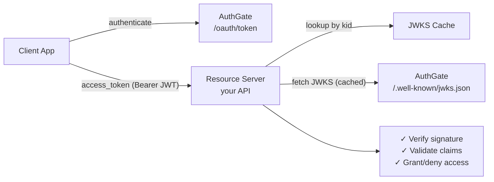
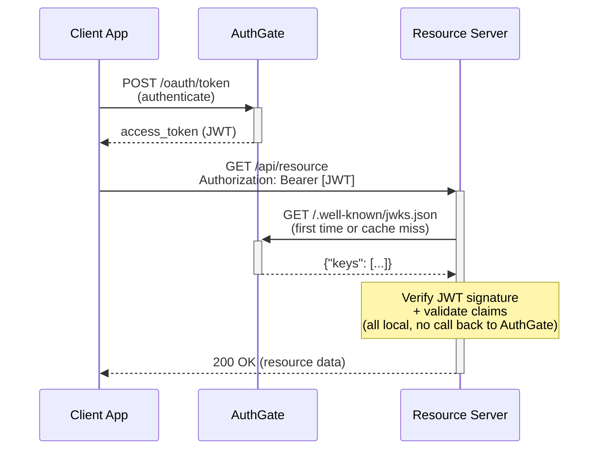

# JWT Verification Guide

This guide explains how **resource servers** (your APIs and microservices) can verify AuthGate-issued JWT tokens locally using public keys, without calling back to AuthGate on every request.

> **Important tradeoff**: Local JWT verification cannot detect server-side token revocation or status changes (revoked/disabled). Tokens remain valid until they expire. If your application requires real-time revocation enforcement, use AuthGate's `/oauth/tokeninfo` endpoint for online validation, or combine local verification with periodic introspection for a balanced approach.

## Table of Contents

- [Overview](#overview)
- [Algorithm Comparison](#algorithm-comparison)
- [How It Works](#how-it-works)
- [Configuring AuthGate](#configuring-authgate)
- [OIDC Discovery](#oidc-discovery)
- [JWKS Endpoint](#jwks-endpoint)
- [JWT Token Structure](#jwt-token-structure)
- [Verification Steps](#verification-steps)
- [Code Examples](#code-examples)
- [JWKS Caching Best Practices](#jwks-caching-best-practices)
- [Key Rotation](#key-rotation)
- [Common Pitfalls](#common-pitfalls)
- [Related Documentation](#related-documentation)

## Overview

With symmetric signing (HS256), every service that needs to verify a JWT must either share the same secret or call AuthGate's `/oauth/tokeninfo` endpoint. This creates tight coupling and additional load on AuthGate.

Asymmetric signing (RS256/ES256) solves this:

1. **AuthGate signs tokens** with a private key that only it holds
2. **AuthGate publishes the public key** via the JWKS endpoint (`/.well-known/jwks.json`)
3. **Resource servers fetch the public key once**, cache it, and verify every token locally

Benefits:

- **No shared secrets** — the private key never leaves AuthGate
- **Offline verification** — resource servers validate tokens without network calls to AuthGate
- **Reduced load** — AuthGate only handles authentication; token verification is fully distributed
- **Standard protocol** — uses JWKS (RFC 7517) and OIDC Discovery, supported by every major language and framework

## Algorithm Comparison

| Algorithm | Type       | Key Material                 | Token Size | Use Case                           |
| --------- | ---------- | ---------------------------- | ---------- | ---------------------------------- |
| `HS256`   | Symmetric  | `JWT_SECRET` (shared secret) | ~300 bytes | Simple single-service deployments  |
| `RS256`   | Asymmetric | RSA 2048-bit private key     | ~600 bytes | Wide ecosystem support, JWKS-based |
| `ES256`   | Asymmetric | ECDSA P-256 private key      | ~400 bytes | Compact tokens, modern deployments |

> **Recommendation**: Use **RS256** for maximum compatibility or **ES256** for smaller tokens. Avoid HS256 in multi-service architectures.

## How It Works



**Sequence diagram:**



## Configuring AuthGate

### Generate Keys

```bash
# RS256: Generate RSA 2048-bit private key
openssl genrsa -out rsa-private.pem 2048

# ES256: Generate ECDSA P-256 private key
openssl ecparam -genkey -name prime256v1 -noout -out ec-private.pem
```

### Set Environment Variables

```bash
# For RS256
JWT_SIGNING_ALGORITHM=RS256
JWT_PRIVATE_KEY_PATH=/path/to/rsa-private.pem
JWT_KEY_ID=                   # Optional: auto-generated from key fingerprint

# For ES256
JWT_SIGNING_ALGORITHM=ES256
JWT_PRIVATE_KEY_PATH=/path/to/ec-private.pem
JWT_KEY_ID=                   # Optional: auto-generated from key fingerprint
```

> For complete configuration details including supported PEM formats, validation rules, and key rotation, see the [Configuration Guide](CONFIGURATION.md#jwt-signing-algorithm).

## OIDC Discovery

Resource servers can automatically discover the JWKS endpoint using OIDC Discovery:

```bash
curl https://your-authgate/.well-known/openid-configuration
```

Response (relevant fields):

```json
{
  "issuer": "https://your-authgate",
  "jwks_uri": "https://your-authgate/.well-known/jwks.json",
  "id_token_signing_alg_values_supported": ["RS256"],
  "token_endpoint": "https://your-authgate/oauth/token",
  "authorization_endpoint": "https://your-authgate/oauth/authorize",
  "userinfo_endpoint": "https://your-authgate/oauth/userinfo"
}
```

> **Note**: The `jwks_uri` field is only present when AuthGate is configured with RS256 or ES256. It is omitted for HS256. The `id_token_signing_alg_values_supported` value reflects the configured `JWT_SIGNING_ALGORITHM` (e.g., `["ES256"]` when using ES256), and may be omitted if ID tokens are not supported.

## JWKS Endpoint

```bash
curl https://your-authgate/.well-known/jwks.json
```

### RS256 Response

```json
{
  "keys": [
    {
      "kty": "RSA",
      "use": "sig",
      "kid": "abc123...",
      "alg": "RS256",
      "n": "0vx7agoebGc...base64url-encoded-modulus...",
      "e": "AQAB"
    }
  ]
}
```

### ES256 Response

```json
{
  "keys": [
    {
      "kty": "EC",
      "use": "sig",
      "kid": "def456...",
      "alg": "ES256",
      "crv": "P-256",
      "x": "f83OJ3D2xF1B...base64url-encoded-x...",
      "y": "x_FEzRu9m36H...base64url-encoded-y..."
    }
  ]
}
```

### Response Headers

The JWKS endpoint includes a cache directive:

```
Cache-Control: public, max-age=3600
```

Resource servers should cache the JWKS response for up to 1 hour.

### HS256 Behavior

When AuthGate uses HS256, the JWKS endpoint returns an empty key set:

```json
{
  "keys": []
}
```

This is correct — symmetric secrets are never exposed via JWKS.

## JWT Token Structure

### Header

```json
{
  "alg": "RS256",
  "kid": "abc123...",
  "typ": "JWT"
}
```

The `kid` (Key ID) header identifies which key was used to sign the token. Use this to look up the correct key from the JWKS response.

### Payload (Claims)

```json
{
  "user_id": "user-uuid",
  "client_id": "client-uuid",
  "scope": "openid profile email",
  "type": "access",
  "exp": 1700000000,
  "iat": 1699996400,
  "iss": "https://your-authgate",
  "sub": "user-uuid",
  "jti": "unique-token-id"
}
```

| Claim       | Description                                                                                 |
| ----------- | ------------------------------------------------------------------------------------------- |
| `user_id`   | End-user identifier, or `client:<client_id>` for `client_credentials` tokens                |
| `client_id` | OAuth client that requested the token                                                       |
| `scope`     | Space-separated list of granted scopes                                                      |
| `type`      | `access` or `refresh`                                                                       |
| `exp`       | Expiration time (Unix timestamp)                                                            |
| `iat`       | Issued-at time (Unix timestamp)                                                             |
| `iss`       | Issuer URL (AuthGate's `BASE_URL`)                                                          |
| `sub`       | Subject: user UUID for user tokens, or `client:<client_id>` for `client_credentials` tokens |
| `jti`       | Unique token identifier (UUID)                                                              |

> **Note:** For access tokens issued via the `client_credentials` grant, there is no end user. Both `sub` and `user_id` are set to a synthetic machine identity (`client:<client_id>`).

## Verification Steps

1. **Decode the JWT header** (without verifying) to extract `kid` and `alg`
2. **Fetch JWKS** from `/.well-known/jwks.json` (use cached response if available)
3. **Find the key** in the `keys` array whose `kid` matches the JWT header's `kid`
4. **Verify the signature** using the matched public key and the algorithm from the header
5. **Validate standard claims**:
   - `exp` — token is not expired
   - `iss` — matches your expected AuthGate URL
   - `type` — is `access` (not `refresh`)
   - `aud` — when `JWT_AUDIENCE` is configured on AuthGate, verify the value matches your service's expected audience (see [Custom Claims](#custom-claims))
6. **Check authorization** — verify `scope` and `client_id` match your requirements

## Custom Claims

In addition to the standard JWT claims, AuthGate may optionally populate the standard `aud` claim and may also emit two custom claims (`project`, `service_account`) that gateways and resource servers can use for routing and per-request authorization. All three are **optional** — they only appear when configured.

| Claim             | Classification        | Type                  | Source                                              | When present                                                |
| ----------------- | --------------------- | --------------------- | --------------------------------------------------- | ----------------------------------------------------------- |
| `aud`             | Standard JWT claim    | `string` or `[]string` | `JWT_AUDIENCE` env var (deployment-wide)            | When `JWT_AUDIENCE` is non-empty                            |
| `project`         | Custom AuthGate claim | `string`              | `OAuthApplication.Project` (per-client metadata)    | When the client has a non-empty `Project` value             |
| `service_account` | Custom AuthGate claim | `string`              | `OAuthApplication.ServiceAccount` (per-client)      | When the client has a non-empty `ServiceAccount` value      |

`aud` is the standard registered JWT claim defined by RFC 7519 §4.1.3. It is a single string when `JWT_AUDIENCE` has one entry and a `[]string` when it has multiple — verifiers must handle both shapes. Many JWT libraries (e.g. `golang-jwt/jwt`) normalize this for you via their `WithAudience` option.

`project` and `service_account` are AuthGate-specific custom claims that reflect the OAuth client's current admin- or owner-configured metadata at issuance time. On refresh, AuthGate re-resolves these values from the database, so changes propagate to the next refreshed access token rather than being pinned to the values present when the original refresh token was issued.

### Trust model

`project` and `service_account` are **set by the OAuth client owner** (admin or end-user, depending on your deployment). Treat them as untrusted assertions: a successful JWT signature only proves AuthGate emitted the token, not that the asserted project/service account ownership has been independently verified.

If your downstream service uses these claims to make access decisions:

- Always verify the JWT signature first (everything below assumes a valid signature).
- Apply your own access policies (e.g. an allowlist of `(client_id, project)` pairs) on top of the claim values.
- Do not assume `service_account: "sa-prod@example.com"` proves anything about the operator behind the token; it only proves the OAuth client metadata was set to that value.

For deployments that share AuthGate across multiple teams, consider configuring per-user whitelists outside this PR's scope, or restricting `Project` / `ServiceAccount` editing to admins only via your deployment process.

ID tokens are **not** affected by this feature — their `aud` remains the OIDC-mandated `client_id` per OIDC Core 1.0.

## Code Examples

### Go

Using [`github.com/MicahParks/keyfunc/v3`](https://github.com/MicahParks/keyfunc) for automatic JWKS fetching and caching:

```go
package main

import (
  "fmt"
  "log"
  "net/http"
  "strings"

  "github.com/MicahParks/keyfunc/v3"
  "github.com/golang-jwt/jwt/v5"
)

func main() {
  jwksURL := "https://your-authgate/.well-known/jwks.json"

  // Create a keyfunc that auto-refreshes JWKS every hour
  k, err := keyfunc.NewDefault([]string{jwksURL})
  if err != nil {
    log.Fatalf("Failed to create JWKS keyfunc: %v", err)
  }

  http.HandleFunc("/api/resource", func(w http.ResponseWriter, r *http.Request) {
    // Extract Bearer token
    auth := r.Header.Get("Authorization")
    if !strings.HasPrefix(auth, "Bearer ") {
      http.Error(w, "Missing Bearer token", http.StatusUnauthorized)
      return
    }
    tokenString := strings.TrimPrefix(auth, "Bearer ")

    // Parse and verify the JWT
    token, err := jwt.Parse(tokenString, k.Keyfunc,
      jwt.WithIssuer("https://your-authgate"),
      jwt.WithExpirationRequired(),
      jwt.WithValidMethods([]string{"RS256", "ES256"}),
    )
    if err != nil {
      http.Error(w, fmt.Sprintf("Invalid token: %v", err), http.StatusUnauthorized)
      return
    }

    claims, ok := token.Claims.(jwt.MapClaims)
    if !ok {
      http.Error(w, "Invalid token claims", http.StatusUnauthorized)
      return
    }

    // Check token type
    tokenType, ok := claims["type"].(string)
    if !ok || tokenType != "access" {
      http.Error(w, "Invalid token type", http.StatusUnauthorized)
      return
    }

    // Check scopes
    scopeStr, ok := claims["scope"].(string)
    if !ok || scopeStr == "" {
      http.Error(w, "Insufficient scope", http.StatusForbidden)
      return
    }
    scopes := strings.Fields(scopeStr)
    if !contains(scopes, "read") {
      http.Error(w, "Insufficient scope", http.StatusForbidden)
      return
    }

    // For user tokens, user_id is a UUID; for client_credentials, it is "client:<client_id>"
    subject, ok := claims["sub"].(string)
    if !ok || subject == "" {
      http.Error(w, "Invalid token claims", http.StatusUnauthorized)
      return
    }
    fmt.Fprintf(w, "Hello, %s!", subject)
  })

  log.Fatal(http.ListenAndServe(":8081", nil))
}

func contains(ss []string, s string) bool {
  for _, v := range ss {
    if v == s {
      return true
    }
  }
  return false
}
```

### Python

Using [`PyJWT`](https://pyjwt.readthedocs.io/) with built-in JWKS client:

```python
import jwt
from jwt import PyJWKClient
from flask import Flask, request, jsonify

app = Flask(__name__)

AUTHGATE_URL = "https://your-authgate"
JWKS_URL = f"{AUTHGATE_URL}/.well-known/jwks.json"

# PyJWKClient caches JWKS keys automatically
jwks_client = PyJWKClient(JWKS_URL, cache_keys=True, lifespan=3600)

@app.route("/api/resource")
def protected_resource():
    # Extract Bearer token
    auth = request.headers.get("Authorization", "")
    if not auth.startswith("Bearer "):
        return jsonify({"error": "Missing Bearer token"}), 401

    token = auth.removeprefix("Bearer ")

    try:
        # Fetch the signing key by kid
        signing_key = jwks_client.get_signing_key_from_jwt(token)

        # Decode and verify the JWT
        payload = jwt.decode(
            token,
            signing_key.key,
            algorithms=["RS256", "ES256"],
            issuer=AUTHGATE_URL,
            options={"require": ["exp", "iss", "sub"]},
        )
    except jwt.InvalidTokenError as e:
        return jsonify({"error": f"Invalid token: {e}"}), 401

    # Check token type
    if payload.get("type") != "access":
        return jsonify({"error": "Invalid token type"}), 401

    # Check scopes
    scopes = payload.get("scope", "").split()
    if "read" not in scopes:
        return jsonify({"error": "Insufficient scope"}), 403

    return jsonify({"message": f"Hello, user {payload['user_id']}!"})
```

### Node.js

Using [`jose`](https://github.com/panva/jose) (zero-dependency, Web Crypto API):

```javascript
import { createRemoteJWKSet, jwtVerify } from "jose";
import { createServer } from "node:http";

const AUTHGATE_URL = "https://your-authgate";
const JWKS = createRemoteJWKSet(
  new URL(`${AUTHGATE_URL}/.well-known/jwks.json`),
);

const server = createServer(async (req, res) => {
  if (req.url !== "/api/resource") {
    res.writeHead(404);
    res.end("Not found");
    return;
  }

  // Extract Bearer token
  const auth = req.headers.authorization || "";
  if (!auth.startsWith("Bearer ")) {
    res.writeHead(401);
    res.end(JSON.stringify({ error: "Missing Bearer token" }));
    return;
  }

  const token = auth.slice(7);

  try {
    // Verify the JWT using JWKS (auto-fetched and cached)
    const { payload } = await jwtVerify(token, JWKS, {
      issuer: AUTHGATE_URL,
      algorithms: ["RS256", "ES256"],
      requiredClaims: ["exp", "sub", "scope"],
    });

    // Check token type
    if (payload.type !== "access") {
      res.writeHead(401);
      res.end(JSON.stringify({ error: "Invalid token type" }));
      return;
    }

    // Check scopes
    const scopes = (payload.scope || "").split(" ");
    if (!scopes.includes("read")) {
      res.writeHead(403);
      res.end(JSON.stringify({ error: "Insufficient scope" }));
      return;
    }

    res.writeHead(200, { "Content-Type": "application/json" });
    res.end(JSON.stringify({ message: `Hello, user ${payload.user_id}!` }));
  } catch (err) {
    res.writeHead(401);
    res.end(JSON.stringify({ error: `Invalid token: ${err.message}` }));
  }
});

server.listen(8081, () => console.log("Resource server on :8081"));
```

## JWKS Caching Best Practices

| Practice                    | Details                                                                                                       |
| --------------------------- | ------------------------------------------------------------------------------------------------------------- |
| **Respect `Cache-Control`** | AuthGate sets `max-age=3600` (1 hour). Don't fetch more frequently.                                           |
| **Use JWKS libraries**      | Libraries like `keyfunc` (Go), `PyJWKClient` (Python), and `jose` (Node.js) handle caching automatically.     |
| **Cache by `kid`**          | Index cached keys by their `kid` value for O(1) lookup.                                                       |
| **Handle unknown `kid`**    | If a JWT contains a `kid` not in your cache, re-fetch JWKS once. If it still doesn't match, reject the token. |
| **Pre-warm cache**          | Fetch JWKS at service startup, not on the first request. This avoids latency spikes.                          |

## Key Rotation

AuthGate supports key rotation. Since AuthGate currently serves a single active key in the JWKS response, all instances must be updated to the new key at the same time to avoid intermittent verification failures:

1. **Generate a new key pair** (see [Configuring AuthGate](#configuring-authgate))
2. **Update `JWT_PRIVATE_KEY_PATH`** (and optionally `JWT_KEY_ID`) in AuthGate's configuration on all instances
3. **Pre-warm resource server JWKS caches** — optionally, have resource servers fetch the new JWKS before the switch
4. **Restart all AuthGate instances** — new tokens are signed with the new key; the JWKS endpoint serves the new public key
5. **Resource servers adapt automatically** — tokens with an unknown `kid` trigger a JWKS re-fetch

> **Note:** During the brief window between restart and JWKS cache refresh, resource servers with stale caches may reject tokens signed with the new key. To minimize this, ensure resource servers re-fetch JWKS on unknown `kid` (as shown in the [Code Examples](#code-examples)).

### Timeline

```
T+0:   AuthGate restarts with new key
T+0:   New tokens signed with new kid
T+0:   JWKS endpoint serves new public key
T+0~1h: Resource servers with cached old JWKS re-fetch on unknown kid
T+10h: All old access tokens have expired (default expiry = 10 hours)
```

### Limitations

- AuthGate serves **a single active public key** in the JWKS response (multi-key JWKS is not currently supported)
- During rotation, resource servers that don't handle unknown `kid` gracefully may reject new tokens until their JWKS cache expires

> For key management security practices, see the [Security Guide](SECURITY.md#secrets-management).

## Common Pitfalls

### 1. Not checking the `kid` header

Always match the JWT's `kid` against the JWKS keys. Without this, you can't handle key rotation and may use the wrong key.

### 2. Hardcoding the public key

Embedding the public key in your application config defeats the purpose of JWKS. Use a JWKS client library that fetches keys dynamically.

### 3. Not validating the `iss` (issuer) claim

Always verify that `iss` matches your expected AuthGate URL. Without this check, tokens from other issuers could be accepted.

### 4. Not handling JWKS cache miss on key rotation

When you encounter an unknown `kid`, re-fetch JWKS once before rejecting. This allows seamless key rotation.

### 5. Expecting JWKS to work with HS256

The JWKS endpoint returns an empty key set for HS256. Symmetric secrets are never exposed. If you need JWKS-based verification, switch to RS256 or ES256.

### 6. Accepting refresh tokens as access tokens

Always check the `type` claim. Refresh tokens (`type: "refresh"`) should never be accepted by resource server endpoints.

### 7. Clock skew causing `exp` validation failures

If your servers' clocks are not synchronized, token expiration checks may fail. Use NTP to keep clocks in sync, or configure a small clock skew tolerance in your JWT library (typically 30-60 seconds).

## Related Documentation

- [Configuration Guide — JWT Signing Algorithm](CONFIGURATION.md#jwt-signing-algorithm) — Full configuration reference for key generation, PEM formats, and validation rules
- [Security Guide — Secrets Management](SECURITY.md#secrets-management) — Private key storage, permissions, and rotation security practices
- [Troubleshooting — JWT Signature Verification](TROUBLESHOOTING.md#issue-jwt-signature-verification-fails) — Debugging verification failures
- [Architecture Guide](ARCHITECTURE.md) — Overall system design and component overview
