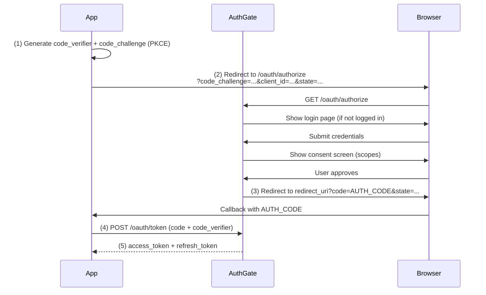

# Authorization Code Flow + PKCE

The **Authorization Code Flow** (RFC 6749) with **PKCE** (Proof Key for Code Exchange, RFC 7636) is the recommended OAuth 2.0 flow for web applications, single-page apps (SPAs), and mobile apps.

PKCE replaces the need for a client secret, making it safe for **public clients** where the secret cannot be kept confidential.

## When to Use This Flow

Use Authorization Code + PKCE when:

- You are building a **web application** with a server-side backend
- You are building a **single-page app** (React, Vue, Angular, etc.)
- You are building a **mobile application**
- You need users to see a **consent screen** before granting access

## How It Works



### Step 1: Generate PKCE Parameters

Before redirecting, your app generates a cryptographically random `code_verifier` and derives a `code_challenge` from it:

**Go**

```go
import (
    "crypto/rand"
    "crypto/sha256"
    "encoding/base64"
)

// Generate code_verifier (32 random bytes → 43-char base64url string)
buf := make([]byte, 32)
_, _ = rand.Read(buf)
codeVerifier := base64.RawURLEncoding.EncodeToString(buf)

// Derive code_challenge = BASE64URL(SHA256(code_verifier))
h := sha256.Sum256([]byte(codeVerifier))
codeChallenge := base64.RawURLEncoding.EncodeToString(h[:])
```

**Python**

```python
import hashlib
import base64
import secrets

# Generate code_verifier (32 random bytes → 43-char base64url string)
code_verifier = base64.urlsafe_b64encode(secrets.token_bytes(32)).rstrip(b"=").decode()

# Derive code_challenge = BASE64URL(SHA256(code_verifier))
digest = hashlib.sha256(code_verifier.encode()).digest()
code_challenge = base64.urlsafe_b64encode(digest).rstrip(b"=").decode()
```

**JavaScript (Node.js)**

```javascript
// Generate code_verifier (43-128 random chars)
const codeVerifier = crypto.randomBytes(32).toString("base64url");

// Derive code_challenge = BASE64URL(SHA256(code_verifier))
const codeChallenge = crypto
  .createHash("sha256")
  .update(codeVerifier)
  .digest("base64url");
```

Store the `code_verifier` securely (session or memory) — you'll need it in Step 4.

### Step 2: Redirect to Authorization Endpoint

Build the authorization URL and redirect the user:

```
GET /oauth/authorize
  ?client_id=YOUR_CLIENT_ID
  &redirect_uri=https://yourapp.com/callback
  &response_type=code
  &scope=openid profile email
  &state=RANDOM_STATE
  &code_challenge=CODE_CHALLENGE
  &code_challenge_method=S256
```

> **Always include `state`** — a random value that you verify on callback to prevent CSRF attacks.

The user will be prompted to log in (if not already) and then see a consent screen listing the requested scopes.

### Step 3: Handle the Callback

After approval, AuthGate redirects to your `redirect_uri` with an authorization code:

```
https://yourapp.com/callback?code=AUTH_CODE&state=RANDOM_STATE
```

Verify that `state` matches what you sent in Step 2.

### Step 4: Exchange Code for Tokens

Exchange the authorization code for tokens by including the `code_verifier`:

```bash
curl -X POST https://your-authgate/oauth/token \
  -d "grant_type=authorization_code" \
  -d "code=AUTH_CODE" \
  -d "redirect_uri=https://yourapp.com/callback" \
  -d "client_id=YOUR_CLIENT_ID" \
  -d "code_verifier=CODE_VERIFIER"
```

Response:

```json
{
  "access_token": "eyJhbG...",
  "refresh_token": "def502...",
  "token_type": "Bearer",
  "expires_in": 3600,
  "scope": "openid profile email"
}
```

### Step 5: Refresh the Access Token

When the access token expires, use the refresh token:

```bash
curl -X POST https://your-authgate/oauth/token \
  -d "grant_type=refresh_token" \
  -d "refresh_token=REFRESH_TOKEN" \
  -d "client_id=YOUR_CLIENT_ID"
```

## Registering an Auth Code Client

In the admin panel (**Admin → OAuth Clients → New**):

1. Set **Client Type**:
   - `public` — for SPAs and mobile apps using PKCE (no client secret)
   - `confidential` — for server-side web apps that can store a secret
2. Enable **Authorization Code Flow**
3. Add your **Redirect URIs** (one per line)
4. Note the generated `client_id`

## Managing User Authorizations

Users can review and revoke per-app access at **Account → Authorized Apps**.

Admins can force re-authentication for all users of a client at **Admin → OAuth Clients → [client] → Revoke All**.

## Security Considerations

| Requirement           | Details                                             |
| --------------------- | --------------------------------------------------- |
| Always use PKCE       | Prevents authorization code interception            |
| Validate `state`      | Prevents CSRF attacks                               |
| Use HTTPS             | Required in production; prevents token leakage      |
| Short-lived codes     | Authorization codes expire after a few minutes      |
| Rotate refresh tokens | Set `ENABLE_TOKEN_ROTATION=true` for extra security |

## Example Client

See [github.com/go-authgate/oauth-cli](https://github.com/go-authgate/oauth-cli) for a working Go implementation of Authorization Code + PKCE.

For a hybrid CLI that auto-detects the environment and uses Device Flow over SSH or Auth Code Flow locally, see [github.com/go-authgate/cli](https://github.com/go-authgate/cli).

## Related

- [Getting Started](./getting-started)
- [Device Authorization Flow](./device-flow)
- [Client Credentials Flow](./client-credentials)
- [JWT Verification](./jwt-verification)
