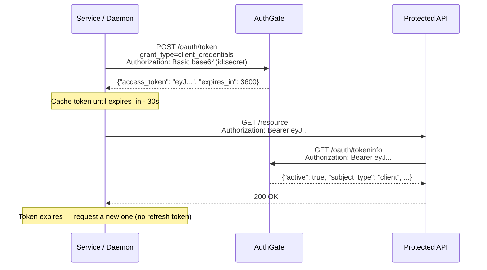

# Client Credentials Flow

The **Client Credentials Grant** (RFC 6749 §4.4) is designed for machine-to-machine (M2M) authentication. No user is involved — the service authenticates as itself using a `client_id` and `client_secret`.

## When to Use This Flow

Use Client Credentials when:

- You are building a **microservice, daemon, or CI/CD pipeline** that calls a protected API
- There is **no user** involved (pure service-to-service identity)
- The service can **securely store a `client_secret`** (server-side only — never in a browser or mobile app)

## How It Works



### Step 1: Request an Access Token

Authenticate with HTTP Basic Auth using your `client_id` and `client_secret`:

```bash
curl -X POST https://your-authgate/oauth/token \
  -u "$CLIENT_ID:$CLIENT_SECRET" \
  -d "grant_type=client_credentials" \
  -d "scope=read"
```

Response:

```json
{
  "access_token": "eyJhbG...",
  "token_type": "Bearer",
  "expires_in": 3600,
  "scope": "read"
}
```

> No `refresh_token` is issued per RFC 6749 §4.4.3.

### Step 2: Use the Token

Include the access token as a Bearer header on every API request:

```bash
curl -H "Authorization: Bearer ACCESS_TOKEN" https://api.example.com/resource
```

Resource servers can verify tokens using the tokeninfo endpoint:

```bash
curl -H "Authorization: Bearer ACCESS_TOKEN" https://your-authgate/oauth/tokeninfo
```

The response includes `"subject_type": "client"` to distinguish M2M tokens from user-delegated tokens.

### Step 3: Token Expires — Request a New One

When the token expires, simply repeat Step 1. There is no refresh token to manage.

Cache the token in memory and re-fetch it when it nears expiry (subtract ~30 seconds as a safety buffer):

```
if time.Now().Add(30 * time.Second).After(expiresAt) {
    token = requestNewToken()
}
```

## Registering a Client Credentials Client

In the admin panel (**Admin → OAuth Clients → New**):

1. Set **Client Type** to `confidential` (public clients cannot use this flow)
2. Enable **Client Credentials Flow (RFC 6749 §4.4)**
3. Add the **Scopes** the service may request (space-separated)
4. Leave **Redirect URIs** empty — not required for this flow
5. Note the generated `client_id` and store the `client_secret` in a secrets manager

To rotate the secret later: **Admin → OAuth Clients → [client] → Regenerate Secret**

## Token Lifecycle

| Setting               | Default | Config                                |
| --------------------- | ------- | ------------------------------------- |
| Access token lifetime | 1 hour  | `CLIENT_CREDENTIALS_TOKEN_EXPIRATION` |
| Refresh token         | None    | Not issued for this grant type        |

## Security Considerations

| Requirement            | Details                                                                                        |
| ---------------------- | ---------------------------------------------------------------------------------------------- |
| Store secrets securely | Use environment variables or a secrets manager; never commit `client_secret` to source control |
| Use HTTPS              | The `client_secret` is sent on every token request; TLS is required in production              |
| Keep TTL short         | Consider reducing `CLIENT_CREDENTIALS_TOKEN_EXPIRATION` (e.g. `15m`) for sensitive services    |
| Restrict scopes        | Register only the scopes each service actually needs                                           |
| One client per service | Separate clients enable independent revocation and per-service scope control                   |
| Monitor audit logs     | Filter by `CLIENT_CREDENTIALS_TOKEN_ISSUED` to detect unexpected issuance                      |

## Related

- [Getting Started](./getting-started)
- [Device Authorization Flow](./device-flow)
- [Authorization Code Flow](./auth-code-flow)
- [JWT Verification](./jwt-verification)
