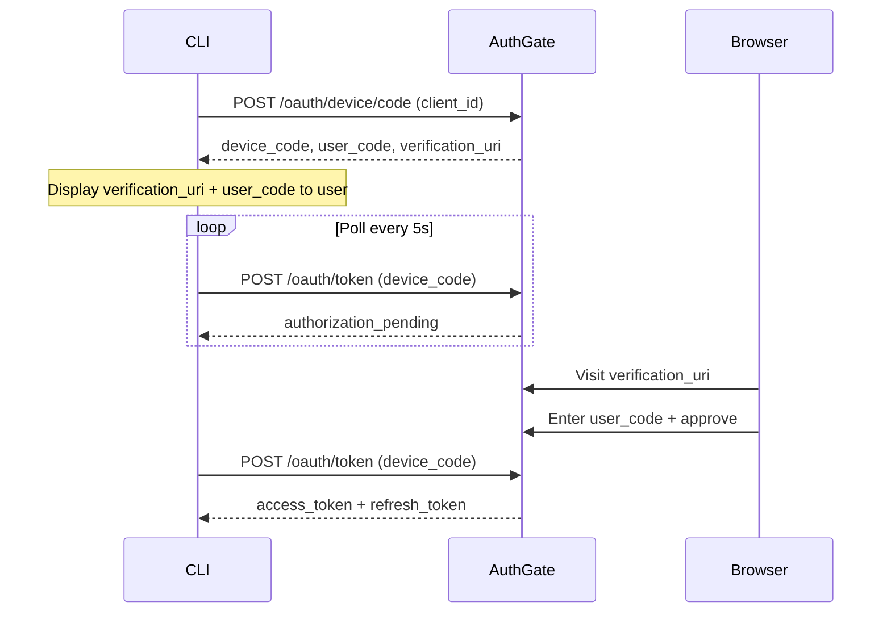

# Device Authorization Flow

The **Device Authorization Grant** (RFC 8628) lets CLI tools, scripts, and headless environments authenticate users without requiring a browser on the device itself. Instead, the user visits a short URL on any device (phone, laptop, etc.) to complete authentication.

## When to Use This Flow

Use the Device Flow when:

- You are building a **CLI tool** (e.g., `my-tool login`)
- Your environment is **headless** (e.g., a remote server over SSH)
- Opening a browser automatically is not possible or desirable

## How It Works



### Step 1: Request a Device Code

Your CLI calls `POST /oauth/device/code` with its `client_id`:

```bash
curl -X POST https://your-authgate/oauth/device/code \
  -d "client_id=YOUR_CLIENT_ID"
```

Response:

```json
{
  "device_code": "abc123...",
  "user_code": "WXYZ-1234",
  "verification_uri": "https://your-authgate/device",
  "expires_in": 1800,
  "interval": 5
}
```

### Step 2: Display Instructions to the User

Show the user where to go and what code to enter:

```
Open https://your-authgate/device in your browser.
Enter code: WXYZ-1234
Waiting for authorization...
```

### Step 3: Poll for the Token

While the user completes the browser step, your CLI polls for the token:

```bash
curl -X POST https://your-authgate/oauth/token \
  -d "grant_type=urn:ietf:params:oauth:grant-type:device_code" \
  -d "device_code=abc123..." \
  -d "client_id=YOUR_CLIENT_ID"
```

Possible responses while polling:

| Response                | Meaning                                 |
| ----------------------- | --------------------------------------- |
| `authorization_pending` | User hasn't approved yet — keep polling |
| `slow_down`             | Polling too fast — increase interval    |
| `expired_token`         | Device code expired — restart flow      |
| `access_denied`         | User rejected the request               |
| `200 OK` + tokens       | Success!                                |

### Step 4: Use and Refresh Tokens

Once you receive an `access_token`, include it in API requests:

```bash
curl -H "Authorization: Bearer ACCESS_TOKEN" https://api.example.com/resource
```

When the access token expires, use the `refresh_token`:

```bash
curl -X POST https://your-authgate/oauth/token \
  -d "grant_type=refresh_token" \
  -d "refresh_token=REFRESH_TOKEN" \
  -d "client_id=YOUR_CLIENT_ID"
```

## Registering a Device Flow Client

In the admin panel (**Admin → OAuth Clients → New**):

1. Set **Client Type** to `public` (no client secret required)
2. Enable **Device Authorization Flow**
3. Note the generated `client_id`

## Token Expiry and Rotation

| Setting                | Default    | Config                       |
| ---------------------- | ---------- | ---------------------------- |
| Access token lifetime  | 1 hour     | `JWT_EXPIRATION`             |
| Device code lifetime   | 30 minutes | `DEVICE_CODE_EXPIRATION`     |
| Refresh token rotation | Disabled   | `ENABLE_TOKEN_ROTATION=true` |

> When token rotation is enabled, each refresh invalidates the old refresh token and issues a new one. This limits the blast radius of a stolen refresh token.

## Example CLI Client

See [github.com/go-authgate/device-cli](https://github.com/go-authgate/device-cli) for a working example in Go that implements the complete Device Flow.

## Related

- [Getting Started](./getting-started)
- [Authorization Code Flow](./auth-code-flow)
- [Client Credentials Flow](./client-credentials)
