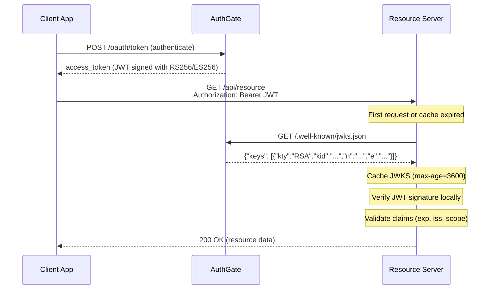

# JWT Verification

Verify AuthGate-issued JWT tokens at your resource servers using public keys — no callback to AuthGate needed.

> **Important tradeoff**: Local JWT verification cannot detect server-side token revocation or status changes (revoked/disabled). Tokens remain valid until they expire. If you need real-time revocation enforcement, use AuthGate's `/oauth/tokeninfo` endpoint for online validation.

## When to Use

Use JWT verification with JWKS when:

- You have **multiple microservices** that need to verify tokens independently
- You want to **reduce load** on AuthGate by eliminating token validation callbacks
- You need **offline verification** without network dependencies on AuthGate
- You are deploying in a **zero-trust architecture** where services should not share secrets

> **Prerequisite**: AuthGate must be configured with **RS256** or **ES256** signing. For **HS256** (symmetric) signing, the JWKS endpoint exists but returns an empty key set, and the OIDC discovery document omits `jwks_uri`.

## How It Works



After the initial JWKS fetch, all subsequent token verifications happen locally — no network call to AuthGate is needed.

## Configure AuthGate

Generate a signing key and set the environment variables:

```bash
# RS256: Generate RSA 2048-bit key
openssl genrsa -out rsa-private.pem 2048

# ES256: Generate ECDSA P-256 key
openssl ecparam -genkey -name prime256v1 -noout -out ec-private.pem
```

```bash
# Environment variables
JWT_SIGNING_ALGORITHM=RS256        # or ES256
JWT_PRIVATE_KEY_PATH=/path/to/rsa-private.pem
JWT_KEY_ID=                        # Optional: auto-generated from key fingerprint
```

## OIDC Discovery

Resource servers discover the JWKS URL via OIDC Discovery:

```bash
curl https://your-authgate/.well-known/openid-configuration
```

```json
{
  "issuer": "https://your-authgate",
  "jwks_uri": "https://your-authgate/.well-known/jwks.json",
  "id_token_signing_alg_values_supported": ["RS256"]
}
```

> The `jwks_uri` field is only present when RS256 or ES256 is configured. When present, `id_token_signing_alg_values_supported` reflects the configured `JWT_SIGNING_ALGORITHM` (e.g., `["ES256"]` when using ES256), but this field may be omitted entirely when ID tokens are not supported.

## JWKS Endpoint

```bash
curl https://your-authgate/.well-known/jwks.json
```

**RS256 response:**

```json
{
  "keys": [{
    "kty": "RSA",
    "use": "sig",
    "kid": "abc123...",
    "alg": "RS256",
    "n": "0vx7agoebGc...",
    "e": "AQAB"
  }]
}
```

**ES256 response:**

```json
{
  "keys": [{
    "kty": "EC",
    "use": "sig",
    "kid": "def456...",
    "alg": "ES256",
    "crv": "P-256",
    "x": "f83OJ3D2xF1B...",
    "y": "x_FEzRu9m36H..."
  }]
}
```

The response includes `Cache-Control: public, max-age=3600` — cache for up to 1 hour.

## JWT Token Structure

**Header:**

```json
{
  "alg": "RS256",
  "kid": "abc123...",
  "typ": "JWT"
}
```

**Payload:**

```json
{
  "user_id": "user-uuid",
  "client_id": "client-uuid",
  "scope": "openid profile email",
  "type": "access",
  "exp": 1700000000,
  "iat": 1699996400,
  "iss": "https://your-authgate",
  "sub": "user-uuid",
  "jti": "unique-token-id"
}
```

| Claim       | Description                            |
| ----------- | -------------------------------------- |
| `user_id`   | End-user identifier, or `client:<client_id>` for `client_credentials` tokens |
| `client_id` | OAuth client that requested the token  |
| `scope`     | Space-separated granted scopes         |
| `type`      | `access` or `refresh`      |
| `exp`       | Expiration time (Unix timestamp)       |
| `iss`       | Issuer URL (AuthGate's BASE_URL)       |
| `sub`       | Subject: user UUID for user tokens, or `client:<client_id>` for `client_credentials` tokens |
| `jti`       | Unique token identifier (UUID)         |

> **Note:** For `client_credentials` tokens, there is no end user. Both `sub` and `user_id` are set to a synthetic machine identity (`client:<client_id>`).

## Verification Steps

1. **Decode** the JWT header to extract `kid` and `alg`
2. **Fetch JWKS** from `/.well-known/jwks.json` (use cached copy if available)
3. **Find the key** matching the `kid` from the JWT header
4. **Verify the signature** using the public key
5. **Validate claims**: `exp` (not expired), `iss` (matches AuthGate URL), `type` (is `access`)
6. **Check authorization**: verify `scope` and `client_id` match your requirements

## Code Examples

### Go

Using [`keyfunc`](https://github.com/MicahParks/keyfunc) for automatic JWKS fetching and caching:

```go
package main

import (
	"fmt"
	"log"
	"net/http"
	"strings"

	"github.com/MicahParks/keyfunc/v3"
	"github.com/golang-jwt/jwt/v5"
)

func main() {
	jwksURL := "https://your-authgate/.well-known/jwks.json"

	// Create a keyfunc that auto-refreshes JWKS
	k, err := keyfunc.NewDefault([]string{jwksURL})
	if err != nil {
		log.Fatalf("Failed to create JWKS keyfunc: %v", err)
	}

	http.HandleFunc("/api/resource", func(w http.ResponseWriter, r *http.Request) {
		auth := r.Header.Get("Authorization")
		if !strings.HasPrefix(auth, "Bearer ") {
			http.Error(w, "Missing Bearer token", http.StatusUnauthorized)
			return
		}
		tokenString := strings.TrimPrefix(auth, "Bearer ")

		// Parse and verify the JWT using JWKS
		token, err := jwt.Parse(tokenString, k.Keyfunc,
			jwt.WithIssuer("https://your-authgate"),
			jwt.WithExpirationRequired(),
			jwt.WithValidMethods([]string{"RS256", "ES256"}),
		)
		if err != nil {
			http.Error(w, fmt.Sprintf("Invalid token: %v", err), http.StatusUnauthorized)
			return
		}

		claims, ok := token.Claims.(jwt.MapClaims)
		if !ok {
			http.Error(w, "Invalid token claims", http.StatusUnauthorized)
			return
		}

		tokenType, ok := claims["type"].(string)
		if !ok || tokenType != "access" {
			http.Error(w, "Invalid token type", http.StatusUnauthorized)
			return
		}

		// For user tokens, sub is a UUID; for client_credentials, it is "client:<client_id>"
		subject, ok := claims["sub"].(string)
		if !ok || subject == "" {
			http.Error(w, "Invalid token claims", http.StatusUnauthorized)
			return
		}
		fmt.Fprintf(w, "Hello, %s!", subject)
	})

	log.Fatal(http.ListenAndServe(":8081", nil))
}
```

### Python

Using [`PyJWT`](https://pyjwt.readthedocs.io/) with built-in JWKS client:

```python
import jwt
from jwt import PyJWKClient
from flask import Flask, request, jsonify

app = Flask(__name__)

AUTHGATE_URL = "https://your-authgate"
JWKS_URL = f"{AUTHGATE_URL}/.well-known/jwks.json"

# PyJWKClient caches JWKS keys automatically
jwks_client = PyJWKClient(JWKS_URL, cache_keys=True, lifespan=3600)

@app.route("/api/resource")
def protected_resource():
    auth = request.headers.get("Authorization", "")
    if not auth.startswith("Bearer "):
        return jsonify({"error": "Missing Bearer token"}), 401

    token = auth.removeprefix("Bearer ")

    try:
        signing_key = jwks_client.get_signing_key_from_jwt(token)
        payload = jwt.decode(
            token,
            signing_key.key,
            algorithms=["RS256", "ES256"],
            issuer=AUTHGATE_URL,
            options={"require": ["exp", "iss", "sub"]},
        )
    except jwt.InvalidTokenError as e:
        return jsonify({"error": f"Invalid token: {e}"}), 401

    if payload.get("type") != "access":
        return jsonify({"error": "Invalid token type"}), 401

    return jsonify({"message": f"Hello, user {payload['user_id']}!"})
```

### Node.js

Using [`jose`](https://github.com/panva/jose) (zero-dependency):

```javascript
import { createRemoteJWKSet, jwtVerify } from "jose";
import { createServer } from "node:http";

const AUTHGATE_URL = "https://your-authgate";
const JWKS = createRemoteJWKSet(
  new URL(`${AUTHGATE_URL}/.well-known/jwks.json`)
);

const server = createServer(async (req, res) => {
  const auth = req.headers.authorization || "";
  if (!auth.startsWith("Bearer ")) {
    res.writeHead(401);
    res.end(JSON.stringify({ error: "Missing Bearer token" }));
    return;
  }

  try {
    const { payload } = await jwtVerify(auth.slice(7), JWKS, {
      issuer: AUTHGATE_URL,
      algorithms: ["RS256", "ES256"],
      requiredClaims: ["exp", "sub", "scope"],
    });

    if (payload.type !== "access") {
      res.writeHead(401);
      res.end(JSON.stringify({ error: "Invalid token type" }));
      return;
    }

    res.writeHead(200, { "Content-Type": "application/json" });
    res.end(JSON.stringify({ message: `Hello, user ${payload.user_id}!` }));
  } catch (err) {
    res.writeHead(401);
    res.end(JSON.stringify({ error: `Invalid token: ${err.message}` }));
  }
});

server.listen(8081, () => console.log("Resource server on :8081"));
```

## Caching Best Practices

| Practice | Details |
| -------- | ------- |
| **Respect `Cache-Control`** | AuthGate sets `max-age=3600` (1 hour). Don't fetch more often. |
| **Use JWKS libraries** | Libraries like `keyfunc` (Go), `PyJWKClient` (Python), and `jose` (Node.js) handle caching automatically. |
| **Handle unknown `kid`** | Re-fetch JWKS once on unknown `kid`. If still no match, reject the token. |
| **Pre-warm cache** | Fetch JWKS at service startup to avoid latency on the first request. |

## Key Rotation

1. Generate a new key pair and update `JWT_PRIVATE_KEY_PATH` in AuthGate
2. Restart AuthGate — new tokens are signed with the new key
3. Resource servers detect the unknown `kid` and re-fetch JWKS automatically

> AuthGate currently serves a single active key. During rotation, allow up to 1 hour for cached JWKS to expire at resource servers.

## Common Pitfalls

- **JWKS empty for HS256** — Switch to RS256 or ES256 for JWKS-based verification
- **Not validating `iss`** — Always check the issuer matches your AuthGate URL
- **Accepting refresh tokens** — Always verify `type` is `access`
- **Hardcoding public keys** — Use JWKS for automatic key rotation support
- **Clock skew** — Keep server clocks synchronized with NTP

## Related

- [Getting Started](./getting-started)
- [Device Authorization Flow](./device-flow)
- [Auth Code Flow](./auth-code-flow)
- [Client Credentials Flow](./client-credentials)
