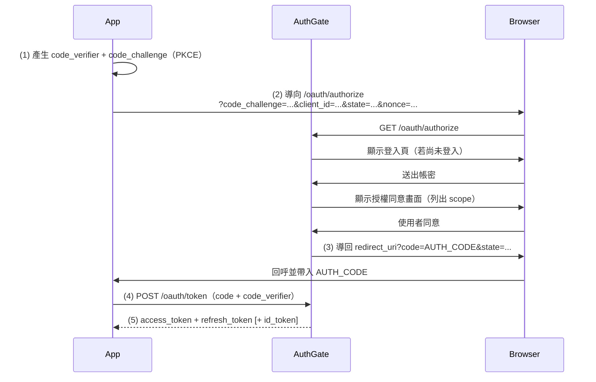

# Authorization Code Flow + PKCE（授權碼流程）

**Authorization Code Flow**（RFC 6749）搭配 **PKCE**（Proof Key for Code Exchange，RFC 7636）是網頁應用、單頁應用（SPA）、行動應用的首選 OAuth 2.0 流程。

## 何時使用此流程

在下列情況使用 Authorization Code + PKCE：

- 您在打造 **伺服器端網頁應用**（機密客戶端 — 有後端可安全保管 `client_secret`）
- 您在打造 **單頁應用**（公開客戶端 — 沒有 secret）
- 您在打造 **行動或桌面應用**（公開客戶端）
- 您希望使用者在授權前看到 **同意授權畫面**

## 客戶端類型

| 類型             | 憑證                          | 典型範例                           | 必須使用 PKCE？ |
| ---------------- | ----------------------------- | ---------------------------------- | --------------- |
| `confidential`   | `client_id` + `client_secret` | Rails / Django / Node 後端          | 建議            |
| `public`         | 僅 `client_id`（無 secret）   | React SPA、iOS/Android、Electron   | 是 — 一律要     |

> PKCE（S256）**永遠是安全的選擇**，也是 AuthGate 唯一接受的 `code_challenge_method`。機密客戶端也應該加上，做為縱深防禦。

## 運作方式



### 步驟 1：產生 PKCE 參數

產生一串密碼學隨機的 `code_verifier`（43–128 字元），並推導出 `code_challenge`：

**Go**

```go
import (
    "crypto/rand"
    "crypto/sha256"
    "encoding/base64"
)

buf := make([]byte, 32)
_, _ = rand.Read(buf)
codeVerifier := base64.RawURLEncoding.EncodeToString(buf)

h := sha256.Sum256([]byte(codeVerifier))
codeChallenge := base64.RawURLEncoding.EncodeToString(h[:])
```

**Python**

```python
import hashlib, base64, secrets

code_verifier = base64.urlsafe_b64encode(secrets.token_bytes(32)).rstrip(b"=").decode()
digest = hashlib.sha256(code_verifier.encode()).digest()
code_challenge = base64.urlsafe_b64encode(digest).rstrip(b"=").decode()
```

**JavaScript（Node / 瀏覽器 via `crypto.subtle`）**

```javascript
// Node 16+:
const codeVerifier = crypto.randomBytes(32).toString("base64url");
const codeChallenge = crypto.createHash("sha256").update(codeVerifier).digest("base64url");
```

把 `code_verifier` 存起來，步驟 4 會用到：

- **機密客戶端**：放在伺服器端 session。
- **SPA**：最好放在記憶體變數裡。真的需要跨重新整理時才退一步用 `sessionStorage` — 請注意任何瀏覽器儲存都會暴露在 XSS 面前，真正的解法是採用 Backend-For-Frontend（BFF）模式。

### 步驟 2：導向授權端點

```
GET /oauth/authorize
  ?client_id=YOUR_CLIENT_ID
  &redirect_uri=https://yourapp.example/callback
  &response_type=code
  &scope=openid profile email offline_access
  &state=RANDOM_STATE
  &nonce=RANDOM_NONCE
  &code_challenge=CODE_CHALLENGE
  &code_challenge_method=S256
```

| 參數                    | 必填     | 備註                                                                |
| ----------------------- | -------- | ------------------------------------------------------------------- |
| `client_id`             | 是       | 管理員提供                                                          |
| `redirect_uri`          | 是       | 與註冊 URI **完全字串比對**                                         |
| `response_type`         | 是       | 必須是 `code`（AuthGate 僅支援此類型）                              |
| `scope`                 | 建議     | 空白分隔；包含 `openid` 以取得 ID token                             |
| `state`                 | 是（CSRF） | 隨機值 — 回呼時驗證                                                |
| `nonce`                 | OIDC     | 當 `scope` 含 `openid` 時必填；會寫進 `id_token` 以防重送           |
| `code_challenge`        | PKCE     | 依上面方式推導                                                      |
| `code_challenge_method` | PKCE     | 必須是 `S256`（`plain` 會被拒）                                     |

> **state 與 nonce**：各自獨立、隨機、夠長（≥ 16 bytes base64url）。把 `state` 與 `code_verifier` 以 `state` 當作鍵存入使用者 session，回呼時才能查得到。

使用者會被要求登入（若尚未登入），接著看到列出 scope 的授權同意畫面。

### 步驟 3：處理回呼

```
https://yourapp.example/callback?code=AUTH_CODE&state=RANDOM_STATE
```

使用 `code` 之前 **先驗證 `state` 是否與您送出的相符**。不相符就中止。

若使用者拒絕授權，AuthGate 會改用 OAuth 錯誤格式回呼：

```
https://yourapp.example/callback?error=access_denied&error_description=...&state=RANDOM_STATE
```

完整錯誤清單見 [錯誤處理](./errors)。

### 步驟 4：用 code 交換權杖

`/oauth/token` 端點 **只** 接受 `application/x-www-form-urlencoded`，不吃 JSON。

**公開客戶端（只有 PKCE）：**

```bash
curl -X POST https://your-authgate/oauth/token \
  -H "Content-Type: application/x-www-form-urlencoded" \
  -d "grant_type=authorization_code" \
  -d "code=AUTH_CODE" \
  -d "redirect_uri=https://yourapp.example/callback" \
  -d "client_id=YOUR_CLIENT_ID" \
  -d "code_verifier=CODE_VERIFIER"
```

**機密客戶端（HTTP Basic — 建議）：**

```bash
curl -X POST https://your-authgate/oauth/token \
  -u "$CLIENT_ID:$CLIENT_SECRET" \
  -H "Content-Type: application/x-www-form-urlencoded" \
  -d "grant_type=authorization_code" \
  -d "code=AUTH_CODE" \
  -d "redirect_uri=https://yourapp.example/callback" \
  -d "code_verifier=CODE_VERIFIER"
```

也可以放在表單 body（`client_id=...&client_secret=...`）。依 RFC 6749 §2.3.1，HTTP Basic 是首選。

**回應：**

```json
{
  "access_token": "eyJhbG...",
  "refresh_token": "def502...",
  "id_token": "eyJhbG...",
  "token_type": "Bearer",
  "expires_in": 3600,
  "scope": "openid profile email offline_access"
}
```

`id_token` 僅在要求 scope 含 `openid` 時出現。claim 與驗證方式詳見 [OpenID Connect](./oidc)。

> 這裡送出的 `redirect_uri` 必須與步驟 2 的一模一樣 — AuthGate 會完全比對。

### 步驟 5：刷新 access token

接近過期時，用 refresh token 換一組新的。詳見 [Token 與撤銷](./tokens)，特別留意 **輪轉模式重用偵測的陷阱**，舊 refresh token 被重用兩次會讓整個 token family 被撤銷。

### 步驟 6：登出

登出時，**請撤銷 refresh token**（不要只清本機 session）— 見 [Token 與撤銷](./tokens)。只刪 cookie 會讓被偷走的 token 一直有效到過期為止。

## 管理使用者授權

使用者可在 AuthGate 介面 **Account → Authorized Apps** 檢視與撤銷每個應用的授權。要預期使用者回來時手上的 token 已過期或被撤銷 — 請妥善處理 `invalid_grant` 並重跑流程。

## 安全檢查清單

| 要求                    | 說明                                                                           |
| ----------------------- | ------------------------------------------------------------------------------ |
| 一律驗 `state`          | 防止回呼 CSRF                                                                  |
| 一律驗 `nonce`          | OIDC 用 — 比對 `id_token` 內的 `nonce` claim 與您送出的值                      |
| 一律用 PKCE（S256）     | 即便是機密客戶端，也做縱深防禦                                                 |
| 全程 HTTPS              | token 與 code 絕對不能以明文通過網路                                           |
| redirect URI 完全符合   | AuthGate 完全字串比對 — 小心尾斜線                                             |
| 登出時撤銷              | 用 refresh token 呼叫 `/oauth/revoke`                                          |
| 短效 access token       | 尊重 `expires_in`；提前刷新（例如過期前 30 秒）                                |
| 驗證 `id_token`         | 簽章、`iss`、`aud=client_id`、`exp`、`nonce` — 見 [OpenID Connect](./oidc)     |
| SPA 權杖儲存            | 優先使用 BFF。否則：access token 只放記憶體；refresh token 放 `HttpOnly; Secure; SameSite=Lax` cookie。**絕不用 `localStorage`。** |
| 原生 / CLI 儲存         | OS keychain / Credential Manager / Secret Service — 見 [Device Flow](./device-flow) |

## 範例客戶端

- [github.com/go-authgate/oauth-cli](https://github.com/go-authgate/oauth-cli) — Go 實作的 Auth Code + PKCE
- [github.com/go-authgate/cli](https://github.com/go-authgate/cli) — 混合 CLI（SSH 環境走 Device Flow，本機走 Auth Code）

## 相關文件

- [開始使用](./getting-started)
- [Device Authorization Flow](./device-flow)
- [Client Credentials Flow](./client-credentials)
- [OpenID Connect](./oidc)
- [JWT 驗證](./jwt-verification)
- [Token 與撤銷](./tokens)
- [錯誤處理](./errors)
