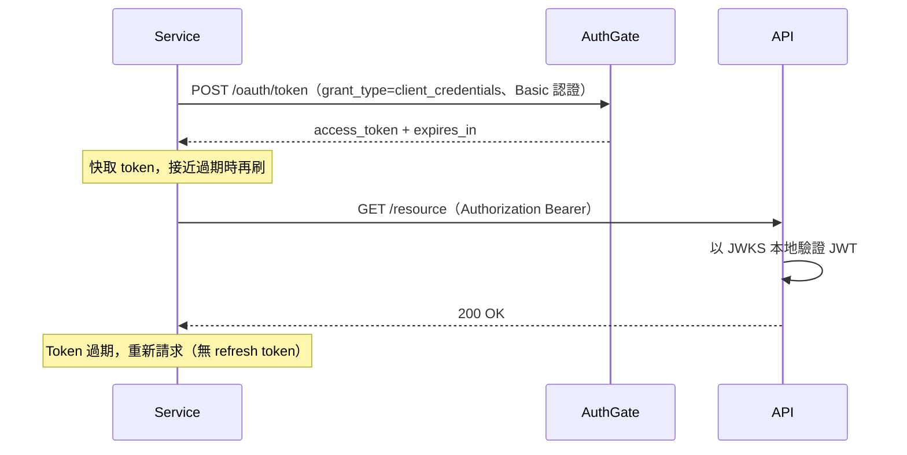

# Client Credentials Flow（用戶端憑證流程）

**Client Credentials Grant**（RFC 6749 §4.4）用於機器對機器（M2M）認證。沒有使用者 — 服務以自己的身分（`client_id` 與 `client_secret`）進行認證。

## 何時使用此流程

- **微服務、常駐程式、CI/CD 流水線** 呼叫受保護的 API
- **沒有使用者** — 純服務身分
- 服務可以 **安全保管** `client_secret`（伺服器端 secrets manager、環境變數 — **絕對不要** 放在瀏覽器、行動 App，或發放給終端使用者的 CLI）

## 串接之前

請管理員建立一個 `confidential` 客戶端，具備：

- 啟用 **Client Credentials Flow**
- 為此服務註冊所需 **scope**（依部署而定的自訂 API scope）
- 不需要 redirect URI

您會拿到：

- `client_id` — 可以寫進 log
- `client_secret` — 存進 secrets manager；一旦外洩立即輪換

> **受限的 scope**：`openid` 與 `offline_access` 在此流程不合法，會以 `invalid_scope` 被拒。scope 是對應到一個合成的服務身分，不是使用者。

## 運作方式



### 步驟 1：請求 access token

以 HTTP Basic 認證（建議）或 form body 兩種方式。端點只接受 `application/x-www-form-urlencoded` 本文。

**HTTP Basic（依 RFC 6749 §2.3.1 建議使用）：**

```bash
curl -X POST https://your-authgate/oauth/token \
  -u "$CLIENT_ID:$CLIENT_SECRET" \
  -H "Content-Type: application/x-www-form-urlencoded" \
  -d "grant_type=client_credentials"
```

**Form body：**

```bash
curl -X POST https://your-authgate/oauth/token \
  -H "Content-Type: application/x-www-form-urlencoded" \
  -d "grant_type=client_credentials" \
  -d "client_id=$CLIENT_ID" \
  -d "client_secret=$CLIENT_SECRET"
```

省略 `scope` 會拿到此客戶端已註冊的全部 scope。只有在您想要 **子集** 時才帶 `scope=...`。

> 上面用 `$CLIENT_SECRET` 環境變數展示沒問題；但在正式環境 **不要把字面 secret 直接丟到指令列**，argv 會出現在 `ps` 與 shell 歷史裡。改用 `curl --netrc`、設定檔（`-K`）或語言端的 SDK。

**回應：**

```json
{
  "access_token": "eyJhbG...",
  "token_type": "Bearer",
  "expires_in": 3600,
  "scope": "<此客戶端被授予的 scope>"
}
```

> **此 grant 不會簽發 refresh token**（RFC 6749 §4.4.3）。access token 過期時重新請求。`/oauth/revoke` 與 `/oauth/tokeninfo` 仍可用 — 見 [Token 與撤銷](./tokens)。

若索取的 scope 超過此客戶端允許範圍，AuthGate 會回：

```json
{
  "error": "invalid_scope",
  "error_description": "Requested scope exceeds client permissions or contains restricted scopes (openid, offline_access are not permitted)"
}
```

完整錯誤清單見 [錯誤處理](./errors)。

### 步驟 2：使用 token

```bash
curl -H "Authorization: Bearer ACCESS_TOKEN" https://api.example.com/resource
```

Resource server 應 **以 AuthGate 的 JWKS 在本地驗證 JWT** — 見 [JWT 驗證](./jwt-verification)。

**辨識 M2M token**：Client Credentials 發出的 token 其 JWT `sub`（與 `user_id`）欄位為 `client:<client_id>`。resource server 可以依此分流服務呼叫與使用者委派呼叫。

### 步驟 3：快取與續約

不要每次呼叫都換一個新 token。快取在記憶體，接近過期再換（減去安全緩衝）：

```go
// Go 虛擬碼
if time.Now().Add(30 * time.Second).After(expiresAt) {
    accessToken, expiresAt = requestNewToken()
}
```

```python
# Python
if time.time() + 30 >= expires_at:
    access_token, expires_at = request_new_token()
```

避免多副本同時續約的雪崩：在 30 秒緩衝上加入小量隨機抖動，或使用共享快取（Redis）搭配 single-flight 續約。

## 安全檢查清單

| 要求                       | 說明                                                                                        |
| -------------------------- | ------------------------------------------------------------------------------------------- |
| 安全保管 secret            | Secrets manager 或 runtime 注入環境變數 — 絕對不要 commit 到版控                            |
| 全程 HTTPS                 | 每次 token 請求都會把 `client_secret` 送上線路                                              |
| 一服務一客戶端             | 個別撤銷與細粒度的服務 scope 控制                                                           |
| 只要最小 scope             | 最小權限原則                                                                                |
| 外洩即輪換                 | 請管理員重新產生 secret；更新 secrets manager                                               |
| 退避重試                   | `/oauth/token` 有速率限制 — 見 [Token 與撤銷](./tokens)；處理 429 與 `Retry-After`          |
| 快取 token，不要重抓       | 尊重 `expires_in`；只在接近過期時續約                                                       |
| 監控 audit log             | 請管理員對異常的 `CLIENT_CREDENTIALS_TOKEN_ISSUED` 事件設警示                               |

## 相關文件

- [開始使用](./getting-started)
- [Authorization Code Flow](./auth-code-flow)
- [Device Authorization Flow](./device-flow)
- [JWT 驗證](./jwt-verification)
- [Token 與撤銷](./tokens)
- [錯誤處理](./errors)
