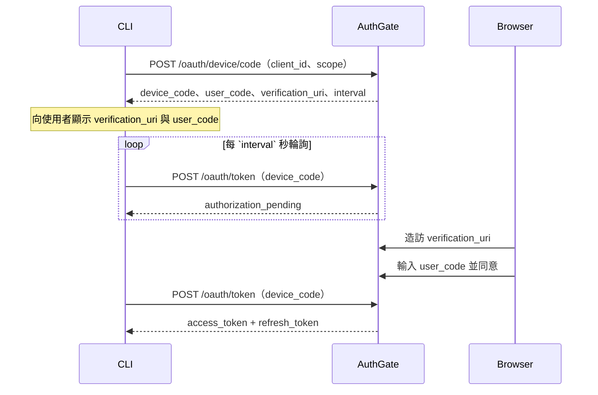

# Device Authorization Flow（裝置授權流程）

**Device Authorization Grant**（RFC 8628）讓 CLI 工具、IoT 裝置、以及無頭環境（headless）可以在不打開本機瀏覽器的情況下完成使用者認證 — 使用者改用任何其他裝置（手機、筆電等）完成瀏覽器端的授權步驟。

## 何時使用此流程

- 您在打造 **CLI 工具**（`my-tool login`）
- 您的環境是 **無頭的** — SSH 遠端伺服器、Docker 容器、CI runner
- 程式化開啟瀏覽器不可行或不便

客戶端一律是 **公開** 的（無 `client_secret`）。若要做（較少見的）Device 版 PKCE，才會用到 `code_challenge` — AuthGate 不要求。

## 運作方式



### 步驟 1：請求 device code

```bash
curl -X POST https://your-authgate/oauth/device/code \
  -H "Content-Type: application/x-www-form-urlencoded" \
  -d "client_id=YOUR_CLIENT_ID" \
  -d "scope=openid profile email offline_access"
```

| 參數        | 必填 | 備註                                                               |
| ----------- | ---- | ------------------------------------------------------------------ |
| `client_id` | 是   | 已啟用 Device Flow 的公開客戶端                                    |
| `scope`     | 否   | 空白分隔；省略則預設 `email profile`。包含 `openid` 才會拿到 ID token |

**回應：**

```json
{
  "device_code": "abc123...",
  "user_code": "WXYZ-1234",
  "verification_uri": "https://your-authgate/device",
  "expires_in": 1800,
  "interval": 5
}
```

> `interval` 是 **最短** 輪詢間隔。若遇到 `slow_down`（見下）請再拉長。

### 步驟 2：對使用者顯示指示

```
請登入此網址：
    https://your-authgate/device

並輸入驗證碼：
    WXYZ-1234

等待授權中…
```

若本機有瀏覽器可開，自動打開 `verification_uri`（但仍要印出網址與 user code，以防自動開啟失敗）：

```go
// Go
_ = exec.Command("open", verificationURI).Start()      // macOS
_ = exec.Command("xdg-open", verificationURI).Start()  // Linux
_ = exec.Command("cmd", "/c", "start", verificationURI).Start() // Windows
```

附帶顯示 `verification_uri` 的 QR code（外加 user code）對手機使用者是很友善的作法。

### 步驟 3：輪詢換 token

```bash
curl -X POST https://your-authgate/oauth/token \
  -H "Content-Type: application/x-www-form-urlencoded" \
  -d "grant_type=urn:ietf:params:oauth:grant-type:device_code" \
  -d "device_code=abc123..." \
  -d "client_id=YOUR_CLIENT_ID"
```

**成功**（使用者已同意）：

```json
{
  "access_token": "eyJhbG...",
  "refresh_token": "def502...",
  "token_type": "Bearer",
  "expires_in": 3600,
  "scope": "openid profile email offline_access"
}
```

**輪詢中的錯誤**（HTTP 400，格式 `{"error": "...", "error_description": "..."}`）：

| `error`                 | HTTP | 意義 / 處理動作                                           |
| ----------------------- | ---- | --------------------------------------------------------- |
| `authorization_pending` | 400  | 使用者還沒同意 — 維持原 `interval` 繼續輪詢               |
| `slow_down`             | 400  | 輪詢太快 — **將 interval 增加 ≥ 5 秒**                    |
| `access_denied`         | 400  | 使用者拒絕了 — 停止輪詢                                   |
| `expired_token`         | 400  | `device_code` 超過 `expires_in` — 從步驟 1 重新開始       |
| `invalid_grant`         | 400  | `device_code` 不存在或已被用過 — 從步驟 1 重新開始        |

也可能遇到 `429 Too Many Requests` — 見 [Token 與撤銷](./tokens)。完整錯誤清單見 [錯誤處理](./errors)。

### 步驟 4：使用 access token

```bash
curl -H "Authorization: Bearer ACCESS_TOKEN" https://api.example.com/resource
```

### 步驟 5：刷新 access token

接近過期時用 refresh token 換 — 見 [Token 與撤銷](./tokens)。實作重試邏輯前請先讀 **輪轉模式重用偵測的陷阱**。

### 步驟 6：登出

執行 `my-tool logout` 時 **請撤銷 refresh token** — 只刪本機 token 檔案會讓被偷走的 token 有效到過期為止。見 [Token 與撤銷](./tokens)。

## 本機儲存 token

CLI 常見慣例：

- macOS：**Keychain**（例如 `security add-generic-password`）
- Linux：**Secret Service**（libsecret），或放 `$XDG_CONFIG_HOME/<app>/token.json` 權限 `0600`
- Windows：**Credential Manager**

絕對不要把 refresh token 寫到 log 或除錯輸出。

## 串接檢查清單

- [ ] 已由管理員啟用 Device Flow 的 `client_id`
- [ ] 遵守 `interval`；遇到 `slow_down` 會退避
- [ ] 遇到 `expired_token` / `access_denied` 會重啟流程
- [ ] access 與 refresh token 放到 OS 等級安全儲存
- [ ] 登出時撤銷 refresh token
- [ ] 對 429 速率限制有退避處理

## 範例 CLI 客戶端

[github.com/go-authgate/device-cli](https://github.com/go-authgate/device-cli) — Go 的完整 Device Flow 範例。

## 相關文件

- [開始使用](./getting-started)
- [Authorization Code Flow](./auth-code-flow)
- [Client Credentials Flow](./client-credentials)
- [JWT 驗證](./jwt-verification)
- [Token 與撤銷](./tokens)
- [錯誤處理](./errors)
