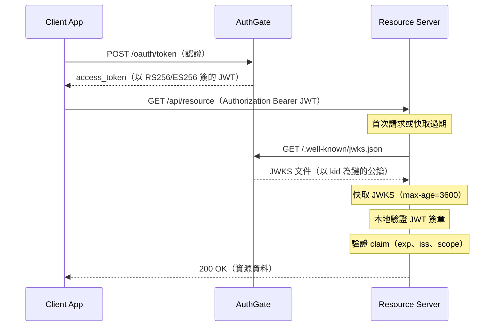

# JWT 驗證

在您的 resource server 以公鑰驗證 AuthGate 簽發的 **access token**，不用回呼 AuthGate。

> **本頁只涵蓋 access token。** ID token（`scope` 含 `openid` 時簽發）同樣透過 JWKS 驗證，但 claim 集合與驗證規則更嚴格 — 見 [OpenID Connect](./oidc)。

> **重要取捨**：本機 JWT 驗證無法偵測伺服器端的撤銷或狀態變更（撤銷 / 停用的 token 在密碼學上仍然是有效的，直到過期為止）。若您需要即時撤銷生效，請改打 `/oauth/introspect`（RFC 7662）或 `/oauth/tokeninfo` — 見 [Token 與撤銷](./tokens)。

## 適用情境

下列情況適合搭配 JWKS 做 JWT 驗證：

- 有 **多個微服務** 各自獨立驗證 token
- 想 **降低 AuthGate 負載**，不用每次都回打驗證
- 需要 **離線驗證**，不想依賴對 AuthGate 的網路
- **零信任架構** 中，服務不應共享 secret

> **前置條件**：AuthGate 必須設定為 **RS256** 或 **ES256** 簽章。若為 **HS256**（對稱），JWKS 端點存在但會回空集合，OIDC discovery 文件也會省略 `jwks_uri`。

## 演算法比較

| 演算法   | 類型       | 金鑰材料                       | Token 大小 | 適用情境                               |
| -------- | ---------- | ------------------------------ | ---------- | -------------------------------------- |
| `HS256`  | 對稱       | `JWT_SECRET`（共享 secret）    | ~300 bytes | 單一服務的簡單部署                     |
| `RS256`  | 非對稱     | RSA 2048-bit 私鑰              | ~600 bytes | 廣泛生態支援，以 JWKS 分發             |
| `ES256`  | 非對稱     | ECDSA P-256 私鑰               | ~400 bytes | 體積小，適合現代部署                   |

> **建議**：最大相容性選 **RS256**；想要小體積 token 選 **ES256**。多服務架構請避免 HS256。

## 運作方式



初次抓 JWKS 後，後續所有 token 驗證都在本機進行，不再呼叫 AuthGate。

## 確認您的 AuthGate 使用非對稱簽章

基於 JWKS 的驗證只在 AuthGate 設定為 **RS256** 或 **ES256** 時可行。從 OIDC Discovery 確認 — 若 `jwks_uri` 欄位不存在，或 `/.well-known/jwks.json` 回傳空 `keys` 陣列，表示該部署是 HS256，無法用本方式驗證。

遇到這情況，請管理員將部署切到 RS256/ES256。對稱 secret 絕對不會透過 JWKS 暴露出來。

## OIDC Discovery

Resource server 從 OIDC Discovery 發現 JWKS 網址：

```bash
curl https://your-authgate/.well-known/openid-configuration
```

```json
{
  "issuer": "https://your-authgate",
  "jwks_uri": "https://your-authgate/.well-known/jwks.json",
  "id_token_signing_alg_values_supported": ["RS256"]
}
```

> `jwks_uri` 只在 RS256 / ES256 啟用時出現。出現時，`id_token_signing_alg_values_supported` 會反映設定的 `JWT_SIGNING_ALGORITHM`（例如 ES256 時是 `["ES256"]`），但若不支援 ID token 則可能完全省略此欄位。

## JWKS 端點

```bash
curl https://your-authgate/.well-known/jwks.json
```

**RS256 回應：**

```json
{
  "keys": [{
    "kty": "RSA",
    "use": "sig",
    "kid": "abc123...",
    "alg": "RS256",
    "n": "0vx7agoebGc...",
    "e": "AQAB"
  }]
}
```

**ES256 回應：**

```json
{
  "keys": [{
    "kty": "EC",
    "use": "sig",
    "kid": "def456...",
    "alg": "ES256",
    "crv": "P-256",
    "x": "f83OJ3D2xF1B...",
    "y": "x_FEzRu9m36H..."
  }]
}
```

回應帶 `Cache-Control: public, max-age=3600` — 可快取最多 1 小時。

> **HS256**：JWKS 端點回傳 `{"keys": []}`。對稱 secret 絕不會透過 JWKS 暴露。

## JWT 結構

**Header：**

```json
{
  "alg": "RS256",
  "kid": "abc123...",
  "typ": "JWT"
}
```

**Payload：**

```json
{
  "user_id": "user-uuid",
  "client_id": "client-uuid",
  "scope": "openid profile email",
  "type": "access",
  "exp": 1700000000,
  "iat": 1699996400,
  "iss": "https://your-authgate",
  "sub": "user-uuid",
  "jti": "unique-token-id"
}
```

| Claim       | 說明                                                                                                            |
| ----------- | --------------------------------------------------------------------------------------------------------------- |
| `user_id`   | 與 `sub` 相同                                                                                                   |
| `client_id` | 索取此 token 的 OAuth 客戶端                                                                                    |
| `scope`     | 空白分隔的授予 scope                                                                                            |
| `type`      | 收到當 Bearer 使用的一定是 `access`。refresh token 也會帶 `type=refresh` 但不應送到 resource server — 一律只接受 `access` |
| `exp`       | 過期時間（Unix 秒）                                                                                             |
| `iat`       | 簽發時間（Unix 秒）                                                                                             |
| `iss`       | Issuer URL（AuthGate 的 BASE_URL）                                                                              |
| `sub`       | 使用者 UUID；Client Credentials token 則為 `client:<client_id>`                                                 |
| `jti`       | 唯一 token id（UUID）                                                                                           |

> **無 `aud` claim**：AuthGate 的 access token 刻意不帶 `aud`。**不要** 在 JWT 函式庫設定要求 `aud`，否則每張 token 都會被拒。（ID token **有** `aud=<client_id>`；只在 ID token 驗 `aud`。詳見 [OpenID Connect](./oidc)。）

> **M2M token**：當 `sub` 以 `client:` 開頭，代表這張 token 來自 Client Credentials 流程，沒有終端使用者。若您的 API 要區別處理服務呼叫，可以依此分流。

## 驗證步驟

1. **解碼** JWT header 取出 `kid` 與 `alg`
2. **抓取 JWKS** `/.well-known/jwks.json`（有快取就用快取）
3. **找金鑰** 對應 JWT header 的 `kid`
4. **驗簽** 用對應公鑰
5. **驗 claim**：`exp`（未過期）、`iss`（對應 AuthGate URL）、`type`（是 `access`）
6. **授權檢查**：驗 `scope` 是否滿足需求；若您的 API 只允許特定客戶端，也驗 `client_id`

## 程式範例

### Go

使用 [`keyfunc`](https://github.com/MicahParks/keyfunc) 自動抓取並快取 JWKS：

```go
package main

import (
	"fmt"
	"log"
	"net/http"
	"slices"
	"strings"

	"github.com/MicahParks/keyfunc/v3"
	"github.com/golang-jwt/jwt/v5"
)

func main() {
	jwksURL := "https://your-authgate/.well-known/jwks.json"

	// 建立會自動重新抓取 JWKS 的 keyfunc
	k, err := keyfunc.NewDefault([]string{jwksURL})
	if err != nil {
		log.Fatalf("Failed to create JWKS keyfunc: %v", err)
	}

	http.HandleFunc("/api/resource", func(w http.ResponseWriter, r *http.Request) {
		auth := r.Header.Get("Authorization")
		if !strings.HasPrefix(auth, "Bearer ") {
			http.Error(w, "Missing Bearer token", http.StatusUnauthorized)
			return
		}
		tokenString := strings.TrimPrefix(auth, "Bearer ")

		// 以 JWKS 解析並驗證 JWT
		token, err := jwt.Parse(tokenString, k.Keyfunc,
			jwt.WithIssuer("https://your-authgate"),
			jwt.WithExpirationRequired(),
			jwt.WithValidMethods([]string{"RS256", "ES256"}),
		)
		if err != nil {
			http.Error(w, fmt.Sprintf("Invalid token: %v", err), http.StatusUnauthorized)
			return
		}

		claims, ok := token.Claims.(jwt.MapClaims)
		if !ok {
			http.Error(w, "Invalid token claims", http.StatusUnauthorized)
			return
		}

		tokenType, ok := claims["type"].(string)
		if !ok || tokenType != "access" {
			http.Error(w, "Invalid token type", http.StatusUnauthorized)
			return
		}

		// 檢查 scope — 視您的 API 所需替換 "profile"。
		scopeStr, _ := claims["scope"].(string)
		scopes := strings.Fields(scopeStr)
		if !slices.Contains(scopes, "profile") {
			http.Error(w, "Insufficient scope", http.StatusForbidden)
			return
		}

		// 使用者 token 的 sub 是 UUID；client_credentials 則為 "client:<client_id>"
		subject, ok := claims["sub"].(string)
		if !ok || subject == "" {
			http.Error(w, "Invalid token claims", http.StatusUnauthorized)
			return
		}
		fmt.Fprintf(w, "Hello, %s!", subject)
	})

	log.Fatal(http.ListenAndServe(":8081", nil))
}
```

### Python

使用 [`PyJWT`](https://pyjwt.readthedocs.io/) 內建的 JWKS client：

```python
import jwt
from jwt import PyJWKClient
from flask import Flask, request, jsonify

app = Flask(__name__)

AUTHGATE_URL = "https://your-authgate"
JWKS_URL = f"{AUTHGATE_URL}/.well-known/jwks.json"

# PyJWKClient 會自動快取 JWKS
jwks_client = PyJWKClient(JWKS_URL, cache_keys=True, lifespan=3600)

@app.route("/api/resource")
def protected_resource():
    auth = request.headers.get("Authorization", "")
    if not auth.startswith("Bearer "):
        return jsonify({"error": "Missing Bearer token"}), 401

    token = auth.removeprefix("Bearer ")

    try:
        signing_key = jwks_client.get_signing_key_from_jwt(token)
        payload = jwt.decode(
            token,
            signing_key.key,
            algorithms=["RS256", "ES256"],
            issuer=AUTHGATE_URL,
            options={"require": ["exp", "iss", "sub"]},
        )
    except jwt.InvalidTokenError as e:
        return jsonify({"error": f"Invalid token: {e}"}), 401

    if payload.get("type") != "access":
        return jsonify({"error": "Invalid token type"}), 401

    # 檢查 scope — 視您的 API 所需替換 "profile"。
    scopes = payload.get("scope", "").split()
    if "profile" not in scopes:
        return jsonify({"error": "Insufficient scope"}), 403

    return jsonify({"message": f"Hello, user {payload['user_id']}!"})
```

### Node.js

使用 [`jose`](https://github.com/panva/jose)（零依賴）：

```javascript
import { createRemoteJWKSet, jwtVerify } from "jose";
import { createServer } from "node:http";

const AUTHGATE_URL = "https://your-authgate";
const JWKS = createRemoteJWKSet(
  new URL(`${AUTHGATE_URL}/.well-known/jwks.json`)
);

const server = createServer(async (req, res) => {
  const auth = req.headers.authorization || "";
  if (!auth.startsWith("Bearer ")) {
    res.writeHead(401);
    res.end(JSON.stringify({ error: "Missing Bearer token" }));
    return;
  }

  try {
    const { payload } = await jwtVerify(auth.slice(7), JWKS, {
      issuer: AUTHGATE_URL,
      algorithms: ["RS256", "ES256"],
      requiredClaims: ["exp", "sub", "scope"],
    });

    if (payload.type !== "access") {
      res.writeHead(401);
      res.end(JSON.stringify({ error: "Invalid token type" }));
      return;
    }

    // 檢查 scope — 視您的 API 所需替換 "profile"。
    const scopes = (payload.scope || "").trim().split(/\s+/).filter(Boolean);
    if (!scopes.includes("profile")) {
      res.writeHead(403);
      res.end(JSON.stringify({ error: "Insufficient scope" }));
      return;
    }

    res.writeHead(200, { "Content-Type": "application/json" });
    res.end(JSON.stringify({ message: `Hello, user ${payload.user_id}!` }));
  } catch (err) {
    res.writeHead(401);
    res.end(JSON.stringify({ error: `Invalid token: ${err.message}` }));
  }
});

server.listen(8081, () => console.log("Resource server on :8081"));
```

## 快取最佳實務

| 做法                        | 細節                                                                                                                  |
| --------------------------- | --------------------------------------------------------------------------------------------------------------------- |
| **尊重 `Cache-Control`**    | AuthGate 回 `max-age=3600`（1 小時）。不要抓得更頻繁。                                                                |
| **使用 JWKS 函式庫**        | `keyfunc`（Go）、`PyJWKClient`（Python）、`jose`（Node.js）都會自動快取。                                             |
| **以 `kid` 當鍵**           | 以 `kid` 做 O(1) 查表。                                                                                               |
| **遇到未知的 `kid`**        | 重抓 JWKS 一次；仍找不到才拒絕此 token。                                                                              |
| **預熱快取**                | 服務啟動時先抓一次 JWKS，避免首個請求卡延遲。                                                                         |

## 金鑰輪替

1. 產生新金鑰對並更新 AuthGate 的 `JWT_PRIVATE_KEY_PATH`
2. 重啟 AuthGate — 新 token 會以新金鑰簽
3. Resource server 看到未知的 `kid` 會自動重抓 JWKS

### 時程

| 時間   | 事件                                                                               |
| ------ | ---------------------------------------------------------------------------------- |
| T+0    | AuthGate 帶新金鑰重啟；JWKS 端點開始提供新公鑰                                     |
| T+0~1h | 還在舊 JWKS 快取的 resource server 遇到未知 `kid` 後重抓                           |
| T+1h   | 舊 access token 全部過期（預設 1 小時）                                            |

> **限制**：AuthGate 在 JWKS 回應中只公開一把有效公鑰。輪替期間，沒有正確處理未知 `kid` 的 resource server 可能拒絕新 token，直到 JWKS 快取過期（最長 1 小時）。一旦某台 resource server 更新到新 JWKS，它就無法驗證仍未過期、由舊金鑰簽的 token。為減少中斷，請使用短效 access token 或在離峰時段輪替。

## 常見陷阱

- **不檢查 `kid` header** — 一律以 JWT 的 `kid` 對應 JWKS key，才能支援金鑰輪替
- **遇到未知 `kid` 不重抓 JWKS** — 拒絕前先重抓一次，才能無縫輪替
- **HS256 時 JWKS 是空的** — 要改用 RS256 / ES256 才能以 JWKS 驗證
- **不驗 `iss`** — 一律驗 issuer 與 AuthGate URL 相符
- **接受 refresh token** — 一律檢查 `type` 是 `access`
- **把公鑰寫死** — 改用 JWKS，才能自動支援金鑰輪替
- **時鐘偏移** — 伺服器保持 NTP 同步；在 JWT 函式庫設 30–60 秒容許誤差

## 相關文件

- [開始使用](./getting-started)
- [OpenID Connect](./oidc) — 驗證 ID token 與使用 `/oauth/userinfo`
- [Token 與撤銷](./tokens) — 本地驗證不夠時的線上 introspection
- [Device Authorization Flow](./device-flow)
- [Authorization Code Flow](./auth-code-flow)
- [Client Credentials Flow](./client-credentials)
- [錯誤處理](./errors)
